# C-REWARDS: System Architecture & User Journey

This document visualizes the **System Architecture** and **User Journey** for the C-REWARDS ecosystem, aligning with the technical design outlined in the proposal.

## 1. System Architecture

The following diagram illustrates the core components of the C-REWARDS ecosystem and their interactions across Front-end, Back-end, and External Services.

```mermaid
graph TD
    subgraph "Clients (Front-end)"
        CustomerApp["📱 Customer Application\n(Flutter)"]
        PartnerApp["🤳 Partner Application\n(Flutter)"]
        AdminWeb["💻 Admin Console\n(React/Vue)"]
    end

    subgraph "Backend Services"
        API["⚙️ Backend API\n(Node.js / Laravel)"]
        Auth["🔐 Authentication\n(Firebase / JWT)"]
        JobQueue["🔄 Job Queue\n(Background Processing)"]
    end

    subgraph "Data Layer"
        DB[("🗄️ PostgreSQL\nRelational Data")]
        Cache[("⚡ Redis\nCaching")]
        FileStore["📁 Cloud Storage\n(Images/Docs)"]
    end

    subgraph "External Services"
        Maps["🗺️ Google Maps Platform\n(Geofencing/Places)"]
        Notif["🔔 Firebase Cloud Messaging\n(Push Notifications)"]
        Anal["📊 Analytics Engine\n(Google Analytics/Mixpanel)"]
    end

    %% Client to Backend
    CustomerApp -->|API / WebSocket| API
    PartnerApp -->|API / WebSocket| API
    AdminWeb -->|API / HTTPS| API

    %% Backend to Data
    API --> DB
    API --> Cache
    API --> FileStore
    API --> Auth

    %% Backend to Internal
    API --> JobQueue

    %% Backend to External
    API --> Maps
    API --> Notif
    API --> Anal
```

### Component Overview
- **Clients**: Includes the **Customer Application** (for Fans/Members), **Partner Application** (for Staff validation), and **Admin Console** (for Management).
- **Backend**: The central processing unit handling all logic and integrations.
- **Data Layer**: Stores transactional data and caches for performance.
- **External Services**: Integrates with key services like Google Maps (Location) and Firebase (Notifications).

---

## 2. User Journey: Mission & Redemption

This sequence diagram depicts the core engagement loop: from discovering a Mission to redeeming a Reward.

```mermaid
sequenceDiagram
    autonumber
    actor User as 👤 Member (User)
    participant App as 📱 Customer App
    participant System as ⚙️ System/API
    actor Partner as 🏪 Partner/Staff

    title Core Loop: Mission Execution & Reward Redemption

    Note over User, System: Phase 1: Mission Engagement
    User->>App: Opens App & Browses Mission Center
    App->>System: Requests Location-Based Missions (Geofencing)
    System-->>App: Returns available Missions
    
    User->>App: Selects Mission "Stadium Check-in"
    User->>User: Travels to designated location 🏃‍♂️
    
    User->>App: Taps "Check-in" Button
    App->>System: Validates GPS Coordinates & Geofence
    alt Location Valid
        System-->>App: ✅ Check-in Successful! Points Awarded
        App->>User: Displays "Mission Complete" Animation
    else Location Invalid
        System-->>App: ❌ Error: "You are outside the zone"
    end

    Note over User, Partner: Phase 2: Reward Redemption System
    User->>App: Accesses Reward Redemption Catalog
    User->>App: Redeems "Drink Discount" (50 Points)
    App->>System: Requests Redemption QR Code
    System-->>App: Generates Digital Coupon (QR)

    User->>Partner: Presents QR Code to Staff
    Partner->>PartnerApp: Opens Partner App & Scans QR
    PartnerApp->>System: Validates Redemption QR
    System-->>PartnerApp: ✅ ID Verified / Redemption Approved
    Partner->>User: Provides Discount/Item

    System->>App: Notification: "Redemption Successful"
    System->>User: Updates Transaction History
```

### Journey Steps
1.  **Discovery**: User finds missions in the **Mission Center** based on their current location.
2.  **Action**: User completes the task (e.g., Check-in), verified by **Precision Location Technology**.
3.  **Reward**: User receives Points instantly upon successful verification.
4.  **Redemption**: User exchanges points for rewards in the **Reward Redemption System**, validated by the **Partner Application** via QR scan.

---
