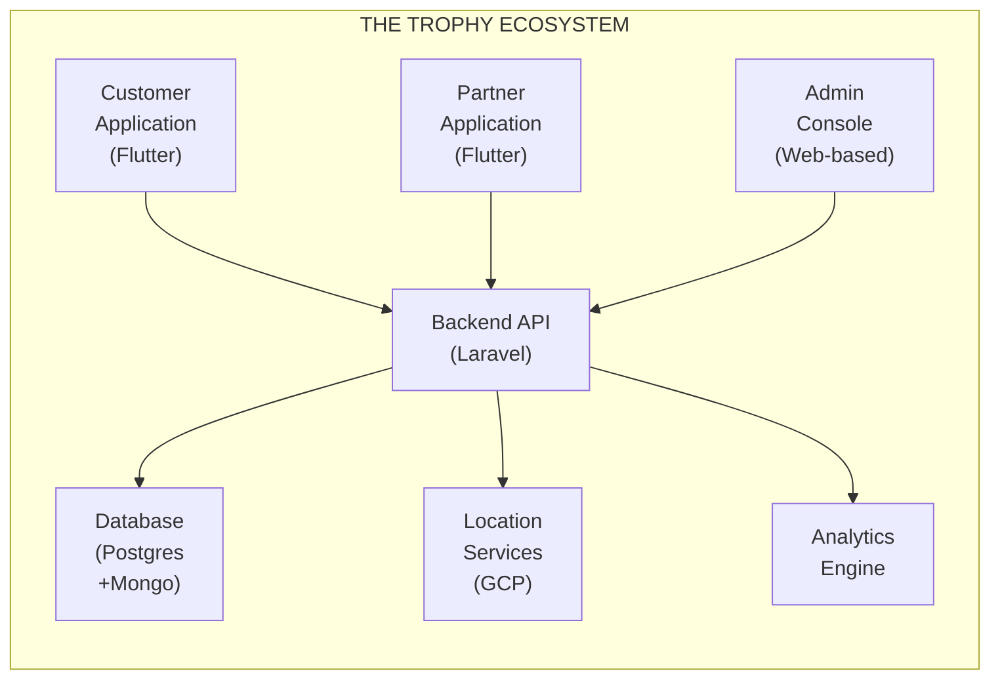

# THE TROPHY: ระบบภักดีและการมีส่วนร่วมแบบเกมมิฟิเคชัน

## ข้อเสนอโครงการ

**จัดทำให้กับ:** ________________________________________

**จัดทำโดย:** บริษัท ดิจิตอลมีเดีย เอาต์ซอร์ส โซลูชั่น จำกัด (DOS)

**วันที่:** 29 ธันวาคม 2568

**เวอร์ชันข้อเสนอ:** 2.1

**ใช้ได้ถึง:** 27 มีนาคม 2569

---

## การควบคุมเอกสาร

| เวอร์ชัน | วันที่ | ผู้จัดทำ | การเปลี่ยนแปลง |
| --- | --- | --- | --- |
| 1.0 | 25 ธ.ค. 2568 | ทีม DOS | ข้อเสนอเริ่มต้น |
| 1.1 | 25 ธ.ค. 2568 | Jakapong L | ตรวจทาน |
| 1.2 | 25 ธ.ค. 2568 | ทีม DOS | อัพเดทจากข้อเสนอแนะ |
| 1.3 | 25 ธ.ค. 2568 | ทีม DOS | ปรับระบบ tiering เป็น 2 ระดับ (Standard/Exclusive) |
| 2.0 | 27 ธ.ค. 2568 | ทีม DOS | อัพเดทตาม Meeting Note 3 - เปลี่ยนชื่อโครงการเป็น "The Trophy", เพิ่ม point transfer, ชี้แจง wallet, ปรับ phases, คำแนะนำ QR |
| 2.1 | 29 ธ.ค. 2568 | Jakapong L | ตรวจทานขั้นสุดท้าย |

---

## บทสรุปสำหรับผู้บริหาร

### โอกาสทางธุรกิจ

**The Trophy** เป็นแนวทางใหม่ที่เปลี่ยนแปลงการมีส่วนร่วมของแฟนและการจัดการความภักดี แทนที่จะเป็นแอปสะสมคะแนนธรรมดา The Trophy ทำหน้าที่เป็น **แพลตฟอร์มประสบการณ์เกมมิฟิเคชันที่ครอบคลุม** ซึ่งสร้างการเชื่อมต่อคุณค่าอย่างยั่งยืนระหว่าง:

- **องค์กรกีฬา** (สโมสรฟุตบอล / ผู้จัดงาน)
- **พันธมิตรธุรกิจ** (ร้านค้าปลีก ผู้ให้บริการ ผู้สนับสนุน)
- **ผู้ใช้งาน** (แฟนๆ สมาชิก ลูกค้า)

### คุณค่าเชิงกลยุทธ์ที่นำเสนอ

แพลตฟอร์มเปลี่ยนกิจกรรมประจำวันของแฟนให้เป็นคุณค่าทางธุรกิจที่วัดผลได้ผ่าน **กลไกการมีส่วนร่วมแบบภารกิจ (mission-based engagement mechanics)** โดยใช้ประโยชน์จาก:

- **เทคโนโลยีตำแหน่งแม่นยำ (Precision Location Technology)** (KML/Polygon-based geofencing)
- **ระบบป้องกันการทุจริตที่แข็งแกร่ง (Robust Fraud Prevention Systems)** (กลไกต่อต้านการเล่นพิทยาสูง)
- **สถาปัตยกรรม White-Label** (เป็นกลางต่อแบรนด์เพื่อความสามารถในการขยายสูงสุด)
- **ข้อมูลเชิงลึกขับเคลื่อนด้วยข้อมูล (Data-Driven Insights)** (การวิเคราะห์แบบเรียลไทม์และการติดตาม ROI)
- **ระบบ Trophy Wallet** (การจัดการพอยต์แบบรวมศูนย์พร้อมความสามารถในการโอน)

### แนวทางการดำเนินงาน

เพื่อลดความเสี่ยงและเพิ่มการส่งมอบคุณค่าในระยะเริ่มต้น เราเสนอ **แผนงานการดำเนินงานแบบเป็นขั้นตอน (phased implementation roadmap)** ที่สอดคล้องกับวิสัยทัศน์เชิงกลยุทธ์ของคุณ:

**ขั้นตอนที่เสนอเดิม:**

1. MVP
2. Automation / Scaling
3. Ecosystem Expansion

**แนวทางที่เราแนะนำ (Mapped):**

1. **ขั้นตอนที่ 1: การพิสูจน์แนวคิด (Proof of Concept - POC)** - THB 1,000,000
    - เพิ่มก่อน MVP เพื่อตรวจสอบเทคโนโลยีหลักและลดความเสี่ยง
2. **ขั้นตอนที่ 2: ผลิตภัณฑ์ที่ใช้งานได้ขั้นต่ำ (Minimum Viable Product - MVP)** - THB 3,000,000 - 5,000,000
    - สอดคล้องกับขั้นตอน MVP ของแผนเดิม
3. **ขั้นตอนที่ 3: ระบบนิเวศขนาดเต็ม (Full-Scale Ecosystem)** - THB ~10,000,000
    - รวมขั้นตอน "Automation/Scaling" + "Ecosystem Expansion" ของแผนเดิม

เราแนะนำอย่างยิ่งให้รวมขั้นตอน POC เพื่อตรวจสอบความเป็นไปได้ทางเทคนิค (โดยเฉพาะภารกิจตามตำแหน่งและการรวม Trophy Wallet) ก่อนการลงทุน MVP เต็มรูปแบบ วิธีนี้ช่วยลดความเสี่ยงและรับประกันว่าโมเดลธุรกิจได้รับการพิสูจน์แล้วด้วยต้นทุนที่น้อยที่สุด

---

## 1. บริบททางธุรกิจและเหตุผลเชิงกลยุทธ์

### 1.1 ข้อความปัญหา

องค์กรกีฬาและธุรกิจที่ดำเนินการแบบสมาชิกเผชิญกับความท้าทายสำคัญในการสร้างความผูกพันกับลูกค้าในยุคปัจจุบัน:

**ความท้าทายที่ 1: การมีส่วนร่วมของแฟนคลับต่ำนอกช่วงเวลาจัดกิจกรรม**

- การมีปฏิสัมพันธ์กับแฟนคลับจำกัดเฉพาะวันแข่งขันหรือช่วงงานกิจกรรมเท่านั้น
- ไม่มีจุดสัมผัสอย่างต่อเนื่องเพื่อรักษาการรับรู้แบรนด์
- พลาดโอกาสในการสร้างความสัมพันธ์ตลอดทั้งปี

**ความท้าทายที่ 2: การจัดการระบบนิเวศของพันธมิตรที่ไม่มีประสิทธิภาพ**

- กระบวนการแบบแมนนวลสำหรับการกระจายสิทธิประโยชน์ให้พันธมิตร
- ความยากลำบากในการติดตาม ROI ของพันธมิตรและประสิทธิผลของการมีส่วนร่วม
- มองเห็นข้อมูลเกี่ยวกับผลการดำเนินงานของความร่วมมือได้อย่างจำกัด

**ความท้าทายที่ 3: ความซับซ้อนในการกระจายสิทธิประโยชน์**

- การตรวจสอบการเข้าถึง VIP และสิทธิ์จอดรถแบบแมนนวล
- ค่าใช้จ่ายในการดำเนินงานสูงสำหรับการยืนยันสิทธิประโยชน์
- ช่องโหว่ด้านการฉ้อโกงในระบบกระดาษแบบดั้งเดิม

**ความท้าทายที่ 4: พลาดโอกาสสร้างรายได้**

- สินทรัพย์ของสโมสรที่ไม่ได้ใช้ประโยชน์เต็มที่ (สนามฝึกซ้อม, พื้นที่ VIP)
- การสร้างรายได้จากความภักดีและการมีส่วนร่วมของแฟนคลับที่จำกัด
- ไม่สามารถสร้างช่องทางรายได้ใหม่จากทรัพยากรที่มีอยู่

### 1.2 โซลูชัน The Trophy

The Trophy แก้ไขความท้าทายเหล่านี้ผ่านระบบนิเวศดิจิทัลที่ครอบคลุม ดังนี้:

**สร้างการมีส่วนร่วมอย่างต่อเนื่อง**

- เกมมิฟิเคชันในรูปแบบภารกิจช่วยให้ผู้ใช้มีส่วนร่วมตลอดทั้งปี
- โอกาสสัมผัสจุดติดต่อหลายช่องทางนอกเหนือจากวันจัดกิจกรรม
- ประสบการณ์ที่ปรับแต่งเฉพาะบุคคลตามพฤติกรรมและความชอบของผู้ใช้

**เปิดใช้งานการจัดการพันธมิตรแบบอัตโนมัติ**

- เครื่องมือตรวจสอบดิจิทัลสำหรับการยืนยันพันธมิตร
- การติดตาม ROI และการวิเคราะห์แบบเรียลไทม์
- เวิร์กโฟลว์การแจกจ่ายและแลกแต้มอัตโนมัติ

**ปรับปรุงกระบวนการกระจายสิทธิประโยชน์**

- การตรวจสอบดิจิทัลแทนที่กระบวนการแมนนวล
- ระบบการตรวจสอบที่ปลอดภัยด้วย QR
- ป้องกันการฉ้อโกงด้วยการตรวจสอบหลายชั้น

**ปลดล็อกช่องทางรายได้ใหม่**

- สร้างรายได้จากสินทรัพย์ของสโมสรผ่านการแลกแต้ม
- โอกาสสร้างรายได้จากการได้รับพันธมิตร
- ข้อมูลเชิงลึกจากข้อมูลเพื่อการตัดสินใจเชิงกลยุทธ์

### 1.3 เหตุผลของกลยุทธ์ White-Label

**หลักการหลัก:** แพลตฟอร์มรักษาความเป็นกลางของแบรนด์อย่างสมบูรณ์ - ไม่มีชื่อสโมสร โลโก้ หรือสีปรากฏภายในอินเทอร์เฟซของแอปพลิเคชัน

**ประโยชน์เชิงกลยุทธ์:**

1. **ความยืดหยุ่นในการขยายตลาด:** แพลตฟอร์มสามารถให้บริการองค์กรกีฬาหรือธุรกิจหลายแห่งพร้อมกันได้
2. **ลดความอ่อนไหวต่อการแข่งขัน:** พันธมิตรและผู้ใช้จากสังกัดที่แข่งขันกันสามารถเข้าร่วมได้
3. **การดึงดูดใจแบบสากล:** มุ่งเน้นที่คุณค่าและสิทธิประโยชน์มากกว่าความภักดีต่อแบรนด์เฉพาะ
4. **การขยายตัว:** แพลตฟอร์มเดียวสามารถรองรับการใช้งาน white-label หลายรูปแบบได้

**หมายเหตุการใช้งาน:** แม้ว่าแพลตฟอร์มจะเป็นกลางต่อแบรนด์ แต่ผู้ใช้ยังคงสามารถเข้าถึงสินทรัพย์พิเศษของสโมสร (การเยี่ยมชมสนามฝึกซ้อม ที่นั่ง VIP) ผ่านระบบการแลกแต้ม

---

## 2. สถาปัตยกรรมโซลูชันและการออกแบบทางเทคนิค

### 2.1 ภาพรวมระบบ

ระบบนิเวศ The Trophy ประกอบด้วยแอปพลิเคชันที่เชื่อมต่อกันสามตัว สร้างบนโครงสร้าง backend เดียวกัน:

### 2.2 แอปพลิเคชันลูกค้า (User Super App)

**ผู้ใช้เป้าหมาย:** แฟนคลับ สมาชิก ประชาชนทั่วไป

**ฟีเจอร์หลัก: ระบบ Trophy Wallet**

- **การจัดการแต้ม Awards:** กระเป๋าเงินกลางสำหรับแต้มที่ได้รับทั้งหมด
- **การโอนแต้ม (เข้าและออก):**
    - โอนแต้มไปยัง/จากโปรแกรมความภักดีของพันธมิตร
    - การเชื่อมต่อกับระบบรีวอร์ดของบัตรเครดิต (ผู้ให้บริการบางรายอาจจำกัดให้อัปโหลดแบบแมนนวลเท่านั้น)
    - แลกเปลี่ยนแต้มกับระบบนิเวศภายนอก
- **ประวัติการทำธุรกรรม:** บันทึกการตรวจสอบที่สมบูรณ์ของการเคลื่อนไหวแต้มทั้งหมด
- **ภาพรวมยอดคงเหลือ:** ยอดแต้มและมูลค่าแบบเรียลไทม์

*หมายเหตุ: ฟีเจอร์การโอนแต้มจะได้รับการออกแบบพร้อมการควบคุมทางเศรษฐกิจเพื่อป้องกันการใช้ในทางที่ผิดและรักษาเสถียรภาพของมูลค่าแต้ม ขอบเขตการโอนและกฎการตรวจสอบสามารถกำหนดค่าได้โดยผู้ดูแลระบบ*

**ศูนย์ภารกิจ**

- **ภารกิจตามตำแหน่ง:** เช็คอินที่ตำแหน่งพันธมิตรโดยใช้ KML/Polygon geofencing แม่นยำสูง (ไม่ใช่รัศมีธรรมดา)
- **ภารกิจตามการกระทำ:** การยืนยันด้วยภาพถ่ายกับพนักงานที่กำหนด
- **ภารกิจตามเวลา:** เข้าร่วมกิจกรรม ดูการแข่งขัน (ยืนยันผ่านตำแหน่ง)
- **ภารกิจตามการซื้อ:** ช็อปปิ้งที่ตำแหน่งพันธมิตรพร้อมการยืนยันใบเสร็จผ่าน Partner Application
- **ภารกิจโซเชียล:** แชร์คอนเทนต์ มีส่วนร่วมบนโซเชียลมีเดีย

**ระบบแลกรางวัล**

- เรียกดูแคตตาล็อกรางวัลที่มีหรือมุมมองแผนที่
- กรองตามหมวดหมู่: ประสบการณ์พิเศษ การเข้าถึง VIP ส่วนลดจากพันธมิตร สินค้า
- การสร้างคูปองดิจิทัลพร้อม QR code
- ประวัติการแลกและการติดตาม
- การแจ้งเตือนและการเตือนความจำหมดอายุ

**ระบบการจัดระดับ**

- ระดับสมาชิกแบบ Standard / Exclusive
- สิทธิประโยชน์เฉพาะระดับและภารกิจพิเศษ
- การติดตามความคืบหน้าและข้อกำหนดการอัพเกรดระดับ
- รางวัลพิเศษและการเข้าถึงเฉพาะระดับเท่านั้น

**โปรไฟล์ผู้ใช้และการมีส่วนร่วม**

- ยอดแต้มและประวัติการทำธุรกรรม
- สถิติการทำภารกิจสำเร็จ
- อันดับกระดานผู้นำ (องค์ประกอบการแข่งขันเสริม)
- การจัดการความชอบและการตั้งค่าการแจ้งเตือน

**การยืนยันตัวตน**

- **หมายเลขโทรศัพท์มือถือ (หลัก):** การยืนยันตัวตนด้วยหมายเลขโทรศัพท์
- **เปลี่ยนหมายเลขโทรศัพท์มือถือ:** อนุญาตให้ผู้ใช้อัปเดตหมายเลขโทรศัพท์ที่ลงทะเบียนได้อย่างปลอดภัย
- การยืนยันด้วย One-Time Password (OTP)

*หมายเหตุ: เราแนะนำการยืนยันตัวตนด้วยหมายเลขโทรศัพท์มือถือเท่านั้น (ไม่ใช่ social login) เพื่อความปลอดภัยที่ดีขึ้น ความสอดคล้องของข้อมูล และการป้องกันการฉ้อโกง ฟีเจอร์ "เปลี่ยนหมายเลขโทรศัพท์มือถือ" จัดการกับข้อกังวลเกี่ยวกับผู้ใช้ที่เปลี่ยนหมายเลขโทรศัพท์*

**ไฮไลท์ทางเทคนิค:**

- สร้างด้วย Flutter เพื่อประสิทธิภาพแบบ native บน iOS และ Android
- การซิงโครไนซ์ข้อมูลแบบเรียลไทม์กับ backend
- การแจ้งเตือนแบบพุชสำหรับภารกิจและรางวัลใหม่ (ผ่าน OneSignal)
- การยืนยันตัวตนที่ปลอดภัยพร้อมการรองรับ social login

### 2.3 แอปพลิเคชันพันธมิตร (เครื่องมือตรวจสอบและให้บริการ)

**ผู้ใช้เป้าหมาย:** พนักงานพันธมิตร พนักงานสโมสร ผู้จัดกิจกรรม

**ฟีเจอร์หลัก: QR Scanner และการตรวจสอบ (Hybrid Earn & Redeem)**

- **แนวทางที่แนะนำ:** ระบบ QR แบบ Hybrid สำหรับการดำเนินงานที่คล่องตัว
- QR code เดียวสำหรับทั้งการรับแต้มและการแลก
- พนักงานพันธมิตรสามารถมอบแต้มหรือแลกรางวัลได้ในการสแกนครั้งเดียว
- ลดความยุ่งยากและปรับปรุงประสบการณ์ผู้ใช้
- สแกน QR code ของผู้ใช้เพื่อยืนยันตัวตนและสิทธิ์
- มอบแต้มสำหรับภารกิจที่สำเร็จ (เช่น บริการล้างรถ)
- แลกคูปองและสิทธิประโยชน์ของผู้ใช้

**การตรวจสอบภารกิจ**

- อินเทอร์เฟซอนุมัติภารกิจภาพถ่าย
- การตรวจสอบแบบแมนนวลสำหรับภารกิจที่ซับซ้อน
- การปฏิเสธพร้อมเหตุผลแจ้งกลับไปยังผู้ใช้
- ความสามารถในการอนุมัติเป็นชุด

*หมายเหตุ: เราเสนอให้ใช้พนักงานพันธมิตรสำหรับการตรวจสอบภาพถ่ายแทนการตรวจจับวัตถุด้วย AI ล้วนๆ สิ่งนี้ให้: (1) ประหยัดต้นทุนในการพัฒนาและบำรุงรักษา AI (2) ความแม่นยำที่ดีขึ้นผ่านการตัดสินของมนุษย์ (3) สัมผัสของมนุษย์และการมีส่วนร่วมระหว่างพนักงานพันธมิตรและผู้ใช้ปลายทาง การตรวจสอบโดยใช้ AI ช่วยเหลือสามารถเพิ่มในระยะต่อไปได้หากจำเป็น*

**แดชบอร์ดพันธมิตร (เบา)**

- สถิติรายวัน/รายสัปดาห์เกี่ยวกับการมีส่วนร่วมของลูกค้า
- แต้มที่มอบและแลก
- ภารกิจและรางวัลที่ได้รับความนิยมมากที่สุด
- ความคิดเห็นและคะแนนของลูกค้า

**ไฮไลท์ทางเทคนิค:**

- แอปมือถือที่ใช้ Flutter (iOS/Android)
- อินเทอร์เฟซที่เรียบง่ายและใช้งานง่ายสำหรับพนักงานที่ไม่ใช่ด้านเทคนิค
- การยืนยันตัวตนพันธมิตรที่ปลอดภัย

### 2.4 Admin Console (ศูนย์บัญชาการและควบคุมกลาง)

**ผู้ใช้เป้าหมาย:** ผู้ดูแลระบบแพลตฟอร์ม ผู้จัดการธุรกิจ นักวิเคราะห์ข้อมูล

**ฟีเจอร์หลัก: แดชบอร์ดแบบเรียลไทม์**

- ผู้ใช้ที่ใช้งานและเมตริกเซสชัน
- การหมุนเวียนแต้ม (มอบเทียบกับแลก)
- อัตราการทำภารกิจสำเร็จ
- ภาพรวมผลการดำเนินงานของพันธมิตร
- การติดตามรายได้และ ROI

**การจัดการภารกิจ**

- สร้างและกำหนดค่าภารกิจ (ตามตำแหน่ง การกระทำ ตามเวลา)
- ตั้งค่ารางวัลแต้มและเกณฑ์สิทธิ์
- กำหนด polygon geofence โดยใช้การทำแผนที่ KML
- กำหนดเวลาความพร้อมใช้งานของภารกิจ (วันเริ่มต้น/สิ้นสุด)
- ติดตามผลการดำเนินงานของภารกิจและการมีส่วนร่วม

**ตัวจัดการ Polygon และ Geofence**

- นำเข้าไฟล์ KML จาก Google Maps
- รองรับหลาย polygon สำหรับตำแหน่งที่ซับซ้อน
- เครื่องมือทดสอบเพื่อยืนยันความแม่นยำของตำแหน่ง

**การจัดการแคตตาล็อกรางวัล**

- สร้างและจัดการรางวัล
- ตั้งค่าต้นทุนแต้มและขอบเขตความพร้อมใช้งาน
- อัปโหลดรูปภาพและคำอธิบาย (ไทย/อังกฤษสองภาษา)
- ติดตามอัตราการแลกและความนิยม

**การจัดการพันธมิตร**

- เพิ่มพันธมิตรใหม่พร้อมข้อมูลประจำตัว
- ตั้งค่าขอบเขตการจัดสรรแต้มต่อพันธมิตร
- ติดตามกิจกรรมของพันธมิตรและความสอดคล้อง
- สร้างรายงานผลการดำเนินงานของพันธมิตร

**การตรวจจับและป้องกันการฉ้อโกง**

- การแจ้งเตือนการตรวจจับความผิดปกติ (รูปแบบการเช็คอินที่ผิดปกติ)
- การติดตามกิจกรรมผู้ใช้ที่น่าสงสัย
- บันทึกการตรวจสอบพันธมิตรสำหรับการแจกจ่ายแต้ม
- การจัดการบัญชีดำและการระงับผู้ใช้
- การตรวจจับการปลอมแปลง GPS

**การจัดการผู้ใช้**

- โปรไฟล์ผู้ใช้และประวัติกิจกรรม
- การปรับแต้มแบบแมนนวล (พร้อมบันทึกการตรวจสอบ)
- การจัดการระดับและการอัพเกรดแบบแมนนวล (Standard/Exclusive)
- อินเทอร์เฟซการรับตั๋วสนับสนุนลูกค้าขั้นพื้นฐาน

**Trophy Wallet Admin**

- การติดตามและอนุมัติการโอนแต้ม (หากจำเป็น)
- การจัดการการเชื่อมต่อระบบนิเวศภายนอก
- การกำหนดค่าขอบเขตและกฎการโอน
- การติดตามสุขภาพทางเศรษฐกิจ (หนี้สินแต้ม การหมุนเวียน)

**การวิเคราะห์และการรายงาน**

- ตัวสร้างรายงานแบบกำหนดเอง
- ความสามารถในการส่งออก (CSV, PDF)
- การวิเคราะห์กลุ่มและการแบ่งกลุ่มผู้ใช้
- เครื่องมือคำนวณ ROI ของพันธมิตร
- การวิเคราะห์เชิงคาดการณ์สำหรับการพยากรณ์หนี้สินแต้ม

**ไฮไลท์ทางเทคนิค:**

- อินเทอร์เฟซเว็บแบบ responsive (Vue.js)
- การควบคุมการเข้าถึงตามบทบาท (Admin, Manager, Support, Analyst)
- การแสดงภาพข้อมูลขั้นสูง (แผนภูมิ, heatmaps)
- การเชื่อมต่อกับ Google Maps API สำหรับ geofencing

---

## 3. แผนงานการใช้งานและการแบ่งระยะ

### 3.1 Phase 1: Proof of Concept (POC)

**วัตถุประสงค์:** ตรวจสอบความเป็นไปได้ของเทคโนโลยีหลักและข้อสมมติฐานทางธุรกิจด้วยการลงทุนขั้นต่ำ

**ระยะเวลา:** 8-10 สัปดาห์

**งบประมาณ:** THB 1,000,000

**ผลลัพธ์สำคัญ: Customer App (Basic)**

- User registration และ authentication (เบอร์โทรศัพท์)
- Simple location-based check-in (ใช้ basic geofencing)
- Point accumulation display
- Basic profile management
- Trophy Wallet prototype (ดูยอดคงเหลือ, basic transaction history)

**Partner App (Prototype)**

- QR scanner สำหรับ user verification
- Manual point award interface

**Admin Console (Essential)**

- Basic dashboard แสดง user counts และ point totals
- Simple mission creation (location-based เท่านั้น)
- Manual user และ partner management

**Backend Infrastructure**

- Basic API สำหรับ user, mission และ point management
- Simple database schema
- Authentication service

**Testing & Validation**

- Limited pilot กับ test users 50-100 คน
- Partner locations 3-5 แห่งสำหรับการตรวจสอบ
- Basic fraud prevention (rate limiting)

**Success Criteria:**

- Users สามารถทำ location-based missions สำเร็จ
- Points ได้รับการมอบและติดตามอย่างถูกต้อง
- Partner verification workflow ทำงานได้ถูกต้อง
- ไม่พบช่องโหว่ด้านความปลอดภัยร้ายแรง

**Exclusions (ย้ายไป Phase ถัดไป):**

- Advanced fraud AI
- Complex mission types (photo verification)
- Two-tier membership system
- Reward redemption
- Advanced analytics
- Point transfer functionality
- Production-grade security hardening
- Publishing to App Store / Play Store (ทดสอบผ่าน TestFlight/Internal Testing เท่านั้น)

### 3.2 Phase 2: Minimum Viable Product (MVP)

**วัตถุประสงค์:** เปิดตัวระบบที่พร้อมใช้งานจริงพร้อมฟีเจอร์หลักสำหรับการดึงดูด users และ partners ในโลกแห่งความเป็นจริง

**ระยะเวลา:** 16-20 สัปดาห์

**งบประมาณ:** THB 3,000,000 - 5,000,000

**ผลลัพธ์สำคัญ: Customer App (Production)**

- Mission types ครบถ้วน: Location, Action (photo), Time-based
- Reward redemption พร้อม QR coupon generation
- Two-tier system (Standard/Exclusive)
- Enhanced UI/UX พร้อม onboarding flow
- Push notifications สำหรับ missions และ rewards
- Social sharing capabilities
- **Trophy Wallet (Full):**
    - Complete point management
    - Point transfer (Inbound/Outbound) กับ partner ecosystems
    - Transaction history และ export
    - Transfer limits และ validation

**Partner App (Full)**

- QR scanning สำหรับทั้ง validation และ redemption (Hybrid approach)
- Photo mission approval interface (staff verification)
- Partner dashboard พร้อม basic analytics
- Daily/weekly reports

**Admin Console (Operational)**

- Comprehensive dashboard พร้อม real-time metrics
- Advanced mission creation ครบทุก types
- KML/Polygon geofence tools
- Reward catalog management
- Partner onboarding และ management
- Basic fraud detection alerts
- User support tools
- Trophy Wallet admin controls (transfer monitoring, limits)

**Backend Infrastructure (Scalable)**

- Production-grade API พร้อม authentication และ authorization
- Optimized database design สำหรับการขยายขนาด
- Cloud deployment (GCP)
- Basic monitoring และ logging
- Automated backups

**Security & Compliance**

- HTTPS encryption
- Secure token-based authentication
- PDPA compliance (Thai data protection)
- Basic anti-fraud mechanisms (GPS spoofing detection, rate limiting)
- Partner audit trails

**Testing & Launch**

- Comprehensive UAT/SIT
- Load testing สำหรับ user capacity เป้าหมาย (10,000 concurrent users)
- Security penetration testing
- Beta launch กับ early adopters
- Post-launch monitoring และ support

**Success Criteria:**

- รองรับ users ที่ใช้งานจริง 5,000+ คน
- Onboard partner locations 20+ แห่ง
- Mission completion rate > 30%
- Reward redemption rate > 15%
- ไม่มี critical bugs ใน production
- System uptime > 99%

**หมายเหตุ:** ตัวชี้วัดความสำเร็จขึ้นอยู่กับการจัดสรรงบประมาณของลูกค้าสำหรับการหา users และแคมเปญการตลาด DOS จะออกแบบระบบให้รองรับการทำ digital marketing integration แต่ไม่ได้ให้บริการด้านการตลาด

**Exclusions (ย้ายไป Phase 3):**

- Advanced AI-based fraud detection
- Complex analytics และ predictive models
- Multiple white-label deployments
- Advanced personalization engine
- Third-party integrations (CRM, marketing automation)

### 3.3 Phase 3: Full-Scale Ecosystem

**วัตถุประสงค์:** สร้าง platform ที่ครบครันพร้อมฟีเจอร์ขั้นสูง ความสามารถในการขยายขนาดสำหรับการใช้งานหลายระบบ และ analytics ที่ซับซ้อน

**Original Vision Alignment:** Phase นี้รวม "Automation / Scaling" และ "Ecosystem Expansion" phases ของคุณเข้าด้วยกันเป็นความพยายามในการพัฒนาแบบรวมศูนย์

**ระยะเวลา:** 24-30 สัปดาห์

**งบประมาณ:** THB ~10,000,000

**ผลลัพธ์สำคัญ: Advanced Features**

- AI-powered fraud detection และ anomaly prevention
- Personalization engine สำหรับ mission recommendations
- Enhanced tiering capabilities และ custom tier configurations
- Gamification enhancements (badges, achievements, streaks)
- **Pay with Points:** Real-time partner discounts และ redemption system
    - Partners สามารถเสนอส่วนลดทันทีสำหรับสินค้า/บริการทั้งหมด
    - Real-time point redemption (ไม่ใช่ discount vouchers ที่กำหนดไว้ล่วงหน้า)
    - Dynamic pricing และ point value calculations

**Platform Scalability (Automation / Scaling)**

- Multi-tenant white-label architecture
- Organization-level customization (themes, branding)
- API สำหรับ third-party integrations
- Webhook support สำหรับ external systems
- Multi-language support (นอกจาก Thai/English)
- Automated partner onboarding workflows
- Auto-scaling infrastructure

**Ecosystem Expansion**

- Advanced Trophy Wallet integrations
- Credit card reward systems
- Banking loyalty programs
- Multi-brand point exchanges
- Expanded partner network tools
- API marketplace สำหรับ third-party developers
- Cross-ecosystem point transfer protocols

**Analytics & Intelligence**

- Predictive analytics สำหรับ point liability forecasting
- Machine learning สำหรับ user segmentation
- Churn prediction และ retention campaigns
- Partner ROI optimization algorithms
- Custom reporting API สำหรับ enterprise clients

**Enterprise Integrations**

- CRM integration (Salesforce, HubSpot)
- Marketing automation (Email, SMS campaigns)
- Payment gateway สำหรับ premium features
- Social media platform APIs
- E-commerce platform connections

**Advanced Security**

- Biometric authentication (fingerprint, face ID)
- Advanced GPS spoofing detection
- SOC 2 compliance preparation
- Enhanced audit trails และ compliance reporting

**Operational Excellence**

- 24/7 monitoring และ alerting
- Auto-scaling infrastructure
- Disaster recovery และ business continuity
- Advanced DevOps และ CI/CD pipelines
- Performance optimization สำหรับ users 100,000+ คน

**Success Criteria:**

- รองรับ concurrent active users 50,000+ คน
- Partner locations 100+ แห่งข้ามหลาย organizations
- Advanced fraud detection ที่มี false positive rate < 1%
- 99.9% uptime SLA
- Full self-service partner onboarding

**หมายเหตุ:** ตัวชี้วัดความสำเร็จขึ้นอยู่กับการจัดสรรงบประมาณของลูกค้าสำหรับการขยายการดำเนินงานและการดำเนินการตาม marketing plan DOS จัดหา technical platform ลูกค้ารับผิดชอบกลยุทธ์และการดำเนินการทางการตลาด

---

## 4. Technology Stack & Architecture

### 4.1 Mobile Applications (Customer & Partner)

- **Framework:** Flutter (Single codebase สำหรับ iOS & Android)
- **Key Tech:** Provider/Riverpod (State Mgt), Google Maps, OneSignal (Noti), Pusher (Real-time), Hive/SQLite (Local DB)

### 4.2 Admin Console (Web App)

- **Framework:** React หรือ Vue.js
- **Key Tech:** Material-UI/Ant Design, Redux/Vuex, Chart.js/D3.js (Data Viz)

### 4.3 Backend Services

- **Framework:** Laravel (PHP)
- **Key Tech:** RESTful API, JWT Auth, Laravel Queues (Background jobs), Swagger (Docs)

### 4.4 Database & Storage

- **Primary DB:** PostgreSQL (Transactions & Points)
- **Secondary DB:** MongoDB (Logs & Configs), Redis (Caching)
- **Storage:** GCP Cloud Storage (Files & Images)

### 4.5 Cloud Infrastructure

- **Platform:** Google Cloud Platform (GCP)
- **Services:** GKE/Cloud Run (Compute), Cloud SQL, Cloud Functions

### 4.6 Third-Party Services

- **Tools:** Google Maps Platform, OneSignal, Pusher, SendGrid/Twilio, Sentry (Error Tracking)

---

## 5. Risk Management & Security

### 5.1 Fraud Prevention Strategy

**Risk Category 1: User Gaming**

**ภัยคุกคาม:**

- GPS spoofing เพื่อปลอม location check-ins
- Check-in ซ้ำๆ เพื่อเก็บ points
- ส่ง photo ปลอม
- Users หลาย accounts ต่อคนเดียว

**กลยุทธ์การบรรเทาความเสี่ยง:**

- **GPS Validation:** ตรวจสอบข้อมูล GPS ข้ามกับ cell tower triangulation และ Wi-Fi location
- **Rate Limiting:** จำกัดความถี่ในการ check-in (เช่น สูงสุด 1 check-in ต่อ location ต่อวัน)
- **Device Fingerprinting:** ติดตาม unique device IDs เพื่อป้องกันการใช้หลาย accounts
- **Photo Verification:** ตรวจสอบโดยบุคคล โดย partner staff หรือทีม admin
- **Behavioral Analysis:** Pattern detection เพื่อระบุกิจกรรม user ที่ผิดปกติ

**Risk Category 2: Partner Fraud**

**ภัยคุกคาม:**

- Partners มอบ points โดยไม่มี transactions ที่ถูกต้อง
- การสมรู้ร่วมคิดระหว่าง partners และ users
- แจก points เกินขีดจำกัด
- Redemptions ปลอมเพื่อลดยอดคงเหลือของ user

**กลยุทธ์การบรรเทาความเสี่ยง:**

- **Daily Caps:** จำกัด points ที่ partner สามารถมอบได้ต่อวัน
- **Audit Trails:** บันทึก log ครบถ้วนของการกระทำทั้งหมดของ partner พร้อม timestamps
- **Anomaly Detection:** แจ้งเตือนเมื่อพฤติกรรมของ partner เบี่ยงเบนจาก patterns ปกติ
- **Random Audits:** ตรวจสอบ transactions ของ partner เป็นระยะ
- **Reputation System:** Partner performance scoring พร้อมความสามารถในการระงับ

**Risk Category 3: System Abuse**

**ภัยคุกคาม:**

- API abuse และการโจมตีจาก automated bot
- Point inflation ผ่าน system exploits
- การเข้าถึง admin functions โดยไม่ได้รับอนุญาต

**กลยุทธ์การบรรเทาความเสี่ยง:**

- **API Rate Limiting:** จำกัด requests ต่อ user/IP
- **CAPTCHA:** สำหรับการดำเนินการที่สำคัญ
- **Role-Based Access Control:** การจัดการสิทธิ์ admin อย่างเข้มงวด
- **Security Audits:** Penetration testing เป็นประจำ
- **Bug Bounty Program:** สร้างแรงจูงใจสำหรับการเปิดเผยอย่างรับผิดชอบ

### 5.2 Economic Control & Point Management

**Point Liability Management**

**ความท้าทาย:** Points แทนหนี้สินทางการเงิน - องค์กรต้องสามารถดำเนินการ redemptions ได้โดยไม่มีค่าใช้จ่ายมากเกินไป

**กลยุทธ์:**

- **Point Expiry:** Points ทั้งหมดหมดอายุหลัง 12 เดือน (ปรับแต่งได้)
- **Redemption Limits:** จำกัดมูลค่า point redemption รวมต่อ user ต่อเดือน
- **Reserve Ratio:** รักษาเงินสำรองตามสัดส่วนของ outstanding points
- **Inflation Control:** ติดตามการไหลเวียนของ points และปรับ mission rewards แบบ dynamic
- **Transfer Controls:** Point transfer limits เพื่อป้องกันการใช้ในทางที่ผิดทางเศรษฐกิจ

*หมายเหตุ: Point transfer feature จะมี economic controls ที่เข้มงวด ได้แก่: (1) Daily/monthly transfer limits ต่อ user, (2) Transfer fees เพื่อลดการใช้ในทางที่ผิด, (3) Admin approval สำหรับ transfers ขนาดใหญ่ (ตัวเลือก), (4) Real-time monitoring ของ transfer patterns เพื่อ fraud detection Controls เหล่านี้ปกป้องเศรษฐกิจ points ในขณะที่เปิดใช้งาน ecosystem integration*

**Point Economy Balancing**

**วัตถุประสงค์:** ให้แน่ใจว่ามีสมดุลที่ดีระหว่าง points ที่มอบ (inflow) และ redeem (outflow)

**ตัวชี้วัดที่ต้องติดตาม:**

- **Burn Rate:** เปอร์เซ็นต์ของ awarded points ที่ redeemed
- **Velocity:** เวลาเฉลี่ยระหว่าง point award และ redemption
- **Inflation Rate:** อัตราการเติบโตของ outstanding points ทั้งหมด
- **Redemption Ratio:** เป้าหมาย 60-80% ของ points redeemed ก่อนหมดอายุ
- **Transfer Volume:** ติดตาม inbound/outbound point transfers

**เครื่องมือ:**

- Real-time economic dashboard
- Automated alerts สำหรับ ratios ที่ไม่ดี
- Dynamic reward pricing adjustments
- Predictive modeling สำหรับ liability forecasting

### 5.3 Data Security & Privacy Compliance

**PDPA Compliance (Thai Personal Data Protection Act)**

**ข้อกำหนด:**

- Explicit user consent สำหรับการเก็บข้อมูล
- Clear privacy policy เป็นภาษาไทย
- สิทธิ์ user: เข้าถึง แก้ไข ลบ data portability
- Data breach notification protocols

**การดำเนินการ:**

- Consent management ระหว่าง registration
- Privacy policy และ terms acceptance
- User data export functionality
- Secure data deletion procedures

**Security Best Practices**

- **Data Encryption:** ข้อมูลทั้งหมด encrypted ทั้งขณะจัดเก็บและส่งผ่าน (TLS 1.3)
- **Access Controls:** Least-privilege principle สำหรับการเข้าถึงระบบทั้งหมด
- **Regular Backups:** Daily automated backups พร้อม 30-day retention
- **Incident Response Plan:** ขั้นตอนที่จัดทำเป็นเอกสารสำหรับ security incidents
- **Regular Updates:** Prompt security patching และ dependency updates

### 5.4 Operational Risks & Mitigation

**ความเสี่ยง: System Downtime**

- **ผลกระทบ:** User frustration, โอกาส engagement ที่สูญเสีย, partner disruption
- **การบรรเทา:**
    - High availability architecture (multi-zone deployment)
    - Auto-scaling เพื่อจัดการกับ traffic spikes
    - 99.9% uptime SLA target
    - Incident response runbooks

**ความเสี่ยง: Poor User Adoption**

- **ผลกระทบ:** ROI ต่ำ, business case ล้มเหลว
- **การบรรเทา:**
    - User research และ UX testing ก่อน launch
    - Phased rollout กับ early adopter program
    - การรวบรวม feedback อย่างต่อเนื่องและ iteration
    - Onboarding optimization และ user education

**ความเสี่ยง: Partner Churn**

- **ผลกระทบ:** Value proposition ลดลงสำหรับ users
- **การบรรเทา:**
    - Clear ROI demonstration สำหรับ partners
    - Regular partner performance reports
    - Dedicated partner success support
    - Flexible partnership models

**ความเสี่ยง: Scope Creep & Budget Overrun**

- **ผลกระทบ:** Delayed delivery, ค่าใช้จ่ายเกิน
- **การบรรเทา:**
    - Phased approach พร้อม deliverables ที่ชัดเจน
    - Change request process พร้อม impact assessment
    - Regular stakeholder alignment meetings
    - Contingency buffer ในงบประมาณ (10-15%)

### 5.5 Feature Concerns & Recommendations

**Send Points to Friends**

- Feature นี้ทำให้เกิดความกังวลเกี่ยวกับความมั่นคงของเศรษฐกิจ points Peer-to-peer transfers สามารถเปิดโอกาส: (1) Point farming ผ่านการใช้หลาย accounts, (2) การไหลเวียนของ points ที่ไม่มีการควบคุมส่งผลต่อสมดุลทางเศรษฐกิจ, (3) Gray market point trading หาก feature นี้จำเป็น เราแนะนำให้ implement ใน Phase 3 พร้อม controls ที่เข้มงวด: transfer limits, transaction fees, cooling periods และ fraud monitoring

**In-App Marketplace (Buy Items for Quests)**

- เราแนะนำอย่างยิ่งไม่ให้ implement marketplace ที่ users สามารถซื้อสินค้าเพื่อช่วยทำ quests ให้เสร็จ สิ่งนี้สร้าง "Pay-to-Win" dynamic ที่: (1) ลด campaign engagement และความน่าเชื่อถือ, (2) ทำลาย mission-based gamification model, (3) สร้างความได้เปรียบที่ไม่เป็นธรรมสำหรับ users ที่จ่ายเงิน เราแนะนำให้รักษา platform ให้เป็น skill/engagement-based มากกว่า purchase-based

---

## 6. Business Model และ ROI Framework

### 6.1 Value Proposition แยกตามกลุ่มผู้มีส่วนได้ส่วนเสีย

**สำหรับองค์กรกีฬา / สโมสร:**

**ผลประโยชน์:**

- **เพิ่มการมีส่วนร่วมของแฟนบอล:** มีจุดสัมผัสตลอดทั้งปีนอกเหนือจากวันแข่งขัน
- **ข้อมูลเชิงลึก:** เข้าใจพฤติกรรม ความชอบ และข้อมูลประชากรของแฟนบอล
- **ช่องทางรายได้ใหม่:** สร้างรายได้จากสินทรัพย์ของสโมสร (สิทธิ์ VIP, การเยี่ยมชมสนามฝึก)
- **การได้มาซึ่งพันธมิตร:** ดึงดูดสปอนเซอร์และพันธมิตรผ่านฐานแฟนบอลที่มีส่วนร่วมสูง
- **ประสิทธิภาพการดำเนินงาน:** การตรวจสอบดิจิทัลแทนที่การแจกจ่ายสิทธิประโยชน์แบบ manual

**ตัวชี้วัด ROI:**

- อัตราการมีส่วนร่วมของแฟนบอล (active users / ฐานแฟนบอลทั้งหมด)
- เวลาเฉลี่ยต่อ session และอัตราการทำ mission สำเร็จ
- รายได้จากพันธมิตรที่เข้ามาใหม่
- การประหยัดต้นทุนจากกระบวนการอัตโนมัติ

**สำหรับพันธมิตรธุรกิจ:**

**ผลประโยชน์:**

- **การได้มาซึ่งลูกค้า:** เข้าถึงฐานลูกค้าที่มีส่วนร่วมและตรงกลุ่มเป้าหมาย
- **การเปิดรับแบรนด์:** มองเห็นได้ผ่านการวาง mission และรางวัล
- **ROI ที่ติดตามได้:** เมตริกที่ชัดเจนเกี่ยวกับการเข้าร้านและการแปลงลูกค้า
- **การสร้างความภักดี:** ลูกค้ากลับมาซ้ำผ่านการทำ mission
- **ต้นทุนเริ่มต้นต่ำ:** โมเดลที่คิดตามประสิทธิภาพ (จ่ายต่อการมีส่วนร่วม)

**การคำนวณ ROI:**

<aside>
💡

Partner ROI = (รายได้จากผู้ใช้ Trophy - ต้นทุน point - ต้นทุน integration) / การลงทุนรวม

</aside>

ตัวอย่าง:

- พันธมิตรล้างรถ: 100 users × ค่าใช้จ่ายเฉลี่ย THB 200 = รายได้ THB 20,000
- ต้นทุน point: 100 users × 50 points × THB 0.50/point = THB 2,500
- ค่า platform รายเดือน: THB 2,000
- ผลประโยชน์สุทธิ: THB 15,500 (ROI 344%)

**สำหรับผู้ใช้งานปลายทาง (แฟนบอล):**

**ผลประโยชน์:**

- **ประสบการณ์พิเศษ:** เข้าถึงโอกาสที่เงินซื้อไม่ได้
- **รางวัลที่จับต้องได้:** ส่วนลด สินค้า ประสบการณ์ VIP
- **ความสนุกแบบ gamified:** mission ที่มีส่วนร่วมและองค์ประกอบการแข่งขัน
- **การเชื่อมโยงชุมชน:** รู้สึกเป็นส่วนหนึ่งของชุมชนแฟนบอลที่ใหญ่ขึ้น
- **ผลประโยชน์ส่วนบุคคล:** รางวัลตาม tier ที่สอดคล้องกับระดับการมีส่วนร่วม (Standard หรือ Exclusive)
- **Trophy Wallet:** การจัดการ point ที่ยืดหยุ่นและการเชื่อมต่อ ecosystem

**การรับรู้คุณค่า:**

- 100 points = มูลค่าประมาณ THB 50 ในรางวัล
- การเข้าถึงพิเศษ (สนามฝึก) = ไร้ราคาสำหรับแฟนบอลตัวจริง
- ที่จอดรถ VIP = ประหยัด THB 100-200 ต่อการแข่งขัน

### 6.2 ตัวเลือก Revenue Model

**Model 1: Platform Licensing (แนะนำสำหรับ White-Label)**

- **ค่าธรรมเนียม License รายปี:** THB 500,000 - 2,000,000 ต่อองค์กร (ขึ้นอยู่กับขนาดผู้ใช้)
- **ค่า Implementation:** ค่าบริการติดตั้งครั้งเดียว (ครอบคลุมโดยงบประมาณโครงการ)
- **Maintenance & Support:** 20% ของค่า license รายปี

**Model 2: Transaction-Based**

- **ค่าธรรมเนียมการได้มาซึ่งพันธมิตร:** THB 5,000 - 20,000 ต่อพันธมิตรที่เข้าร่วม
- **ค่าธรรมเนียมธุรกรรม:** 5-10% ของต้นทุน point ของพันธมิตร
- **ค่าธรรมเนียมการแลก:** THB 5-10 ต่อการแลกรางวัล

**Model 3: Hybrid (Platform + Performance)**

- **ค่า Platform พื้นฐาน:** ค่าธรรมเนียมรายปีที่ต่ำกว่า (THB 300,000)
- **Performance Tier:** ค่าธรรมเนียมเพิ่มเติมตาม active users (THB 2-5 ต่อ active user/เดือน)
- **Partner Revenue Share:** 10-15% ของรายได้ที่พันธมิตรสร้างขึ้น

**Model 4: Freemium (สำหรับการใช้งานแบบ Consumer-Facing)**

- **Free Tier:** mission และรางวัลพื้นฐาน
- **Premium Subscription:** THB 99-299/เดือนสำหรับ mission พิเศษและตัวคูณ point ที่สูงขึ้น
- **In-App Purchases:** รางวัลพิเศษหรือแพ็ค point

### 6.3 โครงสร้างต้นทุนและการวิเคราะห์การลงทุน

**Phase 1 (POC): THB 1,000,000**

| รายการ | เปอร์เซ็นต์ | จำนวนเงิน (THB) | คำอธิบาย |
| --- | --- | --- | --- |
| Development | 60% | 600,000 | การออกแบบ การพัฒนา และการพัฒนาฟีเจอร์หลัก |
| Infrastructure | 15% | 150,000 | Cloud services และ environments สำหรับ POC |
| Testing &amp; QA | 10% | 100,000 | การทดสอบการทำงาน การแก้บัก การตรวจสอบความปลอดภัยเบื้องต้น |
| Project Management | 15% | 150,000 | การวางแผน การประสานงาน การรายงาน การสื่อสารกับผู้มีส่วนได้ส่วนเสีย |
| **รวม** | **100%** | **1,000,000** |  |

**Phase 2 (MVP): THB 3,000,000 - 5,000,000**

| รายการ | เปอร์เซ็นต์ | จำนวนเงิน (THB) | คำอธิบาย |
| --- | --- | --- | --- |
| Development | 55% | 1,650,000 - 2,750,000 | การพัฒนาฟีเจอร์หลักสำหรับ mobile apps, admin console และ backend |
| Infrastructure &amp; Cloud | 15% | 450,000 - 750,000 | Cloud environments, การตั้งค่า scaling, monitoring, backups |
| Testing &amp; Security | 12% | 360,000 - 600,000 | UAT/SIT, load testing, penetration testing, hardening |
| Design &amp; UX | 8% | 240,000 - 400,000 | การออกแบบ UI/UX, journeys, design system |
| Project Management | 10% | 300,000 - 500,000 | การวางแผน การประสานงาน การรายงาน การจัดการความเสี่ยง |
| **รวม** | **100%** | **3,000,000 - 5,000,000** |  |

**Phase 3 (Full Scale): THB ~10,000,000**

| รายการ | เปอร์เซ็นต์ | จำนวนเงิน (THB) | คำอธิบาย |
| --- | --- | --- | --- |
| Advanced Development | 50% | 5,000,000 | ฟีเจอร์ขั้นสูง (AI, multi-tenant, การขยาย ecosystem) |
| AI/ML &amp; Analytics | 15% | 1,500,000 | การวิเคราะห์เชิงคาดการณ์, personalization, fraud models |
| Infrastructure &amp; Scaling | 15% | 1,500,000 | Infrastructure แบบ high-availability, auto-scaling, DR/BCP |
| Security &amp; Compliance | 10% | 1,000,000 | ความปลอดภัยขั้นสูง, audits, compliance (เช่น การเตรียม SOC 2) |
| Testing &amp; QA | 5% | 500,000 | การทดสอบอย่างกว้างขวางในระดับ scale, regression, performance |
| Project Management | 5% | 500,000 | Program management, การประสานงานในทุก work streams |
| **รวม** | **100%** | **10,000,000 (โดยประมาณ)** |  |

**ต้นทุนการดำเนินงานต่อเนื่อง (รายปี):**

- Cloud Hosting: THB 300,000 - 600,000 (เพิ่มตามจำนวนผู้ใช้)
- Maintenance & Support: THB 600,000 - 1,200,000 (20% ของต้นทุนพัฒนา)
- Third-Party Services: THB 200,000 - 400,000 (maps, notifications, analytics)
- Staffing (in-house team): THB 2,400,000+ (2-3 developers + support)

**การลงทุนรวม 3 ปี:**

- Development (ทุก Phases): THB 14,000,000 - 16,000,000
- Operations (3 ปี): THB 10,200,000 - 18,600,000
- **รวม: THB 24,200,000 - 34,600,000**

### 6.4 สถานการณ์ Return on Investment (ROI)

**สถานการณ์ที่ 1: การใช้งานของสโมสรกีฬาเดียว**

**สมมติฐาน:**

- สโมสรที่มีแฟนบอลลงทะเบียน 50,000 คน
- เป้าหมาย: active users 20% (10,000 users)
- 30 สถานที่พันธมิตร
- ระยะเวลาวิเคราะห์ 3 ปี

**แหล่งรายได้:**

- การได้มาซึ่งพันธมิตร: 30 × THB 10,000 = THB 300,000
- ค่า Platform License รายปี: THB 1,000,000/ปี × 3 = THB 3,000,000
- ค่าธรรมเนียมธุรกรรมพันธมิตร: THB 500,000/ปี × 3 = THB 1,500,000
- **รายได้รวม (3 ปี): THB 4,800,000**

**ต้นทุน:**

- Development: THB 14,000,000
- Operations: THB 10,200,000
- **ต้นทุนรวม (3 ปี): THB 24,200,000**

**ROI สุทธิ:** ติดลบใน 3 ปีแรก (ปกติสำหรับการลงทุน platform)

**จุดคุ้มทุน:** ปีที่ 4-5 ด้วยรายได้ที่เกิดซ้ำ

**มูลค่าเชิงกลยุทธ์:** ข้อมูลลูกค้า ข้อมูลเชิงลึกการมีส่วนร่วม ประสิทธิภาพการดำเนินงาน

**สถานการณ์ที่ 2: Multi-Tenant White-Label Platform**

**สมมติฐาน:**

- 5 ลูกค้าองค์กรภายในปีที่ 2
- 10 ลูกค้าองค์กรภายในปีที่ 3
- เฉลี่ย 5,000 active users ต่อลูกค้า
- เฉลี่ย 20 พันธมิตรต่อลูกค้า

**แหล่งรายได้:**

- ค่า License (ปีที่ 1: 2 ลูกค้า, ปีที่ 2: 5 ลูกค้า, ปีที่ 3: 10 ลูกค้า)
    - ปีที่ 1: THB 1,000,000 × 2 = THB 2,000,000
    - ปีที่ 2: THB 1,000,000 × 5 = THB 5,000,000
    - ปีที่ 3: THB 1,000,000 × 10 = THB 10,000,000
- ค่าธรรมเนียมพันธมิตร: ~THB 3,000,000 (สะสมกว่า 3 ปี)
- **รายได้รวม (3 ปี): THB 20,000,000**

**ต้นทุน:**

- Development (รวม multi-tenant architecture): THB 16,000,000
- Operations (infrastructure ที่ขยาย): THB 18,600,000
- **ต้นทุนรวม (3 ปี): THB 34,600,000**

**ROI สุทธิ:** ติดลบใน 3 ปีแรก แต่ใกล้จุดคุ้มทุน

**จุดคุ้มทุน:** ปีที่ 3-4

**ข้อได้เปรียบในการขยาย:** ต้นทุนส่วนเพิ่มของลูกค้าเพิ่มเติมต่ำ (ส่วนใหญ่เป็น support)

**หมายเหตุเกี่ยวกับ ROI:** การคาดการณ์เหล่านี้เป็นเพียงตัวอย่าง ROI จริงขึ้นอยู่กับปัจจัยต่อไปนี้เป็นอย่างมาก:

- ความสำเร็จในการได้มาซึ่งลูกค้า
- อัตราการยอมรับของผู้ใช้
- การพัฒนา partner ecosystem
- สภาพแวดล้อมการแข่งขัน
- สภาวะตลาด

---

## 7. การส่งมอบโครงการและรูปแบบการทำงาน

### 7.1 กระบวนการทำงานมาตรฐานของ DOS

โครงการ Trophy จะปฏิบัติตามระเบียบวิธี 8 ขั้นตอนที่พิสูจน์แล้วของ DOS:

**Phase 1: การลงนาม NDA และสัญญา**

- ข้อตกลงการไม่เปิดเผยข้อมูลร่วมกัน
- สัญญาบริการหลัก
- รายละเอียดงานเฉพาะโครงการ (SOW)
- เงื่อนไขการชำระเงินและ milestones

**Phase 2: การรวบรวมความต้องการ**

- การสัมภาษณ์ผู้มีส่วนได้ส่วนเสีย
- การวิจัยผู้ใช้และการพัฒนา persona
- การจับภาพกระบวนการทางธุรกิจ
- เอกสารความต้องการด้านการทำงานและเทคนิค
- การกำหนดเกณฑ์การยอมรับ

**Phase 3: Kickoff**

- การแนะนำทีมโครงการ
- การจัดทำแผนการสื่อสาร
- การทบทวน timeline และ milestone
- การประเมินความเสี่ยงและการวางแผนการลดความเสี่ยง
- การจัดหาเครื่องมือและการเข้าถึง

**Phase 4: Design**

- Information architecture
- Wireframing และ user flows
- Mockups ความละเอียดสูง (UI)
- การสร้าง design system
- Interactive prototypes
- การทบทวนและอนุมัติจากลูกค้า

**Phase 5: Development**

- การวางแผน Sprint (2-week sprints)
- การพัฒนาและทดสอบอย่างต่อเนื่อง
- Sprint demos เป็นประจำ
- Code reviews และ quality assurance
- Integration และการพัฒนา API

**Phase 6: UAT/SIT**

- **User Acceptance Testing (UAT):** ลูกค้าตรวจสอบฟีเจอร์กับความต้องการ
- **System Integration Testing (SIT):** ตรวจสอบว่าทุก components ทำงานร่วมกัน
- การติดตามและแก้ไข bug
- การทดสอบประสิทธิภาพ
- การทดสอบความปลอดภัย
- การอนุมัติขั้นสุดท้ายจากลูกค้า

**Phase 7: Go-Live**

- Production deployment
- Data migration (ถ้าเกี่ยวข้อง)
- การอบรมผู้ใช้และเอกสาร
- การติดตามและสนับสนุนการเปิดตัว
- การเปิดตัวแบบเป็นขั้น (ถ้าเหมาะสม)

**Phase 8: Support & Warranty**

- ระยะเวลา warranty 90 วัน (มาตรฐาน)
- การแก้ไข bug และการแก้ไขปัญหา
- การติดตามประสิทธิภาพ
- การเปลี่ยนไปสู่การบำรุงรักษาต่อเนื่อง (ตัวเลือก)

### 7.2 รูปแบบการทำงานและราคา

**ประเภทโครงการ:** Agile Fixed-Price (การส่งมอบแบบแบ่งเป็นขั้นตอน)

**Phase 1 (POC): THB 1,000,000**

- ราคาคงที่สำหรับขอบเขตที่กำหนด
- Timeline การส่งมอบ 8-10 สัปดาห์
- องค์ประกอบทีม:
    - 1 Lead Developer (50 วัน × THB 13,000 = THB 650,000)
    - 1 Senior Developer (30 วัน × THB 11,000 = THB 330,000)
    - Project buffer: THB 20,000

**Phase 2 (MVP): THB 3,000,000 - 5,000,000**

- ราคาคงที่สำหรับฟีเจอร์หลัก
- Timeline การส่งมอบ 16-20 สัปดาห์
- องค์ประกอบทีม:
    - 1 Project Manager / Lead (120 วัน × THB 13,000 = THB 1,560,000)
    - 2 Senior Developers (200 วัน × THB 11,000 = THB 2,200,000)
    - 1 Junior Developer (100 วัน × THB 8,000 = THB 800,000)
    - 1 UI/UX Designer (40 วัน × THB 11,000 = THB 440,000)
- รวม: THB 5,000,000

**Phase 3 (Full Scale): THB ~10,000,000**

- รายละเอียดจะให้หลังจากเสร็จสิ้น Phase 2
- ประมาณการส่งมอบ 24-30 สัปดาห์
- ทีมที่ขยายพร้อมผู้เชี่ยวชาญ

**เงื่อนไขการชำระเงิน (มาตรฐาน):**

สำหรับ Phase 1:

- 30% เมื่อลงนามสัญญา: THB 300,000
- 40% เมื่อ UAT อนุมัติ: THB 400,000
- 30% เมื่อ go-live: THB 300,000

สำหรับ Phase 2:

- 20% เมื่อลงนามสัญญา
- 30% เมื่ออนุมัติการออกแบบ
- 30% เมื่อ UAT อนุมัติ
- 20% เมื่อ go-live

**ทางเลือก: Monthly Retainer Model**

- พร้อมให้บริการสำหรับการพัฒนาต่อเนื่องหลังการเปิดตัวครั้งแรก
- Senior Developer: THB 180,000/เดือน
- Junior Developer: THB 150,000/เดือน
- ข้อผูกมัดขั้นต่ำ 6 เดือน
- เหมาะสำหรับการพัฒนาฟีเจอร์และการสนับสนุนอย่างต่อเนื่อง

### 7.3 Timeline และ Milestones

**Phase 1: Proof of Concept**

| สัปดาห์ | Milestone | สิ่งส่งมอบ |
| --- | --- | --- |
| 1-2 | Requirements & Design | Wireframes, technical architecture |
| 3-5 | Core Development | Basic customer app, partner app, admin console |
| 6-7 | Integration & Testing | API integration, basic geofencing |
| 8 | UAT | การทดสอบและ feedback จากลูกค้า |
| 9-10 | Refinement & Launch | การแก้ไข bug, pilot deployment |

**Phase 2: MVP**

| สัปดาห์ | Milestone | สิ่งส่งมอบ |
| --- | --- | --- |
| 1-3 | Design & Architecture | การออกแบบ UI/UX แบบเต็ม, database design, API specs |
| 4-8 | Customer App Development | mission ทุกประเภท, rewards, tiering, Trophy Wallet |
| 9-12 | Partner App & Admin Console | เครื่องมือพันธมิตรแบบเต็ม, ฟีเจอร์ admin ที่ครอบคลุม |
| 13-15 | Integration & Security | Point transfer integration, fraud prevention, security hardening |
| 16-17 | Testing | UAT, SIT, load testing, security testing |
| 18-20 | Beta Launch & Refinement | การเริ่มใช้งาน beta user, monitoring, optimization |

**Phase 3: Full Scale**

- Timeline รายละเอียดจะให้หลังจากการทบทวน Phase 2
- ประมาณ 24-30 สัปดาห์
- แนวทางแบบโมดูลาร์ที่อนุญาตให้มีการพัฒนาแบบขนานกัน

### 7.4 องค์ประกอบทีมและบทบาท

**ทีมหลักของ DOS:**

**ผู้นำโครงการ:**

- **Jakapong (TLE)** - Chief Operating Officer / Executive Sponsor
- **Project Manager** - การประสานงานโครงการในแต่ละวัน การสื่อสารกับผู้มีส่วนได้ส่วนเสีย

**ทีมพัฒนา:**

- **Lead Developer (Mobile)** - Flutter architecture, iOS/Android deployment
- **Senior Backend Developer** - API design, database architecture
- **Senior Frontend Developer** - Admin console (React/Vue.js)
- **Junior Developer** - Support development, testing, documentation

**Design & UX:**

- **Nitipong (OHM)** - Head of Design / UX Strategy
- **UI/UX Designer** - Interface design, user flows, design system

**Infrastructure & DevOps:**

- **Surasee (PECK)** - Head of Infrastructure / Cloud Architecture
- **DevOps Engineer** - CI/CD, deployment, monitoring

**Quality Assurance:**

- **QA Engineer** - การวางแผนการทดสอบ การทดสอบแบบ manual และ automated
- **Security Specialist** - Security audits, penetration testing (ที่ปรึกษาภายนอกถ้าจำเป็น)

**ความรับผิดชอบของลูกค้า:**

**Product Owner:**

- กำหนดความต้องการทางธุรกิจและลำดับความสำคัญ
- ให้ feedback ทันเวลาเกี่ยวกับการออกแบบและฟีเจอร์
- อนุมัติสิ่งส่งมอบและยอมรับงานที่เสร็จสมบูรณ์
- เข้าร่วม sprint reviews และการประชุมตัดสินใจสำคัญ

**Subject Matter Experts:**

- ให้ความรู้ด้าน domain (การดำเนินงานกีฬา ความสัมพันธ์กับพันธมิตร)
- ตรวจสอบ business logic และ workflows
- สนับสนุนการทดสอบผู้ใช้และการอบรม

**Stakeholders:**

- ผู้สนับสนุนระดับผู้บริหารสำหรับการจัดแนวเชิงกลยุทธ์
- ทีมการตลาดสำหรับกลยุทธ์การได้มาซึ่งผู้ใช้
- ผู้จัดการพันธมิตรสำหรับการรับพันธมิตรเข้าร่วม

### 7.5 การสื่อสารและความร่วมมือ

**การประชุมประจำ:**

- **Daily Standups:** ทีม DOS ภายใน (15 นาที)
- **Weekly Sprint Reviews:** ลูกค้า + ทีม DOS (1 ชั่วโมง)
    - Demo ของฟีเจอร์ที่เสร็จสมบูรณ์
    - การรวบรวม feedback
    - การวางแผน sprint ถัดไป
- **Bi-weekly Steering Committee:** ผู้มีส่วนได้ส่วนเสียระดับผู้บริหาร + ผู้นำ DOS (30-60 นาที)
    - การทบทวนความคืบหน้า
    - การจัดการความเสี่ยงและปัญหา
    - การจัดแนวเชิงกลยุทธ์

**ช่องทางการสื่อสาร:**

- **หลัก:** Email สำหรับการสื่อสารอย่างเป็นทางการ
- **Real-time:** LINE, Slack หรือ Microsoft Teams สำหรับคำถามด่วน
- **Project Management:** Jira, Asana หรือ Trello สำหรับการติดตามงาน
- **Documentation:** Google Drive หรือ Confluence สำหรับเอกสารที่แชร์

**การรายงาน:**

- **รายงานสถานะรายสัปดาห์:** ความคืบหน้า ความเสี่ยง ปัญหา milestones ที่จะมาถึง
- **สรุปผู้บริหารรายเดือน:** ความคืบหน้าระดับสูงสำหรับผู้มีส่วนได้ส่วนเสีย
- **รายงาน Sprint:** การทำฟีเจอร์ให้เสร็จโดยละเอียดและ burndown charts
---

## 8. การรับประกัน การสนับสนุน และการบำรุงรักษา (Warranty, Support & Maintenance)

### 8.1 การรับประกันมาตรฐาน (Standard Warranty) - รวมอยู่ในราคา

**ระยะเวลา:** 90 วันหลังจาก Go-Live delivery

**ความคุ้มครอง:**

- ข้อบกพร่องของซอฟต์แวร์และ bugs ที่เบี่ยงเบนจาก specifications ที่ตกลงไว้
- ปัญหาการตั้งค่า server ที่เกิดจากทาง DOS
- ช่องโหว่ด้านความปลอดภัยร้ายแรง (critical security vulnerabilities) ที่ถูกค้นพบ
- ปัญหาประสิทธิภาพที่ไม่ตรงตาม SLAs ที่ตกลงไว้

**เงื่อนไขสำหรับการแก้ไขฟรี:**

- ปัญหาที่เบี่ยงเบนจาก specifications ที่ sign-off แล้วอย่างชัดเจน
- ปัญหาที่เกิดจากการพัฒนาหรือการตั้งค่าของทาง DOS
- ปัญหาที่รายงานภายใน 90 วันของช่วงรับประกัน
- ปัญหาที่สามารถทำซ้ำได้ใน production environment

**ข้อยกเว้น (ไม่อยู่ในความคุ้มครองของการรับประกัน):**

- การปรับปรุงฟีเจอร์หรือการเพิ่มขอบเขตงาน (feature enhancements or scope additions)
- ปัญหาที่เกิดจากการแก้ไขของลูกค้าหรือการเชื่อมต่อกับ third-party
- การเปลี่ยนแปลง infrastructure ตามคำขอของลูกค้า
- การอบรมผู้ใช้หรือการอัปเดต documentation
- ปัญหาที่เกิดจากเหตุสุดวิสัย (force majeure) เช่น ภัยธรรมชาติ ฯลฯ

### 8.2 ตัวเลือกการสนับสนุนหลังหมดระยะเวลารับประกัน

**ตัวเลือก 1: Time & Materials (Ad-Hoc)**

- ไม่มีข้อผูกมัดรายเดือน
- จ่ายเฉพาะงานที่ทำจริงเท่านั้น
- อัตราค่าบริการ: Junior THB 8,000/วัน, Senior THB 11,000/วัน
- เหมาะสำหรับ: การแก้ไข bugs เป็นครั้งคราว หรือการอัปเดตเล็กน้อย
- เวลาตอบสนอง: Best effort (โดยทั่วไป 3-5 วันทำการ)

**ตัวเลือก 2: Monthly Retainer (แนะนำ)**

**แผน Basic: THB 50,000/เดือน**

- จำนวนชั่วโมงสนับสนุน 5 ชั่วโมง/เดือน (ชั่วโมงที่ไม่ได้ใช้จะไม่สะสม)
- การสนับสนุนผ่าน email (ตอบภายใน 24 ชั่วโมง)
- การแก้ไข bugs ที่ไม่ร้ายแรง (non-critical)
- การอัปเดตเนื้อหาเล็กน้อย
- เหมาะสำหรับ: ระบบ production ที่มีเสถียรภาพพร้อมความต้องการเป็นครั้งคราว

**แผน Professional: THB 150,000/เดือน**

- จำนวนชั่วโมงสนับสนุน 15 ชั่วโมง/เดือน
- การสนับสนุนผ่าน email และโทรศัพท์ (ตอบภายใน 4 ชั่วโมง)
- การแก้ไข critical bugs ภายใน 24 ชั่วโมง
- รายงานสุขภาพระบบและประสิทธิภาพรายเดือน
- การอัปเดตด้านความปลอดภัยและ patches
- เหมาะสำหรับ: ระบบ production ที่มีการใช้งานพร้อมการอัปเดตเป็นประจำ

**แผน Enterprise: THB 300,000/เดือน**

- จำนวนชั่วโมงสนับสนุน 30 ชั่วโมง/เดือน
- การสนับสนุนแบบลำดับความสำคัญ (priority support) - ตอบภายใน 2 ชั่วโมง
- การแก้ไข critical bugs ภายใน 4 ชั่วโมง
- มี account manager เฉพาะ
- การพัฒนาฟีเจอร์รายไตรมาส
- การติดตามและเพิ่มประสิทธิภาพเชิงรุก (proactive monitoring and optimization)
- เหมาะสำหรับ: ระบบที่สำคัญต่อธุรกิจ (mission-critical) พร้อมผู้ใช้งานจำนวนมาก

**ตัวเลือก 3: Extended Development Team**

- นักพัฒนาเฉพาะ (dedicated developers) แบบ full-time หรือ part-time
- Senior Developer: THB 180,000/เดือน
- Junior Developer: THB 150,000/เดือน
- ข้อผูกมัดขั้นต่ำ 6 เดือน
- เหมาะสำหรับ: การพัฒนาฟีเจอร์อย่างต่อเนื่อง และการปรับปรุงขนาดใหญ่

### 8.3 Service Level Agreements (SLAs)

**ความพร้อมใช้งานของระบบ (System Availability):**

- **MVP (Phase 2):** 99% uptime (downtime สูงสุด 7.2 ชั่วโมง/เดือน)
- **Full Scale (Phase 3):** 99.9% uptime (downtime สูงสุด 43 นาที/เดือน)
- วัดผลรายเดือน ไม่รวมช่วงเวลาบำรุงรักษาตามกำหนดการ

**เวลาตอบสนองการสนับสนุน (Support Response Times):**

| ระดับความรุนแรง | คำอธิบาย | แผน Professional | แผน Enterprise |
| --- | --- | --- | --- |
| Critical | ระบบล่ม ฟังก์ชันหลักเสียหายรุนแรง | 4 ชั่วโมง | 2 ชั่วโมง |
| High | ฟีเจอร์สำคัญบกพร่อง มีวิธีแก้ปัญหาชั่วคราว | 8 ชั่วโมง | 4 ชั่วโมง |
| Medium | ฟีเจอร์เล็กน้อยมีปัญหา ผลกระทบต่อผู้ใช้จำกัด | 24 ชั่วโมง | 12 ชั่วโมง |
| Low | ปัญหาเชิงรูปลักษณ์ การขอฟีเจอร์ | 72 ชั่วโมง | 24 ชั่วโมง |

**การบำรุงรักษาตามกำหนดการ (Scheduled Maintenance):**

- ประกาศล่วงหนา 7 วัน
- ดำเนินการในช่วงเวลา traffic ต่ำ (เช่น 01:00-04:00 น. เวลาประเทศไทย)
- ระยะเวลาสูงสุด 4 ชั่วโมง
- การบำรุงรักษาตามกำหนดการสูงสุด 1 ครั้งต่อเดือน

### 8.4 การติดตามและการจัดการเชิงรุก (Monitoring & Proactive Management)

**รวมอยู่ในแผน Professional และ Enterprise:**

- การติดตามอัตโนมัติตลอด 24/7 สำหรับ:
    - ความพร้อมใช้งานของระบบและ uptime
    - เวลาตอบสนองของ API
    - ประสิทธิภาพของ database
    - อัตราข้อผิดพลาดและ exceptions
    - สุขภาพของ infrastructure (CPU, memory, disk)
- การแจ้งเตือนอัตโนมัติเมื่อเกินค่าขีดจำกัด
- รายงานประสิทธิภาพและสุขภาพรายเดือน
- คำแนะนำเชิงรุกสำหรับการเพิ่มประสิทธิภาพ

**การจัดการด้านความปลอดภัย (Security Management):**

- การอัปเดตด้านความปลอดภัยสำหรับ dependencies เป็นประจำ
- การตรวจสอบความปลอดภัยรายไตรมาส (แผน Enterprise)
- การติดตามความสอดคล้องกับ PDPA
- การสนับสนุนการตอบสนองต่อเหตุการณ์ (incident response support)

---

## 9. การพัฒนาในอนาคตและ Roadmap (Future Enhancements & Roadmap)

แนวทางแบบเป็นขั้นตอน (phased approach) ช่วยให้สามารถขยายงานได้อย่างมีการควบคุม ต่อไปนี้คือการพัฒนาที่เป็นไปได้เกินกว่า Phase 3:

### 9.1 Personalization ขั้นสูงและ AI

**การแนะนำ Mission แบบเฉพาะบุคคล (Personalized Mission Recommendations)**

- อัลกอริทึม machine learning แนะนำ missions โดยพิจารณาจากพฤติกรรมผู้ใช้ รูปแบบสถานที่ และความชอบ
- เพิ่มการมีส่วนร่วม (engagement) โดยแสดงโอกาสที่เกี่ยวข้อง

**การวิเคราะห์เชิงคาดการณ์ (Predictive Analytics)**

- คาดการณ์ user churn และเริ่มแคมเปญรักษาลูกค้า
- ทำนายรูปแบบการแลกคะแนนเพื่อการวางแผน inventory ที่ดีขึ้น
- การคาดการณ์ประสิทธิภาพ partner

**ผู้ช่วย Chatbot**

- Chatbot ที่ขับเคลื่อนด้วย AI สำหรับสนับสนุนผู้ใช้
- ตอบคำถามที่พบบ่อย (FAQs) ช่วยเหลือในการทำ mission ให้สำเร็จ แนะนำของรางวัล
- ลดภาระงานสนับสนุน

### 9.2 Social และฟีเจอร์ Community

**เนื้อหาที่สร้างโดยผู้ใช้ (User-Generated Content)**

- อนุญาตให้ผู้ใช้แชร์รูปภาพและเรื่องราวการทำ mission ให้สำเร็จ
- ฟีด community สำหรับการโต้ตอบระหว่างแฟนคลับ
- เครื่องมือกลั่นกรอง (moderation tools) สำหรับ admin

**ทีมและความท้าทาย (Teams & Challenges)**

- Group missions ที่ผู้ใช้ร่วมมือกัน
- Leaderboards สำหรับทีมหรือ fan clubs
- ความท้าทายแบบแข่งขันพร้อมรางวัล

**โปรแกรมแนะนำเพื่อน (Referral Program)**

- ให้รางวัลแก่ผู้ใช้ที่เชิญเพื่อน
- โบนัสแบบเป็นขั้นสำหรับการแนะนำที่ประสบความสำเร็จ
- กลไกการเติบโตแบบ viral

### 9.3 ขยาย Partner Ecosystem

**การเชื่อมต่อ E-Commerce**

- อนุญาตให้ผู้ใช้แลกคะแนนเป็นสินค้าจาก partner online stores
- ติดตามการซื้อออนไลน์เพื่อให้คะแนน
- โมเดลรายได้จาก affiliate

**API Marketplace**

- เปิด API สำหรับนักพัฒนาบุคคลที่สาม (third-party)
- แอปพลิเคชัน partner สามารถเชื่อมต่อกับ The Trophy loyalty
- การขยาย ecosystem โดยไม่ต้องพัฒนาโดยตรง

**Corporate Partnerships**

- แบรนด์ขนาดใหญ่ (โทรคมนาคม ธนาคาร) เชื่อมต่อโปรแกรมสะสมคะแนน
- การแลกเปลี่ยนคะแนนข้าม brand
- ช่องทางการขาย enterprise

### 9.4 Blockchain และ Web3 Integration

**Points บน Blockchain**

- คะแนนในรูปแบบ cryptocurrency tokens
- บัญชีแยกประเภท (ledger) ที่โปร่งใสและไม่สามารถเปลี่ยนแปลงได้
- มีศักยภาพในการซื้อขายหรือแลกเปลี่ยนคะแนน

**รางวัล NFT**

- ของสะสมดิจิทัลที่เป็นเอกลักษณ์เป็นรางวัลพิเศษ
- ของที่ระลึกรุ่นจำกัด (limited edition) สำหรับแฟนระดับสูง
- แหล่งรายได้เพิ่มเติมผ่านการขาย NFT

**หมายเหตุ:** สิ่งเหล่านี้เป็นการทดลองและขึ้นอยู่กับความพร้อมของตลาดและความชัดเจนทางกฎระเบียบในประเทศไทย

### 9.5 Augmented Reality (AR) Missions

**AR Treasure Hunts**

- ผู้ใช้ค้นหาวัตถุเสมือนในสถานที่จริง
- ประสบการณ์ AR ในสนามกีฬาในวันแข่งขัน
- การมีส่วนร่วมแบบ gamified ด้วยเทคโนโลยีล้ำสมัย

**Virtual Try-Ons**

- ดูตัวอย่างของรางวัลสินค้าผ่าน AR
- ประสบการณ์การช็อปปิ้งที่ดีขึ้น

### 9.6 การขยายงานระดับนานาชาติ (International Expansion)

**การสนับสนุนหลายภาษา (Multi-Language Support)**

- นอกเหนือจากไทย/อังกฤษ: จีน ญี่ปุ่น อินโดนีเซีย ฯลฯ
- เนื้อหาและรางวัลที่ปรับให้เหมาะกับท้องถิ่น (localized)

**Multi-Currency และการปรับให้เหมาะกับภูมิภาค**

- รองรับสกุลเงินและวิธีการชำระเงินที่แตกต่างกัน
- ความสอดคล้องกับกฎหมายคุ้มครองข้อมูลของแต่ละภูมิภาค (GDPR ฯลฯ)

**White-Label Replication**

- ปรับใช้ platform สำหรับสโมสรกีฬาหรือแบรนด์ต่างประเทศ
- การจัดการ platform แบบรวมศูนย์พร้อม instances ที่ปรับให้เหมาะกับท้องถิ่น

---

## 10. การลงทุนของลูกค้าและขั้นตอนต่อไป (Client Investment & Next Steps)

### 10.1 เส้นทางการลงทุนที่แนะนำ

**การดำเนินการทันที: Phase 1 (POC)**

- **การลงทุน:** THB 1,000,000
- **ระยะเวลา:** 8-10 สัปดาห์
- **วัตถุประสงค์:** ตรวจสอบเทคโนโลยีและโมเดลธุรกิจด้วยความเสี่ยงน้อยที่สุด
- **ผลลัพธ์:** ต้นแบบ (prototype) ที่ใช้งานได้พร้อม missions หลักที่อิงตามสถานที่

**เมื่อ POC ประสบความสำเร็จ: Phase 2 (MVP)**

- **การลงทุน:** THB 3,000,000 - 5,000,000
- **ระยะเวลา:** 16-20 สัปดาห์
- **วัตถุประสงค์:** เปิดตัว platform พร้อมใช้งานสำหรับผู้ใช้และ partners จริง
- **ผลลัพธ์:** Ecosystem ที่ทำงานได้อย่างสมบูรณ์รองรับผู้ใช้หลายพันคน

**หลังจากการตรวจสอบตลาด: Phase 3 (Full Scale)**

- **การลงทุน:** THB ~10,000,000
- **ระยะเวลา:** 24-30 สัปดาห์
- **วัตถุประสงค์:** ขยายระดับสู่ enterprise-grade พร้อมฟีเจอร์ขั้นสูง
- **ผลลัพธ์:** Platform แบบ multi-tenant สามารถให้บริการองค์กรหลายแห่ง

### 10.2 เกณฑ์การตัดสินใจสำหรับการก้าวไปสู่ Phase ต่อไป

**ดำเนินการต่อสู่ Phase 2 หาก:**

- POC แสดงให้เห็นการ check-in ที่อิงตามสถานที่ได้สำเร็จด้วยความแม่นยำที่ยอมรับได้
- การทดสอบผู้ใช้แสดงการมีส่วนร่วมและความสะดวกในการใช้งานเชิงบวก
- ไม่พบอุปสรรคทางเทคนิคร้ายแรง (critical technical blockers)
- ตรวจสอบ business case ของลูกค้าแล้ว (ยืนยันความสนใจของ partner)
- อนุมัติงบประมาณสำหรับการพัฒนาเต็มรูปแบบ

**ดำเนินการต่อสู่ Phase 3 หาก:**

- MVP บรรลุเป้าหมายการยอมรับของผู้ใช้ (>20% ของฐานผู้ใช้ที่ลงทะเบียน)
- Partner ecosystem พัฒนาขึ้น (>20 partners ที่ active)
- พิสูจน์เสถียรภาพของระบบแล้ว (>99% uptime เป็นเวลา 3 เดือน)
- แนวโน้ม ROI เป็นบวกหรืออยู่ในความคาดหวัง
- ความต้องการเชิงกลยุทธ์สำหรับฟีเจอร์ขั้นสูง (multi-tenant, AI ฯลฯ)

### 10.3 ขั้นตอนถัดไปทันที

**ขั้นตอนที่ 1: การพิจารณาข้อเสนอและการชี้แจง (สัปดาห์ที่ 1)**

- ผู้มีส่วนได้ส่วนเสียของลูกค้าพิจารณาข้อเสนอนี้
- ระบุคำถาม ข้อกังวล หรือการปรับเปลี่ยนที่ต้องการ
- ทีม DOS ให้การชี้แจงและปรับเปลี่ยน

**ขั้นตอนที่ 2: Alignment Workshop (สัปดาห์ที่ 2)**

- workshop 1 วันกับผู้มีส่วนได้ส่วนเสียหลัก
- ปรับแต่งความต้องการทางธุรกิจและลำดับความสำคัญ
- ตกลงกันเรื่องขอบเขตและเกณฑ์ความสำเร็จของ Phase 1 (POC)
- พิจารณาและปรับ timeline

**ขั้นตอนที่ 3: การเจรจาสัญญาและลงนาม (สัปดาห์ที่ 3-4)**

- สรุป statement of work (SOW) สำหรับ Phase 1
- ลงนาม NDA และ Master Service Agreement
- กำหนดเงื่อนไขการชำระเงินและ milestones
- กำหนด communication protocols

**ขั้นตอนที่ 4: Project Kickoff (สัปดาห์ที่ 5)**

- ประชุม project kickoff อย่างเป็นทางการ
- แนะนำทีมและมอบหมายบทบาท
- จัดหาเครื่องมือและ access
- เริ่มการรวบรวมความต้องการ (requirements gathering)

**ขั้นตอนที่ 5: การออกแบบและพัฒนา (สัปดาห์ที่ 6-14)**

- การออกแบบและพัฒนาแบบ sprints วนซ้ำ (iterative)
- การทบทวนความคืบหน้ารายสัปดาห์
- feedback จากลูกค้าอย่างต่อเนื่อง

**ขั้นตอนที่ 6: UAT และ Pilot Launch (สัปดาห์ที่ 15-18)**

- User acceptance testing
- ทดสอบนำร่องกับผู้ใช้จำนวนจำกัด
- ปรับแต่งตาม feedback

---

## 11. ทำไมต้องเลือก DOS สำหรับ The Trophy?

### 11.1 ความเชี่ยวชาญที่พิสูจน์แล้วในระบบ Loyalty

**ประสบการณ์ที่เกี่ยวข้อง:**

- **Ally Sky Rewards** - Multi-partner privilege ecosystem สำหรับเครือข่าย CDC
- **Big C Loyalty App** - E-commerce และ loyalty สำหรับห้างค้าปลีกรายใหญ่
- **SCG Debenture Club** - Platform สื่อสารและสิทธิพิเศษสำหรับผู้ถือหุ้นกู้

DOS ได้ส่งมอบ loyalty และ rewards platforms หลายแห่งสำหรับบริษัทใหญ่ในประเทศไทยอย่างสำเร็จ แสดงให้เห็นความเข้าใจอย่างลึกซึ้งใน:

- การจัดการคะแนนและการสร้างสมดุลทางเศรษฐกิจ
- การพัฒนา partner ecosystem
- การป้องกันการฉ้อโกงในโปรแกรม loyalty
- สถาปัตยกรรมที่ขยายได้สำหรับระบบ high-transaction

### 11.2 ความเป็นเลิศทางเทคนิคและนวัตกรรม

**ความเป็นผู้นำด้านเทคโนโลยี:**

- ประสบการณ์การพัฒนาซอฟต์แวร์ 10+ ปี
- โครงการที่ส่งมอบสำเร็จ 100+ โครงการ
- ชำนาญ technology stacks 20+ แบบ
- ความเชี่ยวชาญ cloud infrastructure ที่แข็งแกร่ง (GCP)

**ประวัตินวัตกรรม:**

- ผู้นำในการใช้ Flutter สำหรับการพัฒนา mobile แบบ cross-platform
- ความเชี่ยวชาญใน location-based services และ geofencing
- การเชื่อมต่อ AI/ML สำหรับ personalization และการตรวจจับการฉ้อโกง
- แนวปฏิบัติ DevOps ที่ทันสมัยสำหรับการ deployment ที่รวดเร็วและเชื่อถือได้

### 11.3 คุณภาพระดับ Enterprise

**กระบวนการพัฒนาที่เข้มงวด:**

- UAT/SIT ที่ครอบคลุมก่อนทุกการเปิดตัว
- มาตรฐาน code review และการประกันคุณภาพ
- แนวทางที่เน้นความปลอดภัยพร้อมการตรวจสอบเป็นประจำ
- การทดสอบและเพิ่มประสิทธิภาพ (performance testing and optimization)

**ความพึงพอใจของลูกค้าที่พิสูจน์แล้ว:**

- ลูกค้ารายใหญ่: SCG Group, CP ALL, Central Group
- ความสัมพันธ์ระยะยาวและการทำงานซ้ำ
- การรับประกัน 90 วัน และการสนับสนุนหลัง launch ที่เชื่อถือได้

### 11.4 ความเข้าใจตลาดท้องถิ่น

**บริบทธุรกิจไทย:**

- ทีมที่พูดได้สองภาษา (ไทย/อังกฤษ)
- ความเข้าใจพฤติกรรมและความชอบของผู้บริโภคไทย
- ความเชี่ยวชาญในการปฏิบัติตาม PDPA
- ความคุ้นเคยกับระบบการชำระเงินและการเชื่อมต่อของไทย

**ความสอดคล้องทางวัฒนธรรม:**

- แนวทางแบบให้คำปรึกษาและเป็นพันธมิตร
- การสื่อสารที่โปร่งใสและการกำหนดขอบเขตที่สมจริง
- โมเดลการทำงานที่ยืดหยุ่นเหมาะกับแนวปฏิบัติทางธุรกิจไทย

### 11.5 แนวทางแบบเป็นขั้นตอนที่ลดความเสี่ยง

**ปรัชญาที่อนุรักษ์นิยมและเน้นลูกค้าเป็นศูนย์กลาง:**

- เริ่มต้นเล็ก ตรวจสอบ จากนั้นขยายระดับ
- ไม่มีการผูกพันเกินจริงหรือคำมั่นสัญญาที่ไม่สมจริง
- ขอบเขตและผลส่งมอบที่ชัดเจน
- การพัฒนาที่คำนึงถึงงบประมาณสอดคล้องกับความคาดหวัง ROI

**ความยืดหยุ่น:**

- ปรับตาม feedback ของลูกค้าและความต้องการที่เปลี่ยนแปลง
- โมเดลการทำงานหลายรูปแบบ (fixed price, retainer, T&M)
- การเสริมทีมที่ขยายได้

---

## 12. คำถามที่พบบ่อย (FAQ)

### Q1: The Trophy แตกต่างจากแอปสะสมแต้มทั่วไปอย่างไร?

**A:** The Trophy ผสมผสานสี่องค์ประกอบที่เป็นเอกลักษณ์:

1. **ระบบ Mission แบบ Gamified:** นอกเหนือจากการซื้อสินค้าทั่วไป ผู้ใช้สามารถสะสมคะแนนผ่านการ check-in ตามสถานที่, ภารกิจถ่ายภาพ และการเข้าร่วมกิจกรรม
2. **ความยืดหยุ่นแบบ White-Label:** แพลตฟอร์มคงความเป็นกลางทางแบรนด์ รองรับพาร์ทเนอร์และผู้ใช้ที่หลากหลายโดยไม่เกิดความขัดแย้งทางการแข่งขัน
3. **เทคโนโลยีระบุตำแหน่งที่แม่นยำ:** ใช้ KML/Polygon geofencing ไม่ใช่แค่รัศมีวงกลมธรรมดา เพื่อความแม่นยำและป้องกันการโกงการ check-in
4. **Trophy Wallet:** ระบบโอนคะแนนแบบ integrated ที่เชื่อมต่อระบบสะสมแต้มหลายระบบเข้าด้วยกัน

### Q2: ป้องกันผู้ใช้ปลอมตำแหน่งได้อย่างไร?

**A:** มีการป้องกันการโกงหลายชั้น:

- ตรวจสอบ GPS โดยเปรียบเทียบกับ cell tower triangulation และ Wi-Fi location
- Device fingerprinting เพื่อติดตามอุปกรณ์เฉพาะ
- จำกัดอัตราการใช้งาน (เช่น check-in สูงสุด 1 ครั้งต่อสถานที่ต่อวัน)
- วิเคราะห์พฤติกรรมด้วย machine learning เพื่อตรวจจับความผิดปกติ
- การยืนยันจากมนุษย์สำหรับ mission ที่มีมูลค่าสูง (ต้องได้รับการอนุมัติจากเจ้าหน้าที่พาร์ทเนอร์)

### Q3: ถ้ามีงบน้อย - เริ่มต้นด้วยงบน้อยกว่า Phase 1 ได้ไหม?

**A:** Phase 1 (POC) ที่ 1,000,000 บาท เป็นขอบเขตขั้นต่ำที่สุดแล้วเพื่อทดสอบเทคโนโลยีหลัก หากงบประมาณต่ำกว่านี้ เราไม่สามารถส่งมอบ prototype ที่ใช้งานได้และแสดงคุณค่าหลักของระบบได้ เราแนะนำ:

- จัดหางบประมาณ Phase 1 แบบเต็มเพื่อทดสอบแนวคิดอย่างเหมาะสม
- หรือพิจารณาเริ่มต้นด้วยการศึกษาความเป็นไปได้แบบละเอียด (200,000-300,000 บาท) ก่อนตัดสินใจพัฒนา

### Q4: ใช้เวลานานแค่ไหนในการเพิ่มพาร์ทเนอร์ใหม่?

**A:**

- **Phase 2 (MVP):** กระบวนการเพิ่มแบบ manual - ประมาณ 1-2 สัปดาห์ต่อพาร์ทเนอร์ (สร้างบัญชี, อบรม, ตั้งค่าสถานที่)
- **Phase 3 (Full Scale):** Portal สำหรับพาร์ทเนอร์แบบ self-service - พาร์ทเนอร์สามารถเพิ่มตัวเองได้ใน 1-3 วันโดยต้องการการสนับสนุนจาก DOS น้อยที่สุด

### Q5: ผู้ใช้แลกคะแนนเป็นเงินสดได้ไหม?

**A:** ไม่ได้ในระบบมาตรฐาน คะแนนถูกออกแบบเป็นระบบวงปิดเพื่อ:

- รักษาการควบคุมทางเศรษฐกิจและป้องกันภาวะเงินเฟ้อ
- ปฏิบัติตามกฎระเบียบทางการเงิน (การแลกเป็นเงินสดอาจต้องมีใบอนุญาตพิเศษ)
- ให้มั่นใจว่าคะแนนกระตุ้นพฤติกรรมที่ต้องการ (การเยี่ยมชมพาร์ทเนอร์, การแลกของรางวัล)

อย่างไรก็ตาม ของรางวัลสามารถรวมถึง gift card หรือ voucher ที่เทียบเท่าเงินสดได้

### Q6: ถ้าพาร์ทเนอร์ปิดกิจการจะเกิดอะไรขึ้น?

**A:**

- Admin สามารถปิดการใช้งาน mission ของพาร์ทเนอร์ได้ทันที
- คะแนนที่ผู้ใช้มีอยู่ยังคงใช้แลกรางวัลกับพาร์ทเนอร์อื่นได้
- การออกแบบระบบป้องกันการพึ่งพาพาร์ทเนอร์รายเดียวมากเกินไป
- ความหลากหลายของพาร์ทเนอร์เป็นกุญแจสำคัญต่อความยืดหยุ่นของ ecosystem

### Q7: จัดการเรื่อง PDPA อย่างไร?

**A:**

- ขอความยินยอมอย่างชัดเจนจากผู้ใช้ตอนลงทะเบียน
- มีนโยบายความเป็นส่วนตัวที่ชัดเจนเป็นภาษาไทย
- ฟังก์ชันสิทธิ์ผู้ใช้: export ข้อมูล, แก้ไข, ลบ
- เข้ารหัสข้อมูลทั้งที่เก็บและขณะส่งผ่าน
- ตรวจสอบการปฏิบัติตามกฎหมายเป็นประจำ
- มีขั้นตอนการตอบสนองต่อเหตุการณ์ที่จัดทำเป็นเอกสาร

### Q8: หลังจาก launch แล้วปรับแต่งแอปให้เหมาะกับแบรนด์เฉพาะได้ไหม?

**A:** ได้ ภายใต้กรอบการทำงานแบบ white-label:

- **Phase 2 (MVP):** ปรับแต่งได้จำกัด (ธีมสี, การ branding พื้นฐานในรางวัล/mission, ชื่อ tier)
- **Phase 3 (Full Scale):** ปรับแต่งแบบ white-label เต็มรูปแบบพร้อมธีมเฉพาะองค์กร, การ branding ในเนื้อหา (ไม่ใช่ UI หลักของแอป)
- การปรับแต่งแบรนด์อย่างสมบูรณ์จะต้องพัฒนาเพิ่มเติม (เสนอราคาแยกต่างหาก)

### Q9: ถ้าต้องการเพิ่มฟีเจอร์ที่ไม่ได้อยู่ในข้อเสนอล่ะ?

**A:** กระบวนการ change request:

1. ส่งคำขอฟีเจอร์พร้อมเหตุผลทางธุรกิจ
2. DOS ประเมินความพยายามและผลกระทบต่อ timeline/งบประมาณ
3. ให้ประมาณการ (fixed price หรือ T&M)
4. ถ้าได้รับการอนุมัติ ปรับ scope และสัญญา
5. พัฒนาใน sprint ถัดไปที่ว่างหรือ phase ในอนาคต

### Q10: มีการอบรมผู้ใช้และเอกสารคู่มือไหม?

**A:** มี:

- **สำหรับผู้ใช้งานทั่วไป:** onboarding flows ในแอป, ส่วนช่วยเหลือ, FAQs
- **การอบรมพาร์ทเนอร์:** วิดีโอสอนการใช้งานและคู่มือ PDF สำหรับแอปพาร์ทเนอร์
- **การอบรม Admin:** เซสชันอบรมแบบสด (2-4 ชั่วโมง) สำหรับเจ้าหน้าที่ admin พร้อมคู่มือ admin ฉบับสมบูรณ์
- **การสนับสนุนต่อเนื่อง:** มีให้ผ่านแผนการสนับสนุนหลัง warranty

### Q11: ติดตั้งระบบบน server ของเราเองแทน cloud ได้ไหม?

**A:** เป็นไปได้ทางเทคนิคแต่ไม่แนะนำ:

- ต้องลงทุนด้านโครงสร้างพื้นฐานและความเชี่ยวชาญอย่างมาก
- สูญเสียประโยชน์ของ cloud auto-scaling และ managed services
- เพิ่มความเสี่ยงในการดำเนินงานและภาระการบำรุงรักษา
- การรับประกันและ SLA ของ DOS อาจไม่ครอบคลุมการติดตั้งแบบ on-premise

เราขอแนะนำอย่างยิ่งให้ใช้ cloud hosting (GCP) เพื่อประสิทธิภาพ, ความน่าเชื่อถือ และความคุ้มค่าที่ดีที่สุด หากจำเป็น เราสามารถจัดหารูปแบบ hybrid หรือประเมินความเป็นไปได้ของ on-premise แยกต่างหาก

### Q12: ถ้าไม่พอใจกับ Phase 1 (POC) ล่ะ?

**A:** Phase 1 ถูกออกแบบให้เป็นการทดสอบที่มีความเสี่ยงต่ำ:

- มีเกณฑ์ความสำเร็จที่ชัดเจนตั้งแต่แรก
- ถ้า POC ไม่ผ่านเกณฑ์ที่ตกลงกัน เราจะทำงานร่วมกับคุณเพื่อ:
    - ปรับแต่งและทำซ้ำโดยไม่มีค่าใช้จ่ายเพิ่มเติม (ภายในขอบเขตที่เหมาะสม)
    - ตกลงร่วมกันที่จะหยุดพักและประเมินใหม่
- การชำระเงินเป็นไปตาม milestone ดังนั้นคุณจ่ายเต็มจำนวนก็ต่อเมื่อยอมรับ UAT สำเร็จแล้ว

เรามุ่งมั่นในการสื่อสารที่โปร่งใสและจะแจ้งเตือนความเสี่ยงตั้งแต่เนิ่นๆ เพื่อหลีกเลี่ยงความประหลาดใจ

### Q13: การโอนคะแนนใน Trophy Wallet ทำงานอย่างไร?

**A:** การโอนคะแนนช่วยเชื่อมต่อ ecosystem:

- **Inbound:** รับคะแนนจากโปรแกรมสะสมแต้มของพาร์ทเนอร์, รางวัลบัตรเครดิต ฯลฯ
- **Outbound:** โอนคะแนน Trophy ของคุณไปยังระบบภายนอก
- **การควบคุม:** จำกัดรายวัน/รายเดือน, ค่าธรรมเนียมการโอน, การติดตามของ admin
- **ความปลอดภัย:** การยืนยันแบบหลายปัจจัยสำหรับการโอนจำนวนมาก
- **การ Integration:** การเชื่อมต่อแบบ API กับระบบพาร์ทเนอร์

*หมายเหตุ: การโอนคะแนนจะถูกพัฒนาพร้อมการควบคุมทางเศรษฐกิจที่เข้มงวดเพื่อรักษาเสถียรภาพของมูลค่าคะแนนและป้องกันการใช้ในทางที่ผิด*

### Q14: ทำไมถึงแนะนำ mobile number authentication แทน social login?

**A:** Mobile number authentication ให้:

- **ความปลอดภัยที่ดีกว่า:** ยากต่อการสร้างบัญชีปลอม ง่ายต่อการยืนยันผู้ใช้จริง
- **ความสอดคล้องของข้อมูล:** ข้อมูลติดต่อที่เชื่อถือได้มากกว่าสำหรับ notifications และการสนับสนุน
- **การป้องกันการโกง:** เบอร์โทรศัพท์หนึ่งเบอร์ = บัญชีหนึ่งบัญชี (พร้อมฟีเจอร์เปลี่ยนเบอร์สำหรับความต้องการที่ถูกต้อง)
- **การปฏิบัติตาม PDPA:** การจัดการความเป็นส่วนตัวของข้อมูลที่เรียบง่ายกว่า
- **บริบทท้องถิ่น:** เบอร์โทรศัพท์มือถือมีทุกคนในไทย บัญชี social media แตกต่างกัน

เรารวมฟังก์ชัน "เปลี่ยนเบอร์มือถือ" เพื่อรองรับกรณีผู้ใช้เปลี่ยนเบอร์โทรศัพท์

---

## 13. สรุปและ Call to Action

### 13.1 สรุป

**Trophy Gamified Loyalty & Engagement Ecosystem** เป็นโอกาสเชิงกลยุทธ์ในการ:

- เปลี่ยนการมีส่วนร่วมของแฟนคลับจากแบบเฉื่อยไปสู่การมีส่วนร่วมแบบ active ตลอดทั้งปี
- สร้างมูลค่าที่วัดผลได้สำหรับพาร์ทเนอร์ทางธุรกิจผ่านการได้ลูกค้าแบบกำหนดเป้าหมาย
- ปลดล็อกแหล่งรายได้ใหม่จากทรัพย์สินขององค์กรที่มีอยู่
- สร้างแพลตฟอร์ม white-label ที่ปรับขนาดได้พร้อมศักยภาพ multi-tenant
- เปิดใช้งานการเชื่อมต่อ ecosystem ผ่าน Trophy Wallet

ผ่าน**แนวทางแบบเป็นระยะที่ลดความเสี่ยง** DOS เสนอให้เริ่มต้นด้วย **Proof of Concept ราคา 1,000,000 บาท** เพื่อทดสอบเทคโนโลยีหลักและสมมติฐานทางธุรกิจก่อนที่จะมุ่งมั่นไปสู่การพัฒนาแบบเต็มรูปแบบ

ด้วย**ประสบการณ์ที่พิสูจน์แล้วกว่า 10 ปี** ความเชี่ยวชาญใน**ระบบสะสมแต้ม** และ**ปรัชญาแบบระมัดระวังและมุ่งเน้นลูกค้า** DOS มีตำแหน่งที่เหมาะสมเป็นพิเศษในการส่งมอบแพลตฟอร์ม Trophy ที่ประสบความสำเร็จและบรรลุวัตถุประสงค์ทางธุรกิจภายในข้อจำกัดด้านงบประมาณและ timeline

### 13.2 สรุปการลงทุน

| Phase | การลงทุน (บาท) | ระยะเวลา | ผลลัพธ์หลัก |
| --- | --- | --- | --- |
| **1: POC** | 1,000,000 | 8-10 สัปดาห์ | Prototype ที่ทดสอบแล้ว, พิสูจน์แบบจำลองธุรกิจ |
| **2: MVP** | 3,000,000 - 5,000,000 | 16-20 สัปดาห์ | เปิดตัวใช้งานจริง, ผู้ใช้ 5,000+ คน, พาร์ทเนอร์ 20+ ราย, Trophy Wallet |
| **3: Full Scale** | ~10,000,000 | 24-30 สัปดาห์ | แพลตฟอร์มระดับองค์กร, ฟีเจอร์ AI, multi-tenant, ขยาย ecosystem |
| **รวมทุก Phase** | **14,000,000 - 16,000,000** | **48-60 สัปดาห์** | **Ecosystem สมบูรณ์ในระดับใหญ่** |

### 13.3 ขั้นตอนถัดไป - เริ่มกันเลย

เราขอเชิญชวนคุณให้ก้าวแรกในการทำให้ The Trophy เป็นจริง:

**การดำเนินการทันที:**

1. **ทบทวนข้อเสนอนี้** กับผู้มีส่วนได้ส่วนเสียของคุณและรวบรวมคำถาม
2. **กำหนดนัด workshop เพื่อปรับทิศทาง** กับทีม DOS เพื่อปรับแต่งความต้องการ
3. **อนุมัติงบประมาณ Phase 1 (POC)** เพื่อเริ่มการทดสอบ
4. **ลงนามสัญญา** และเริ่มงานภายใน 4 สัปดาห์

**ติดต่อ DOS:**

**Jakapong Lomvong (TLE)**

Chief Operating Officer

Digitalmedia Outsource Solution Co., Ltd.

- **Email:** [jakapong@digitalmedia.co.th](mailto:jakapong@digitalmedia.co.th)
- **Phone:** (+66) 88-622-2488
- **Website:** [digitalmedia.co.th](http://digitalmedia.co.th) | [application.in.th](http://application.in.th)

**ที่อยู่สำนักงาน:**

91/11 หมู่ 2 บ้านใหม่ ปากเกร็ด นนทบุรี 11120

---

## ภาคผนวก

### ภาคผนวก A: ประวัติทีมงาน

**Digitalmedia Outsource Solution Co., Ltd. (DOS)**

- **ก่อตั้ง:** 2014 (10+ ปี)
- **ขนาดทีม:** 30+ ผู้เชี่ยวชาญ
- **โปรเจกต์ที่ส่งมอบ:** 100+
- **Technology Stacks:** 20+
- **เลขประจำตัวผู้เสียภาษี:** 0105555063821

**บุคลากรหลัก:**

| ชื่อ | ตำแหน่ง | ประสบการณ์ |
| --- | --- | --- |
| Jakapong Lomvong (Tle) | Chief Operating Officer | 10+ ปี, การบริหารโปรเจกต์ |
| Nitipong (Ohm) | Head of Design | 8+ ปี, กลยุทธ์ UX/UI |
| Surasee (Peck) | Head of Infrastructure | 10+ ปี, Cloud Architecture |
| Wasin (Gift) | Head of Developer | 9+ ปี, Full-Stack Development |

**ลูกค้าหลัก:**

- SCG Group
- CP ALL (7-Eleven Thailand)
- Central Group
- COM7
- Big C

### ภาคผนวก B: รายละเอียด Technology Stack

**Mobile Applications:**

- Flutter SDK 3.x
- Dart language
- Provider/Riverpod for state management
- Google Maps Flutter Plugin
- OneSignal (Push Notifications)
- Pusher (Real-time updates)
- Hive/SQLite for local storage

**Backend:**

- Laravel (PHP 8.2+)
- PostgreSQL 14+ for relational data
- MongoDB for flexible schema data
- Redis for caching and sessions
- Pusher for real-time features
- RESTful API design

**Cloud Infrastructure:**

- Google Cloud Platform (GCP)
- Google Kubernetes Engine (GKE) for containerization
- Cloud SQL for managed PostgreSQL
- MongoDB Atlas for managed MongoDB
- Cloud Storage for media files
- Cloud Functions for serverless tasks

**Third-Party Services:**

- Google Maps Platform API
- OneSignal (Push Notifications)
- Pusher (Real-time database)
- SendGrid (Email)
- Sentry (Error tracking)

### ภาคผนวก C: Case Study - Ally Sky Rewards

**ลูกค้า:** CDC Network (ผู้พัฒนาอสังหาริมทรัพย์)

**ความท้าทาย:** สร้างโปรแกรมสะสมแต้มสำหรับเจ้าของอสังหาริมทรัพย์ในหลายโครงการ

**โซลูชัน:** แอปมือถือพร้อมระบบคะแนนแบบ mission-based และรางวัลจากพาร์ทเนอร์

**ผลลัพธ์:**

- ผู้ใช้งานที่ active 5,000+ คนภายใน 6 เดือน
- เพิ่มพาร์ทเนอร์ 30+ สาขา
- อัตราผู้ใช้งาน active รายเดือน 40%
- ความพึงพอใจของลูกค้า: การมีส่วนร่วมระยะยาวที่ประสบความสำเร็จ

**ความเกี่ยวข้องกับ The Trophy:** แสดงให้เห็นความเชี่ยวชาญของ DOS ใน:

- การจัดการ ecosystem หลายพาร์ทเนอร์
- การปรับสมดุลเศรษฐกิจคะแนน
- กลยุทธ์การมีส่วนร่วมของผู้ใช้
- สถาปัตยกรรมแพลตฟอร์มสะสมแต้มที่ปรับขนาดได้

### ภาคผนวก D: อภิธานศัพท์

**API:** Application Programming Interface - ช่วยให้ระบบซอฟต์แวร์ต่างๆ สื่อสารกันได้

**Geofencing:** ขอบเขตทางภูมิศาสตร์เสมือนที่กระตุ้นการทำงานเมื่ออุปกรณ์เข้า/ออกพื้นที่

**KML (Keyhole Markup Language):** รูปแบบไฟล์สำหรับข้อมูลทางภูมิศาสตร์ ใช้สำหรับกำหนดตำแหน่งที่แม่นยำ

**MVP (Minimum Viable Product):** เวอร์ชันที่เรียบง่ายที่สุดของผลิตภัณฑ์พร้อมฟีเจอร์หลัก

**POC (Proof of Concept):** ต้นแบบเพื่อแสดงให้เห็นความเป็นไปได้

**PDPA:** Personal Data Protection Act (กฎหมายคุ้มครองข้อมูลส่วนบุคคลของไทย)

**QR Code:** Quick Response code - บาร์โค้ด 2 มิติสำหรับสแกนข้อมูลดิจิทัล

**ROI:** Return on Investment - ผลตอบแทนทางการเงินเทียบกับต้นทุน

**SLA:** Service Level Agreement - คำมั่นสัญญาต่อมาตรฐานคุณภาพการบริการ

**Trophy Wallet:** ระบบจัดการคะแนนแบบ integrated พร้อมความสามารถในการโอน

**UAT/SIT:** User Acceptance Testing / System Integration Testing - การทดสอบก่อน launch

**White-Label:** ผลิตภัณฑ์/แพลตฟอร์มที่สามารถเปลี่ยนแบรนด์โดยองค์กรต่างๆ ได้

---

**ข้อเสนอจัดทำโดย:**

Digitalmedia Outsource Solution Co., Ltd. (DOS)

**วันที่:** 29 ธันวาคม 2025

**เวอร์ชัน:** 2.1

**อายุการใช้งาน:** 90 วัน นับจากวันที่เสนอ

**ประกาศความลับ:**

ข้อเสนอนี้และเอกสารที่เกี่ยวข้องทั้งหมดเป็นความลับและเป็นกรรมสิทธิ์ของ DOS ห้ามเปิดเผยต่อบุคคลที่สามโดยไม่ได้รับความยินยอมเป็นลายลักษณ์อักษร

---

