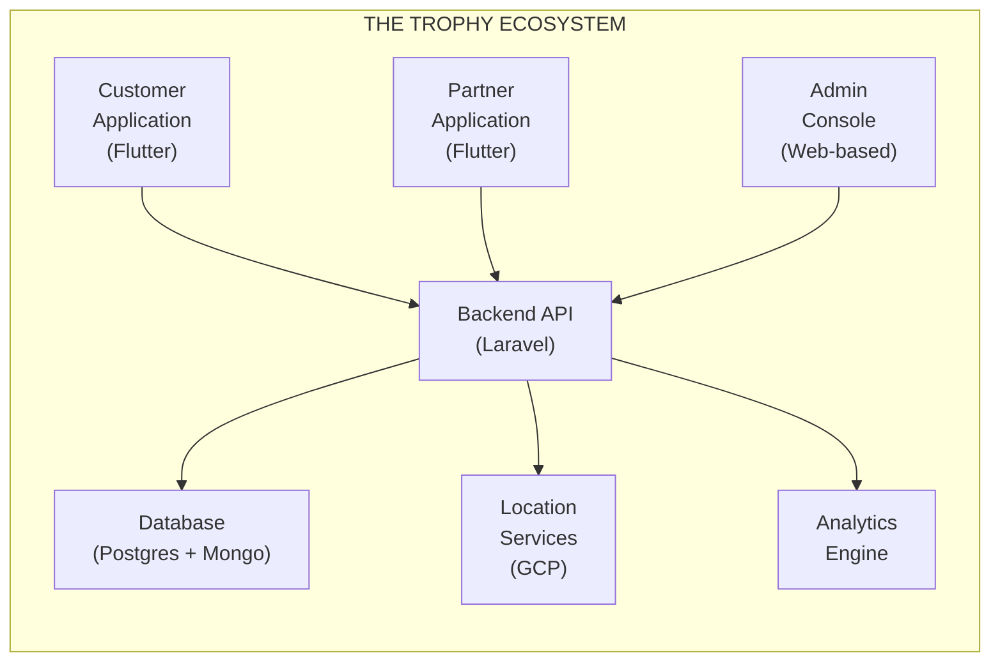

# THE TROPHY: ระบบ Loyalty และการมีส่วนร่วมแบบ Gamification (TH)

## ข้อเสนอโครงการ

**จัดทำให้กับ:** 

**จัดทำโดย:** บริษัท ดิจิทัลมีเดีย เอาท์ซอร์ส โซลูชั่น จำกัด (DOS)

**วันที่:** 29 ธันวาคม 2568

**เวอร์ชันข้อเสนอ:** 2.1

**ใช้ได้ถึง:** 27 มีนาคม 2569

---

## การควบคุมเอกสาร

| เวอร์ชัน | วันที่ | ผู้จัดทำ | การเปลี่ยนแปลง |
| --- | --- | --- | --- |
| 1.0 | 25 ธ.ค. 2568 | ทีม DOS | ข้อเสนอเริ่มต้น |
| 1.1 | 25 ธ.ค. 2568 | Jakapong L | ตรวจทาน |
| 1.2 | 25 ธ.ค. 2568 | ทีม DOS | อัปเดตจากข้อเสนอแนะ |
| 1.3 | 25 ธ.ค. 2568 | ทีม DOS | ปรับระบบ Tiering เป็น 2 ระดับ (Standard / Exclusive) |
| 2.0 | 27 ธ.ค. 2568 | ทีม DOS | อัปเดตตาม Meeting Note 3 – เปลี่ยนชื่อโครงการเป็น “The Trophy”, เพิ่ม Point Transfer, ชี้แจง Wallet, ปรับ Phases, คำแนะนำ QR |
| 2.1 | 29 ธ.ค. 2568 | Jakapong L | ตรวจทานขั้นสุดท้าย |

---

## บทสรุปสำหรับผู้บริหาร

### โอกาสทางธุรกิจ

**The Trophy** เป็นแนวทางใหม่ที่ยกระดับการมีส่วนร่วมของแฟนและการบริหาร Loyalty แทนที่จะเป็นแอปสะสมคะแนนทั่วไป The Trophy ทำหน้าที่เป็น **แพลตฟอร์มประสบการณ์แบบ Gamification แบบครบวงจร** ซึ่งสร้างการเชื่อมต่อคุณค่าอย่างยั่งยืนระหว่าง:

- **องค์กรกีฬา** (สโมสรฟุตบอล / ผู้จัดงาน)
- **พันธมิตรธุรกิจ** (ร้านค้าปลีก ผู้ให้บริการ ผู้สนับสนุน)
- **ผู้ใช้งาน** (แฟน ๆ สมาชิก ลูกค้า)

### คุณค่าเชิงกลยุทธ์ที่นำเสนอ

แพลตฟอร์มเปลี่ยนกิจกรรมประจำวันของแฟนให้เป็นคุณค่าทางธุรกิจที่วัดผลได้ผ่าน **กลไกการมีส่วนร่วมแบบภารกิจ (Mission-based Engagement Mechanics)** โดยใช้ประโยชน์จาก:

- **เทคโนโลยีระบุตำแหน่งแม่นยำ (Precision Location Technology)** (KML / Polygon-based Geofencing)
- **ระบบป้องกันการทุจริตที่แข็งแกร่ง (Robust Fraud Prevention Systems)** (กลไก Anti-cheat ระดับสูง)
- **สถาปัตยกรรม White-label** (เป็นกลางต่อแบรนด์เพื่อความสามารถในการขยายสูงสุด)
- **ข้อมูลเชิงลึกแบบ Data-driven (Data-driven Insights)** (การวิเคราะห์แบบเรียลไทม์และการติดตาม ROI)
- **ระบบ Trophy Wallet** (การจัดการพอยต์แบบรวมศูนย์พร้อมความสามารถในการโอน)

### แนวทางการดำเนินงาน

เพื่อลดความเสี่ยงและเพิ่มการส่งมอบคุณค่าในระยะเริ่มต้น เราเสนอ **แผนงานการดำเนินงานแบบเป็นขั้นตอน (Phased Implementation Roadmap)** ที่สอดคล้องกับวิสัยทัศน์เชิงกลยุทธ์ของคุณ:

**ขั้นตอนที่เสนอเดิม:**

1. MVP
2. Automation / Scaling
3. Ecosystem Expansion

**แนวทางที่เราแนะนำ (Mapped):**

1. **ขั้นตอนที่ 1: Proof of Concept (POC)** – THB 1,000,000
    
    เพิ่มก่อน MVP เพื่อตรวจสอบเทคโนโลยีหลักและลดความเสี่ยง
    
2. **ขั้นตอนที่ 2: Minimum Viable Product (MVP)** – THB 3,000,000 – 5,000,000
    
    สอดคล้องกับขั้นตอน MVP ของแผนเดิม
    
3. **ขั้นตอนที่ 3: Full-scale Ecosystem** – THB ~10,000,000
    
    รวมขั้นตอน “Automation / Scaling” + “Ecosystem Expansion” ของแผนเดิม
    

เราขอแนะนำอย่างยิ่งให้เพิ่มขั้นตอน POC เพื่อตรวจสอบความเป็นไปได้ทางเทคนิค (โดยเฉพาะภารกิจตามตำแหน่งและการเชื่อมต่อกับ Trophy Wallet) ก่อนการลงทุน MVP เต็มรูปแบบ วิธีนี้ช่วยลดความเสี่ยงและช่วยยืนยันว่าโมเดลธุรกิจได้รับการพิสูจน์แล้วด้วยต้นทุนขั้นต่ำ

---

## 1. บริบททางธุรกิจและเหตุผลเชิงกลยุทธ์

### 1.1 ข้อความปัญหา

องค์กรกีฬาและธุรกิจที่ดำเนินการแบบสมาชิกเผชิญกับความท้าทายสำคัญในการสร้างความผูกพันกับลูกค้าในยุคปัจจุบัน:

**ความท้าทายที่ 1: การมีส่วนร่วมของแฟนคลับต่ำนอกช่วงเวลาจัดกิจกรรม**

- การมีปฏิสัมพันธ์กับแฟนคลับจำกัดเฉพาะวันแข่งขันหรือช่วงงานกิจกรรมเท่านั้น
- ไม่มีจุดสัมผัสต่อเนื่องเพื่อรักษาการรับรู้แบรนด์
- พลาดโอกาสในการสร้างความสัมพันธ์ตลอดทั้งปี

**ความท้าทายที่ 2: การบริหาร Ecosystem ของพันธมิตรที่ไม่มีประสิทธิภาพ**

- กระบวนการแบบ Manual สำหรับการจัดสรรสิทธิประโยชน์ให้พันธมิตร
- ความยากลำบากในการติดตาม ROI และประสิทธิผลของแคมเปญร่วมกับพันธมิตร
- มองเห็นข้อมูลเกี่ยวกับผลการดำเนินงานของพันธมิตรได้อย่างจำกัด

**ความท้าทายที่ 3: ความซับซ้อนในการกระจายสิทธิประโยชน์**

- การตรวจสอบการเข้าถึง VIP และสิทธิ์จอดรถแบบ Manual
- ค่าใช้จ่ายในการดำเนินงานสูงสำหรับการยืนยันสิทธิประโยชน์
- ช่องโหว่ด้านการฉ้อโกงในระบบกระดาษแบบดั้งเดิม

**ความท้าทายที่ 4: พลาดโอกาสสร้างรายได้**

- สินทรัพย์ของสโมสรที่ไม่ได้ใช้ประโยชน์เต็มที่ (สนามฝึกซ้อม พื้นที่ VIP)
- การสร้างรายได้จาก Loyalty และการมีส่วนร่วมของแฟนคลับยังจำกัด
- ไม่สามารถสร้างช่องทางรายได้ใหม่จากทรัพยากรที่มีอยู่

### 1.2 โซลูชัน The Trophy

The Trophy แก้ไขความท้าทายเหล่านี้ผ่านระบบนิเวศดิจิทัลแบบครบวงจร ดังนี้:

**สร้างการมีส่วนร่วมอย่างต่อเนื่อง**

- Gamification ในรูปแบบ Mission ทำให้ผู้ใช้มีส่วนร่วมได้ตลอดทั้งปี
- โอกาสสัมผัสจุดติดต่อหลายช่องทางนอกเหนือจากวันจัดกิจกรรม
- ประสบการณ์แบบ Personalization ตามพฤติกรรมและความชอบของผู้ใช้

**เปิดใช้งานการจัดการพันธมิตรแบบอัตโนมัติ**

- เครื่องมือตรวจสอบดิจิทัลสำหรับการยืนยันพันธมิตร
- การติดตาม ROI และ Analytics แบบเรียลไทม์
- เวิร์กโฟลว์การแจกจ่ายและแลกแต้มแบบอัตโนมัติ

**ปรับปรุงกระบวนการกระจายสิทธิประโยชน์**

- การตรวจสอบดิจิทัลแทนที่กระบวนการ Manual
- ระบบตรวจสอบที่ปลอดภัยด้วย QR Code
- ป้องกันการฉ้อโกงด้วยการตรวจสอบหลายชั้น

**ปลดล็อกช่องทางรายได้ใหม่**

- สร้างรายได้จากสินทรัพย์ของสโมสรผ่านการแลกแต้ม
- โอกาสสร้างรายได้จากการได้มาซึ่งพันธมิตรใหม่
- ข้อมูลเชิงลึกเพื่อสนับสนุนการตัดสินใจเชิงกลยุทธ์

### 1.3 เหตุผลของกลยุทธ์ White-label

**หลักการสำคัญ:** แพลตฟอร์มรักษาความเป็นกลางของแบรนด์อย่างสมบูรณ์ – ไม่มีชื่อสโมสร โลโก้ หรือสีของแบรนด์ใดปรากฏในอินเทอร์เฟซหลักของแอปพลิเคชัน

**ประโยชน์เชิงกลยุทธ์:**

1. **ความยืดหยุ่นในการขยายตลาด:** แพลตฟอร์มสามารถให้บริการองค์กรกีฬา / ธุรกิจหลายแห่งพร้อมกันได้
2. **ลดความอ่อนไหวต่อการแข่งขัน:** พันธมิตรและผู้ใช้จากสังกัดที่แข่งขันกันสามารถเข้าร่วมได้อย่างสบายใจ
3. **การดึงดูดใจแบบสากล:** โฟกัสที่ Value และสิทธิประโยชน์มากกว่าความภักดีต่อแบรนด์ใดแบรนด์หนึ่ง
4. **รองรับการขยายตัว:** แพลตฟอร์มเดียวรองรับ Deployment แบบ White-label ได้หลาย Instance

**หมายเหตุการใช้งาน:** แม้แพลตฟอร์มจะเป็นกลางต่อแบรนด์ แต่ผู้ใช้ยังคงเข้าถึงสินทรัพย์พิเศษของสโมสร (การเยี่ยมชมสนามฝึกซ้อม ที่นั่ง VIP) ผ่านระบบการแลกแต้มได้

---

## 2. สถาปัตยกรรมโซลูชันและการออกแบบทางเทคนิค

### 2.1 ภาพรวมระบบ

ระบบนิเวศ The Trophy ประกอบด้วยแอปพลิเคชันที่เชื่อมต่อกัน 3 ส่วน บน Backend ร่วมเดียวกัน:

### 2.2 แอปพลิเคชันลูกค้า (User Super App)

**ผู้ใช้เป้าหมาย:** แฟนคลับ สมาชิก ประชาชนทั่วไป

**ฟีเจอร์หลัก: Trophy Wallet**

- **การจัดการแต้ม Awards:** กระเป๋าเงินกลางสำหรับแต้มทั้งหมดที่ผู้ใช้ได้รับ
- **การโอนแต้ม (เข้า / ออก):**
    - โอนแต้มไปยัง / จากโปรแกรม Loyalty ของพันธมิตร
    - เชื่อมต่อกับระบบ Reward ของบัตรเครดิต (บางผู้ให้บริการอาจอนุญาตเฉพาะการอัปโหลดแบบ Manual)
    - แลกเปลี่ยนแต้มกับ Ecosystem ภายนอก
- **ประวัติการทำธุรกรรม:** Audit Trail ของการเคลื่อนไหวแต้มทั้งหมด
- **ภาพรวมยอดคงเหลือ:** ยอดแต้มและมูลค่าแบบเรียลไทม์

*หมายเหตุ: ฟีเจอร์การโอนแต้มจะถูกออกแบบพร้อม Economic Controls เพื่อป้องกันการใช้ในทางที่ผิดและรักษาเสถียรภาพของมูลค่าแต้ม ขอบเขตการโอนและกฎการตรวจสอบสามารถกำหนดค่าได้โดยผู้ดูแลระบบ*

**Mission Center**

- **ภารกิจตามตำแหน่ง:** เช็กอินที่โลเคชันพันธมิตรโดยใช้ KML / Polygon Geofencing ที่แม่นยำ (ไม่ใช้รัศมีวงกลมอย่างเดียว)
- **ภารกิจตามการกระทำ:** การยืนยันด้วยภาพถ่ายกับพนักงานที่กำหนด
- **ภารกิจตามเวลา:** เข้าร่วมกิจกรรม / ดูการแข่งขัน (ยืนยันผ่านตำแหน่ง)
- **ภารกิจตามการซื้อ:** ช้อปที่โลเคชันพันธมิตรพร้อมยืนยันใบเสร็จผ่าน Partner App
- **ภารกิจโซเชียล:** แชร์คอนเทนต์ มีส่วนร่วมบนโซเชียลมีเดีย

**ระบบแลกรางวัล (Redemption)**

- เรียกดู Reward Catalog หรือดูแบบแผนที่
- กรองตามหมวดหมู่: ประสบการณ์พิเศษ การเข้าถึง VIP ส่วนลดจากพันธมิตร สินค้า
- สร้างคูปองดิจิทัลพร้อม QR Code
- ประวัติการแลกและการติดตาม
- การแจ้งเตือนและเตือนวันหมดอายุ

**ระบบการจัดระดับ (Tiering)**

- ระดับสมาชิก Standard / Exclusive
- สิทธิประโยชน์เฉพาะ Tier และภารกิจพิเศษ
- การติดตามความคืบหน้าและเงื่อนไขการอัปเกรด Tier
- รางวัลพิเศษและการเข้าถึง Benefit เฉพาะ Tier

**โปรไฟล์ผู้ใช้และ Engagement**

- ยอดแต้มและประวัติการทำธุรกรรม
- สถิติภารกิจที่ทำสำเร็จ
- Leaderboard (องค์ประกอบการแข่งขันเพิ่มเติม)
- การตั้งค่าความชอบและ Notification Preferences

**การยืนยันตัวตน (Authentication)**

- **หมายเลขโทรศัพท์มือถือ (หลัก):** ยืนยันตัวตนด้วยเบอร์มือถือ
- **เปลี่ยนหมายเลขโทรศัพท์มือถือ:** ให้ผู้ใช้อัปเดตเบอร์ที่ลงทะเบียนได้อย่างปลอดภัย
- การยืนยันด้วย One-time Password (OTP)

*หมายเหตุ: เราแนะนำ Authentication ด้วยหมายเลขโทรศัพท์มือถือเป็นหลัก (แทน Social Login) เพื่อความปลอดภัยที่ดีกว่า ความสอดคล้องของข้อมูล และการป้องกันการฉ้อโกง ฟีเจอร์ “เปลี่ยนหมายเลขโทรศัพท์มือถือ” รองรับกรณีที่ผู้ใช้เปลี่ยนเบอร์*

**Technical Highlights:**

- พัฒนาโดยใช้ Flutter เพื่อประสิทธิภาพระดับ Native ทั้งบน iOS และ Android
- การซิงโครไนซ์ข้อมูลแบบเรียลไทม์กับ Backend
- Push Notification สำหรับ Mission และ Reward ใหม่ (ผ่าน OneSignal)
- รองรับการยืนยันตัวตนที่ปลอดภัย พร้อมความสามารถในการต่อยอด Social Login ในอนาคต

### 2.3 แอปพลิเคชันพันธมิตร (เครื่องมือตรวจสอบและให้บริการ)

**ผู้ใช้เป้าหมาย:** พนักงานพันธมิตร พนักงานสโมสร ผู้จัดกิจกรรม

**ฟีเจอร์หลัก: QR Scanner และการตรวจสอบ (Hybrid Earn & Redeem)**

- **แนวทางที่แนะนำ:** ระบบ QR แบบ Hybrid สำหรับการปฏิบัติงานที่ลื่นไหล
- ใช้ QR Code เดียวสำหรับทั้งการรับแต้มและการแลกแต้ม
- พนักงานพันธมิตรสามารถมอบแต้มหรือแลกรางวัลได้ในการสแกนครั้งเดียว
- ลดความซับซ้อนและยกระดับประสบการณ์ของผู้ใช้หน้างาน
- สแกน QR Code ของผู้ใช้เพื่อยืนยันตัวตนและสิทธิ์
- มอบแต้มสำหรับภารกิจที่สำเร็จ (เช่น บริการล้างรถ)
- แลกคูปองและสิทธิประโยชน์ของผู้ใช้

**การตรวจสอบภารกิจ (Mission Verification)**

- อินเทอร์เฟซอนุมัติภารกิจที่ต้องใช้รูปภาพ
- การตรวจสอบแบบ Manual สำหรับภารกิจที่ซับซ้อน
- การปฏิเสธพร้อมเหตุผลแจ้งกลับไปยังผู้ใช้
- รองรับการอนุมัติเป็นชุด (Batch Approval)

*หมายเหตุ: เราเสนอให้ใช้พนักงานพันธมิตรในการตรวจสอบภาพถ่ายแทนการใช้ AI Object Detection เพียงอย่างเดียว ซึ่งให้ (1) ต้นทุนด้านการพัฒนาและดูแล AI ที่ต่ำกว่า (2) ความแม่นยำที่ดีขึ้นจากการตัดสินของมนุษย์ (3) Human Touch และ Engagement ระหว่างพนักงานและผู้ใช้ปลายทาง ทั้งนี้สามารถเพิ่ม AI-assisted Verification ใน Phase ถัดไปได้หากจำเป็น*

**Partner Dashboard (Light)**

- สถิติรายวัน / รายสัปดาห์เกี่ยวกับการมีส่วนร่วมของลูกค้า
- แต้มที่มอบและแต้มที่ถูกแลก
- ภารกิจและรางวัลยอดนิยม
- ความคิดเห็นและคะแนนจากลูกค้า

**Technical Highlights:**

- แอปมือถือ Flutter (iOS / Android)
- อินเทอร์เฟซเรียบง่าย ใช้งานง่ายสำหรับพนักงานที่ไม่ใช่สายเทคนิค
- การยืนยันตัวตนของพันธมิตรอย่างปลอดภัย

### 2.4 Admin Console (ศูนย์บัญชาการและควบคุมกลาง)

**ผู้ใช้เป้าหมาย:** ผู้ดูแลระบบแพลตฟอร์ม ผู้จัดการธุรกิจ นักวิเคราะห์ข้อมูล

**ฟีเจอร์หลัก: Real-time Dashboard**

- ผู้ใช้ที่ใช้งานอยู่ (Active Users) และ Session Metrics
- การหมุนเวียนแต้ม (มอบ / แลก)
- อัตราการทำภารกิจสำเร็จ
- ภาพรวมผลการดำเนินงานของพันธมิตร
- การติดตามรายได้และ ROI

**การจัดการภารกิจ (Mission Management)**

- สร้างและตั้งค่าภารกิจ (ตามตำแหน่ง การกระทำ เวลา)
- ตั้งค่า Reward Points และ Eligibility Criteria
- กำหนด Polygon Geofence โดยใช้ข้อมูล KML
- ตั้งค่าช่วงเวลาที่ภารกิจเปิดให้ทำ (วันเริ่มต้น / สิ้นสุด)
- ติดตาม Performance ของภารกิจและระดับ Engagement

**Polygon & Geofence Manager**

- นำเข้าไฟล์ KML จาก Google Maps
- รองรับหลาย Polygon สำหรับพื้นที่ที่มีรูปทรงซับซ้อน
- เครื่องมือทดสอบเพื่อยืนยันความแม่นยำของตำแหน่ง

**Reward Catalog Management**

- สร้างและจัดการรายการรางวัล
- ตั้งค่าต้นทุนแต้มและช่วงความพร้อมใช้งาน
- อัปโหลดรูปภาพและคำอธิบาย (รองรับสองภาษา ไทย / อังกฤษ)
- ติดตามอัตราการแลกและความนิยมของรางวัล

**Partner Management**

- เพิ่มพันธมิตรใหม่พร้อมข้อมูลพื้นฐาน
- ตั้งค่าขอบเขตการจัดสรรแต้มต่อพันธมิตร
- ติดตามกิจกรรมและ Compliance ของพันธมิตร
- สร้างรายงานผลการดำเนินงานของพันธมิตร

**Fraud Detection & Prevention**

- แจ้งเตือนเมื่อพบพฤติกรรมเช็กอินผิดปกติ
- ติดตามกิจกรรมผู้ใช้ที่น่าสงสัย
- Audit Log สำหรับกิจกรรมของพันธมิตรเกี่ยวกับการให้แต้ม
- การจัดการบัญชีดำและการระงับบัญชีผู้ใช้
- การตรวจจับการปลอมแปลง GPS

**User Management**

- โปรไฟล์ผู้ใช้และประวัติกิจกรรม
- การปรับแต้มแบบ Manual (พร้อม Audit Log)
- การจัดการ Tier และการอัปเกรดแบบ Manual (Standard / Exclusive)
- อินเทอร์เฟซรับ Ticket สนับสนุนลูกค้าขั้นพื้นฐาน

**Trophy Wallet Admin**

- การติดตามและอนุมัติการโอนแต้ม (กรณีต้องอนุมัติ)
- การจัดการการเชื่อมต่อกับ Ecosystem ภายนอก
- การตั้งค่า Limit และกฎการโอนแต้ม
- ติดตามสุขภาพทางเศรษฐกิจ (Point Liability / Circulation)

**Analytics & Reporting**

- ตัวสร้างรายงานแบบ Custom
- Export ข้อมูล (CSV, PDF)
- Cohort Analysis และ User Segmentation
- เครื่องมือคำนวณ ROI ของพันธมิตร
- Predictive Analytics สำหรับการพยากรณ์ Point Liability

**Technical Highlights:**

- Web Interface แบบ Responsive (Vue.js หรือ React)
- Role-based Access Control (Admin, Manager, Support, Analyst)
- Data Visualization ขั้นสูง (Charts, Heatmaps)
- เชื่อมต่อ Google Maps API สำหรับ Geofencing

---

## 3. แผนงานการใช้งานและการแบ่งระยะ

### 3.1 Phase 1: Proof of Concept (POC)

**วัตถุประสงค์:** ตรวจสอบความเป็นไปได้ของเทคโนโลยีหลักและสมมติฐานทางธุรกิจด้วยการลงทุนขั้นต่ำ

**ระยะเวลา:** 8–10 สัปดาห์

**งบประมาณ:** THB 1,000,000

**ผลลัพธ์สำคัญ: Customer App (Basic)**

- User Registration และ Authentication (เบอร์โทรศัพท์)
- Simple Location-based Check-in (ใช้ Basic Geofencing)
- การแสดงยอดแต้มที่ได้รับ (Point Accumulation Display)
- Basic Profile Management
- Trophy Wallet Prototype (ดูยอดคงเหลือและประวัติธุรกรรมพื้นฐาน)

**Partner App (Prototype)**

- QR Scanner สำหรับ User Verification
- อินเทอร์เฟซสำหรับมอบแต้มแบบ Manual

**Admin Console (Essential)**

- Dashboard พื้นฐาน แสดงจำนวนผู้ใช้และยอดแต้มรวม
- Simple Mission Creation (แบบ Location-based เท่านั้น)
- การจัดการผู้ใช้และพันธมิตรแบบ Manual

**Backend Infrastructure**

- Basic API สำหรับ User, Mission และ Point Management
- Simple Database Schema
- Authentication Service

**Testing & Validation**

- Pilot Test กับผู้ใช้ทดลอง 50–100 คน
- Partner Locations 3–5 แห่งสำหรับทดสอบ
- Basic Fraud Prevention (เช่น Rate Limiting)

**Success Criteria:**

- ผู้ใช้สามารถทำ Location-based Missions ได้สำเร็จ
- การมอบและติดตามแต้มทำงานได้ถูกต้อง
- Workflow การยืนยันจากพันธมิตรทำงานสมบูรณ์
- ไม่มีช่องโหว่ด้านความปลอดภัยระดับร้ายแรง

**Exclusions (ย้ายไป Phase ถัดไป):**

- Advanced Fraud AI
- Mission รูปแบบซับซ้อน (เช่น Photo Verification ระดับ Production)
- ระบบสมาชิก 2 ระดับ (Full Tiering)
- Reward Redemption เต็มรูปแบบ
- Advanced Analytics
- Point Transfer Functionality
- Production-grade Security Hardening
- การปล่อยขึ้น App Store / Play Store (ใช้ TestFlight / Internal Testing)

### 3.2 Phase 2: Minimum Viable Product (MVP)

**วัตถุประสงค์:** เปิดตัวระบบที่พร้อมใช้งานจริงพร้อมฟีเจอร์หลักสำหรับการดึงดูด Users และ Partners ในโลกจริง

**ระยะเวลา:** 16–20 สัปดาห์

**งบประมาณ:** THB 3,000,000 – 5,000,000

**ผลลัพธ์สำคัญ: Customer App (Production)**

- Mission ครบชุด: Location, Action (Photo), Time-based
- Reward Redemption พร้อมการสร้าง QR Coupon
- Two-tier System (Standard / Exclusive)
- UI / UX ที่ปรับปรุง พร้อม Onboarding Flow
- Push Notifications สำหรับ Missions และ Rewards
- ความสามารถในการแชร์ลง Social
- **Trophy Wallet (Full):**
    - Complete Point Management
    - Point Transfer (Inbound / Outbound) กับ Partner Ecosystems
    - Transaction History และ Export
    - Transfer Limits และ Validation

**Partner App (Full)**

- QR Scanning สำหรับทั้ง Validation และ Redemption (Hybrid Approach)
- อินเทอร์เฟซอนุมัติภารกิจแบบใช้รูปภาพ (Staff Verification)
- Partner Dashboard พร้อม Analytics พื้นฐาน
- รายงานรายวัน / รายสัปดาห์

**Admin Console (Operational)**

- Dashboard ครบถ้วนพร้อม Real-time Metrics
- Advanced Mission Creation ครบทุกประเภท
- KML / Polygon Geofence Tools
- Reward Catalog Management
- Partner Onboarding & Management
- Basic Fraud Detection Alerts
- User Support Tools
- Trophy Wallet Admin Controls (การมอนิเตอร์การโอนแต้มและ Limit)

**Backend Infrastructure (Scalable)**

- Production-grade API พร้อม Authentication และ Authorization
- Database Design ที่ Optimize สำหรับ Scale
- Cloud Deployment (GCP)
- Monitoring และ Logging พื้นฐาน
- Automated Backups

**Security & Compliance**

- HTTPS Encryption
- Secure Token-based Authentication
- PDPA Compliance (กฎหมายคุ้มครองข้อมูลส่วนบุคคลของไทย)
- กลไกป้องกันการโกงพื้นฐาน (เช่น GPS Spoofing Detection, Rate Limiting)
- Partner Audit Trails

**Testing & Launch**

- UAT / SIT แบบครอบคลุม
- Load Testing สำหรับเป้าหมาย 10,000 Concurrent Users
- Security Penetration Testing
- Beta Launch กับกลุ่ม Early Adopters
- Post-launch Monitoring & Support

**Success Criteria:**

- รองรับผู้ใช้ที่ Active จริง 5,000+ คน
- มี Partner Locations ที่ Onboard แล้ว 20+ แห่ง
- Mission Completion Rate > 30%
- Reward Redemption Rate > 15%
- ไม่มี Critical Bugs ใน Production
- System Uptime > 99%

**หมายเหตุ:** ตัวชี้วัดความสำเร็จขึ้นอยู่กับงบประมาณด้าน User Acquisition และ Marketing Campaign ของลูกค้า DOS จะออกแบบระบบให้รองรับ Digital Marketing Integration แต่ไม่รวมบริการการตลาด

**Exclusions (ย้ายไป Phase 3):**

- Advanced AI-based Fraud Detection
- Analytics ขั้นสูงและ Predictive Models ระดับลึก
- Deployment แบบ Multiple White-label Instances
- Advanced Personalization Engine
- Third-party Integrations (เช่น CRM, Marketing Automation)

### 3.3 Phase 3: Full-scale Ecosystem

**วัตถุประสงค์:** สร้างแพลตฟอร์มที่ครบครันพร้อมฟีเจอร์ขั้นสูง รองรับการขยายขนาดหลายระบบ และ Analytics ที่ซับซ้อน

**Original Vision Alignment:** Phase นี้รวม “Automation / Scaling” และ “Ecosystem Expansion” ให้เป็นความพยายามพัฒนารวมศูนย์

**ระยะเวลา:** 24–30 สัปดาห์

**งบประมาณ:** THB ~10,000,000

**ผลลัพธ์สำคัญ: Advanced Features**

- AI-powered Fraud Detection และ Anomaly Prevention
- Personalization Engine สำหรับ Mission Recommendations
- ความสามารถ Tiering ระดับ Advanced และ Custom Tier
- Gamification Enhancements (Badges, Achievements, Streaks)
- **Pay with Points:** ระบบส่วนลดแบบ Real-time กับพันธมิตร
    - พันธมิตรเสนอส่วนลดทันทีสำหรับสินค้า / บริการ
    - Real-time Point Redemption (ไม่ใช่ Discount Voucher ที่ Fix ไว้ล่วงหน้า)
    - Dynamic Pricing และการคำนวณมูลค่าแต้มแบบยืดหยุ่น

**Platform Scalability (Automation / Scaling)**

- Multi-tenant White-label Architecture
- การปรับแต่งระดับองค์กร (Theme, Branding)
- API สำหรับ Third-party Integrations
- Webhook Support สำหรับ External Systems
- Multi-language Support (เพิ่มเติมจากไทย / อังกฤษ)
- Automated Partner Onboarding Workflows
- Auto-scaling Infrastructure

**Ecosystem Expansion**

- Advanced Trophy Wallet Integrations
- ระบบ Reward ของบัตรเครดิต
- Banking Loyalty Programs
- การแลกเปลี่ยนคะแนนข้ามหลายแบรนด์ (Multi-brand Point Exchanges)
- เครื่องมือช่วยขยาย Partner Network
- API Marketplace สำหรับ Third-party Developers
- Cross-ecosystem Point Transfer Protocols

**Analytics & Intelligence**

- Predictive Analytics สำหรับ Point Liability Forecasting
- Machine Learning สำหรับ User Segmentation
- Churn Prediction และ Retention Campaigns
- Algorithm ปรับ ROI ของพันธมิตร
- Custom Reporting API สำหรับ Enterprise Clients

**Enterprise Integrations**

- CRM Integration (เช่น Salesforce, HubSpot)
- Marketing Automation (Email / SMS Campaigns)
- Payment Gateway สำหรับ Premium Features
- Social Media Platform APIs
- E-commerce Platform Connections

**Advanced Security**

- Biometric Authentication (ลายนิ้วมือ Face ID)
- Advanced GPS Spoofing Detection
- การเตรียมความพร้อมสำหรับ SOC 2 Compliance
- Enhanced Audit Trails และ Compliance Reporting

**Operational Excellence**

- Monitoring & Alerting ตลอด 24/7
- Auto-scaling Infrastructure
- Disaster Recovery และ Business Continuity Plan
- Advanced DevOps และ CI/CD Pipelines
- Performance Optimization สำหรับผู้ใช้ 100,000+ คน

**Success Criteria:**

- รองรับ Concurrent Active Users 50,000+ คน
- Partner Locations 100+ แห่งข้ามหลายองค์กร
- Advanced Fraud Detection ที่มี False Positive < 1%
- 99.9% Uptime SLA
- Partner Onboarding แบบ Self-service ครบวงจร

**หมายเหตุ:** ตัวชี้วัดความสำเร็จขึ้นอยู่กับงบประมาณของลูกค้าสำหรับการขยายการดำเนินงานและ Marketing Execution DOS จัดหา Technical Platform ลูกค้ารับผิดชอบด้านกลยุทธ์และการตลาด

---

## 4. Technology Stack & Architecture

### 4.1 Mobile Applications (Customer & Partner)

- **Framework:** Flutter (Single Codebase สำหรับ iOS & Android)
- **Key Tech:** Provider / Riverpod (State Management), Google Maps, OneSignal (Push Notification), Pusher (Real-time), Hive / SQLite (Local DB)

### 4.2 Admin Console (Web App)

- **Framework:** React หรือ Vue.js
- **Key Tech:** Material UI / Ant Design, Redux / Vuex, Chart.js / D3.js (Data Visualization)

### 4.3 Backend Services

- **Framework:** Laravel (PHP)
- **Key Tech:** RESTful API, JWT Auth, Laravel Queues (Background Jobs), Swagger (API Docs)

### 4.4 Database & Storage

- **Primary DB:** PostgreSQL (Transactions & Points)
- **Secondary DB:** MongoDB (Logs & Configs), Redis (Caching)
- **Storage:** GCP Cloud Storage (Files & Images)

### 4.5 Cloud Infrastructure

- **Platform:** Google Cloud Platform (GCP)
- **Services:** GKE / Cloud Run (Compute), Cloud SQL, Cloud Functions

### 4.6 Third-party Services

- **Tools:** Google Maps Platform, OneSignal, Pusher, SendGrid / Twilio, Sentry (Error Tracking)

---

## 5. Risk Management & Security

### 5.1 Fraud Prevention Strategy

**Risk Category 1: User Gaming / ภัยคุกคามจากผู้ใช้ทั่วไป**

- GPS Spoofing เพื่อปลอม Location Check-in
- Check-in ซ้ำ ๆ เพื่อสะสมแต้ม
- ส่งรูปปลอม
- ใช้หลาย Account ต่อคนเดียว

**กลยุทธ์การบรรเทาความเสี่ยง:**

- **GPS Validation:** ตรวจสอบข้อมูล GPS ควบคู่กับ Cell Tower / Wi-Fi Location
- **Rate Limiting:** จำกัดความถี่การ Check-in (เช่น สูงสุด 1 Check-in ต่อ Location ต่อวัน)
- **Device Fingerprinting:** ติดตาม Device ID เฉพาะเพื่อป้องกัน Multi-account Abuse
- **Photo Verification:** ตรวจสอบโดยบุคลากร (Partner Staff หรือทีม Admin)
- **Behavioral Analysis:** ตรวจจับ Pattern พฤติกรรมที่ผิดปกติ

**Risk Category 2: Partner Fraud / ภัยคุกคามจากฝั่งพันธมิตร**

- พันธมิตรให้แต้มโดยไม่มี Transaction จริง
- สมรู้ร่วมคิดระหว่างพันธมิตรและผู้ใช้
- ให้แต้มเกิน Limit
- การแลกแต้มปลอมเพื่อปรับยอดคงเหลือของผู้ใช้

**กลยุทธ์การบรรเทาความเสี่ยง:**

- **Daily Caps:** จำกัดจำนวนแต้มที่พันธมิตรให้ได้ต่อวัน
- **Audit Trails:** เก็บ Log อย่างครบถ้วนของทุกกิจกรรมของพันธมิตรพร้อม Timestamp
- **Anomaly Detection:** แจ้งเตือนเมื่อพฤติกรรมของพันธมิตรเบี่ยงเบนจาก Pattern ปกติ
- **Random Audits:** สุ่มตรวจสอบ Transaction ของพันธมิตรเป็นระยะ
- **Reputation System:** คะแนนประเมินผลงานพันธมิตร พร้อมความสามารถในการระงับการใช้งาน

**Risk Category 3: System Abuse / ภัยคุกคามเชิงระบบ**

- API Abuse และการโจมตีด้วย Bot อัตโนมัติ
- Point Inflation ผ่านช่องโหว่ของระบบ
- การเข้าถึงฟังก์ชัน Admin โดยไม่ได้รับอนุญาต

**กลยุทธ์การบรรเทาความเสี่ยง:**

- **API Rate Limiting:** จำกัด Request ต่อ User / IP
- **CAPTCHA:** สำหรับ Action สำคัญ
- **Role-based Access Control:** กำหนดสิทธิ์ Admin อย่างเข้มงวด
- **Security Audits:** Penetration Testing เป็นประจำ
- **Bug Bounty Program:** สร้างแรงจูงใจให้เปิดเผยช่องโหว่อย่างรับผิดชอบ

### 5.2 Economic Control & Point Management

**Point Liability Management / ความท้าทาย:** แต้มแทนหนี้สินทางการเงิน องค์กรต้องสามารถรองรับการแลกแต้มได้โดยไม่สร้างต้นทุนเกินควร

**กลยุทธ์:**

- **Point Expiry:** แต้มหมดอายุภายใน 12 เดือน (ปรับแต่งได้)
- **Redemption Limits:** จำกัดมูลค่าการแลกรวมต่อผู้ใช้ต่อเดือน
- **Reserve Ratio:** รักษาเงินสำรองในสัดส่วนที่เหมาะสมกับ Outstanding Points
- **Inflation Control:** ติดตามการหมุนเวียนแต้มและปรับ Reward แบบ Dynamic
- **Transfer Controls:** Limit การโอนแต้มเพื่อป้องกันการใช้ในทางที่ผิดเชิงเศรษฐกิจ

*หมายเหตุ: ฟีเจอร์ Point Transfer จะมี Economic Controls เข้มงวด ได้แก่ (1) Daily / Monthly Transfer Limits ต่อผู้ใช้ (2) Transfer Fees เพื่อเบรกการใช้งานที่ไม่เหมาะสม (3) การอนุมัติจาก Admin สำหรับรายการโอนวงเงินสูง (ตัวเลือก) (4) Real-time Monitoring ของ Pattern การโอนเพื่อตรวจจับ Fraud Controls เหล่านี้ช่วยปกป้องเศรษฐกิจของแต้มพร้อมเปิดทางให้เชื่อมต่อ Ecosystem ภายนอกได้อย่างปลอดภัย*

**Point Economy Balancing / วัตถุประสงค์:** รักษาสมดุลระหว่างแต้มที่มอบ (Inflow) และแต้มที่ถูกแลก (Outflow)

**ตัวชี้วัดหลัก:**

- **Burn Rate:** เปอร์เซ็นต์ของแต้มที่ถูกแลก
- **Velocity:** เวลาเฉลี่ยระหว่างการมอบแต้มและการแลกแต้ม
- **Inflation Rate:** อัตราการเติบโตของ Outstanding Points
- **Redemption Ratio:** เป้าหมาย 60–80% ของแต้มถูกแลกก่อนหมดอายุ
- **Transfer Volume:** ติดตาม Volume การโอนแต้มเข้า / ออก

**เครื่องมือ:**

- Real-time Economic Dashboard
- Automated Alerts เมื่อสัดส่วนผิดปกติ
- Dynamic Reward Pricing
- Predictive Modeling สำหรับการพยากรณ์ Point Liability

### 5.3 Data Security & Privacy Compliance

**PDPA Compliance (พระราชบัญญัติคุ้มครองข้อมูลส่วนบุคคลของไทย)**

**ข้อกำหนดหลัก:**

- ขอความยินยอม (Explicit Consent) ในการเก็บและประมวลผลข้อมูล
- นโยบายความเป็นส่วนตัว (Privacy Policy) ภาษาไทยที่ชัดเจน
- สิทธิ์ของผู้ใช้: เข้าถึง แก้ไข ลบ และ Data Portability
- กระบวนการแจ้งเตือนเหตุ Data Breach

**แนวทางการดำเนินการ:**

- ระบบ Consent Management ระหว่าง Registration
- แสดง Privacy Policy และ Terms ให้ผู้ใช้ยืนยัน
- ฟังก์ชัน Export ข้อมูลของผู้ใช้
- กระบวนการลบข้อมูลอย่างปลอดภัย

**Security Best Practices**

- **Data Encryption:** เข้ารหัสข้อมูลทั้งขณะจัดเก็บและระหว่างส่งผ่าน (TLS 1.3)
- **Access Controls:** ใช้หลัก Least-privilege ในการกำหนดสิทธิ์เข้าถึง
- **Regular Backups:** สำรองข้อมูลรายวัน พร้อมเก็บย้อนหลังอย่างน้อย 30 วัน
- **Incident Response Plan:** แผนรับมือเหตุด้านความปลอดภัยที่จัดทำเป็นเอกสารชัดเจน
- **Regular Updates:** อัปเดต Patch ด้านความปลอดภัยและ Dependency อย่างต่อเนื่อง

### 5.4 Operational Risks & Mitigation

**ความเสี่ยง: System Downtime**

- **ผลกระทบ:** ผู้ใช้ไม่พอใจ สูญเสียโอกาส Engagement และกระทบพันธมิตร

**การบรรเทา:**

- สถาปัตยกรรม High Availability (Multi-zone Deployment)
- Auto-scaling รองรับ Traffic สูงชั่วคราว
- เป้าหมาย Uptime 99.9% (ตามระดับ Phase)
- Incident Response Runbook

**ความเสี่ยง: User Adoption ต่ำ**

- **ผลกระทบ:** ROI ต่ำ Business Case ไม่ถึงเป้าหมาย

**การบรรเทา:**

- User Research และ UX Testing ก่อน Launch
- Phased Roll-out กับ Early Adopter Program
- เก็บ Feedback อย่างต่อเนื่องและปรับปรุงตามจริง
- ปรับปรุง Onboarding และ Education ภายในแอป

**ความเสี่ยง: Partner Churn**

- **ผลกระทบ:** Value Proposition สำหรับผู้ใช้ลดลง

**การบรรเทา:**

- แสดง ROI ชัดเจนให้พันธมิตรเห็น
- รายงาน Performance ของพันธมิตรอย่างสม่ำเสมอ
- มีทีม Partner Success Support
- โมเดลความร่วมมือที่ยืดหยุ่น

**ความเสี่ยง: Scope Creep & Budget Overrun**

- **ผลกระทบ:** ส่งมอบล่าช้าและงบประมาณเกิน

**การบรรเทา:**

- แบ่งเป็น Phase พร้อม Deliverable ที่ชัดเจน
- ใช้กระบวนการ Change Request พร้อมวิเคราะห์ผลกระทบ
- ประชุม Alignment กับ Stakeholder เป็นประจำ
- กัน Buffer งบประมาณ 10–15%

### 5.5 Feature Concerns & Recommendations

**Send Points to Friends**

- ฟีเจอร์นี้สร้างความกังวลด้านเสถียรภาพเศรษฐกิจของแต้ม Peer-to-peer Transfers อาจเปิดช่องให้
    
    (1) Point Farming ผ่านการใช้หลาย Account
    
    (2) การหมุนเวียนแต้มที่ไม่ถูกควบคุม ส่งผลต่อ Balance โดยรวม
    
    (3) การซื้อขายแต้มใน Gray Market
    

หากจำเป็นต้องมีฟีเจอร์นี้ เราแนะนำให้ Implement ใน Phase 3 พร้อม Controls ที่เข้มงวด เช่น Transfer Limits, Transaction Fees, Cooling Periods และ Fraud Monitoring

**In-app Marketplace (ซื้อของช่วยทำ Quest)**

- เราไม่แนะนำให้มี Marketplace ที่ผู้ใช้สามารถซื้อไอเท็มเพื่อช่วยทำ Quest ให้สำเร็จ เนื่องจากสร้าง “Pay-to-win” Dynamic ที่
    
    (1) ลดความน่าเชื่อถือของ Campaign
    
    (2) ทำลายโมเดล Gamification ที่อิง Mission
    
    (3) สร้างความเหลื่อมล้ำระหว่างผู้ใช้ที่จ่ายกับไม่จ่าย
    

เราขอแนะนำให้คงโฟกัสที่ Engagement จากการลงมือทำ (Skill / Engagement-based) มากกว่าการซื้อ (Purchase-based)

---

## 6. Business Model และ ROI Framework

### 6.1 Value Proposition แยกตามกลุ่มผู้มีส่วนได้ส่วนเสีย

**สำหรับองค์กรกีฬา / สโมสร – ผลประโยชน์:**

- **เพิ่มการมีส่วนร่วมของแฟนบอล:** มีจุดสัมผัสตลอดทั้งปีนอกเหนือจากวันแข่งขัน
- **ข้อมูลเชิงลึก:** เข้าใจพฤติกรรม ความชอบ และ Demographic ของแฟนบอล
- **ช่องทางรายได้ใหม่:** สร้างรายได้จากสินทรัพย์ของสโมสร (สิทธิ์ VIP การเยี่ยมชมสนามฝึก)
- **การได้มาซึ่งพันธมิตร:** ดึงดูดสปอนเซอร์และพันธมิตรผ่านฐานแฟนบอลที่มี Engagement สูง
- **ประสิทธิภาพการดำเนินงาน:** Digital Verification แทนการแจกสิทธิ์แบบ Manual

**ตัวชี้วัด ROI:**

- อัตราการมีส่วนร่วมของแฟนบอล (Active Users / ฐานแฟนทั้งหมด)
- เวลาเฉลี่ยต่อ Session และอัตรา Mission Completion
- รายได้จากพันธมิตรใหม่
- การประหยัดต้นทุนจากการ Automate กระบวนการเดิม

**สำหรับพันธมิตรธุรกิจ – ผลประโยชน์:**

- **Customer Acquisition:** เข้าถึงฐานลูกค้าที่มี Engagement สูงและตรงกลุ่มเป้าหมาย
- **Brand Exposure:** มองเห็นผ่านการวาง Mission และ Reward
- **ROI ที่วัดผลได้:** มี Metric ชัดเจนเรื่อง Traffic และ Conversion
- **Customer Loyalty:** ลูกค้ากลับมาใช้บริการซ้ำผ่านการทำ Mission
- **ต้นทุนเริ่มต้นต่ำ:** โมเดลคิดค่าบริการตาม Performance (จ่ายต่อ Engagement)

**การคำนวณ ROI (ตัวอย่าง):**

> Partner ROI = (รายได้จากผู้ใช้ Trophy – ต้นทุน Point – ต้นทุน Integration) / การลงทุนรวม
> 

ตัวอย่าง:

- พันธมิตรล้างรถ: 100 Users × ค่าใช้จ่ายเฉลี่ย THB 200 = รายได้ THB 20,000
- ต้นทุน Point: 100 Users × 50 Points × THB 0.50 / Point = THB 2,500
- ค่า Platform รายเดือน: THB 2,000
- ผลประโยชน์สุทธิ: THB 15,500 (ROI 344%)

**สำหรับผู้ใช้งานปลายทาง (แฟนบอล) – ผลประโยชน์:**

- **ประสบการณ์พิเศษ:** เข้าถึงโอกาสที่ “เงินซื้อไม่ได้”
- **รางวัลที่จับต้องได้:** ส่วนลด สินค้า ประสบการณ์ VIP
- **ความสนุกแบบ Gamified:** Mission ที่สนุกและมีองค์ประกอบการแข่งขัน
- **การเชื่อมโยงชุมชน:** รู้สึกเป็นส่วนหนึ่งของ Community แฟนบอล
- **ผลประโยชน์ส่วนบุคคล:** Reward ตาม Tier ที่สอดคล้องระดับการมีส่วนร่วม (Standard / Exclusive)
- **Trophy Wallet:** การจัดการแต้มที่ยืดหยุ่นและเชื่อมต่อ Ecosystem ภายนอกได้

**การรับรู้คุณค่า (Perceived Value):**

- 100 Points ≈ มูลค่าประมาณ THB 50 ในรูปแบบ Reward
- การเข้าถึงสนามฝึกซ้อม = มูลค่าทางใจสูงมากสำหรับแฟนบอลตัวจริง
- ที่จอดรถ VIP = ประหยัด THB 100–200 ต่อแมตช์

### 6.2 ตัวเลือก Revenue Model

**Model 1: Platform Licensing (แนะนำสำหรับ White-label)**

- **ค่าธรรมเนียม License รายปี:** THB 500,000 – 2,000,000 ต่อองค์กร (ขึ้นกับขนาดผู้ใช้)
- **ค่า Implementation:** ค่าบริการติดตั้งครั้งเดียว (รวมอยู่ในงบประมาณโครงการ)
- **Maintenance & Support:** ~20% ของค่า License รายปี

**Model 2: Transaction-based**

- **ค่าธรรมเนียมการได้มาซึ่งพันธมิตร:** THB 5,000 – 20,000 ต่อพันธมิตร
- **ค่าธรรมเนียมธุรกรรม:** 5–10% ของต้นทุน Point ของพันธมิตร
- **ค่าธรรมเนียมการแลก:** THB 5–10 ต่อรายการ Redemption

**Model 3: Hybrid (Platform + Performance)**

- **ค่า Platform พื้นฐาน:** ค่าธรรมเนียมรายปีในระดับต่ำกว่า (เช่น THB 300,000)
- **Performance Tier:** ค่าธรรมเนียมเพิ่มเติมตาม Active Users (THB 2–5 ต่อ Active User / เดือน)
- **Partner Revenue Share:** ส่วนแบ่งรายได้จากพันธมิตร 10–15%

**Model 4: Freemium (Consumer-facing Use Case)**

- **Free Tier:** Mission และ Reward พื้นฐาน
- **Premium Subscription:** THB 99–299 / เดือน สำหรับ Mission พิเศษและตัวคูณแต้ม (Point Multiplier)
- **In-app Purchases:** รางวัลพิเศษหรือ Point Package (ภายใต้กรอบที่ไม่ทำให้ระบบกลายเป็น Pay-to-win)

### 6.3 โครงสร้างต้นทุนและการวิเคราะห์การลงทุน

**Phase 1 (POC): THB 1,000,000**

| รายการ | เปอร์เซ็นต์ | จำนวนเงิน (THB) | คำอธิบาย |
| --- | --- | --- | --- |
| Development | 60% | 600,000 | การออกแบบ พัฒนา และฟีเจอร์หลัก |
| Infrastructure | 15% | 150,000 | Cloud Services และ Environment สำหรับ POC |
| Testing & QA | 10% | 100,000 | Functional Testing, Bug Fixing, Security Check พื้นฐาน |
| Project Management | 15% | 150,000 | การวางแผน ประสานงาน รายงาน และสื่อสารกับ Stakeholder |
| **รวม** | **100%** | **1,000,000** |  |

**Phase 2 (MVP): THB 3,000,000 – 5,000,000**

| รายการ | เปอร์เซ็นต์ | จำนวนเงิน (THB) | คำอธิบาย |
| --- | --- | --- | --- |
| Development | 55% | 1,650,000 – 2,750,000 | พัฒนาฟีเจอร์หลักของ Mobile Apps, Admin Console และ Backend |
| Infrastructure & Cloud | 15% | 450,000 – 750,000 | Cloud Environment, Scaling Setup, Monitoring, Backups |
| Testing & Security | 12% | 360,000 – 600,000 | UAT / SIT, Load Testing, Penetration Testing, Hardening |
| Design & UX | 8% | 240,000 – 400,000 | UI / UX Design, User Journey, Design System |
| Project Management | 10% | 300,000 – 500,000 | การวางแผน ประสานงาน รายงาน และ Risk Management |
| **รวม** | **100%** | **3,000,000 – 5,000,000** |  |

**Phase 3 (Full-scale): THB ~10,000,000**

| รายการ | เปอร์เซ็นต์ | จำนวนเงิน (THB) | คำอธิบาย |
| --- | --- | --- | --- |
| Advanced Development | 50% | 5,000,000 | ฟีเจอร์ขั้นสูง (AI, Multi-tenant, Ecosystem Expansion) |
| AI / ML & Analytics | 15% | 1,500,000 | Predictive Analytics, Personalization, Fraud Models |
| Infrastructure & Scaling | 15% | 1,500,000 | High-availability Infrastructure, Auto-scaling, DR / BCP |
| Security & Compliance | 10% | 1,000,000 | Advanced Security, Audits, Compliance (เช่น SOC 2-ready) |
| Testing & QA | 5% | 500,000 | การทดสอบในระดับ Scale, Regression, Performance |
| Project Management | 5% | 500,000 | Program Management และการประสานทุก Workstream |
| **รวม** | **100%** | **10,000,000 (ประมาณการ)** |  |

**ต้นทุนการดำเนินงานต่อเนื่อง (ต่อปี):**

- Cloud Hosting: THB 300,000 – 600,000 (ปรับตามจำนวนผู้ใช้)
- Maintenance & Support: THB 600,000 – 1,200,000 (~20% ของต้นทุนพัฒนา)
- Third-party Services: THB 200,000 – 400,000 (Maps, Notifications, Analytics)
- Staffing (In-house Team): THB 2,400,000+ (2–3 Developers + Support)

**การลงทุนรวม 3 ปี (ตัวอย่างกรอบคิด):**

- Development (ทุก Phase): THB 14,000,000 – 16,000,000
- Operations (3 ปี): THB 10,200,000 – 18,600,000
- **รวม:** THB 24,200,000 – 34,600,000

### 6.4 สถานการณ์ Return on Investment (ROI)

**สถานการณ์ที่ 1: การใช้งานสำหรับสโมสรกีฬาเดียว**

**สมมติฐาน:**

- สโมสรมีแฟนบอลลงทะเบียน 50,000 คน
- เป้าหมาย Active Users 20% (10,000 Users)
- มี Partner 30 แห่ง
- ระยะเวลาพิจารณา 3 ปี

**แหล่งรายได้ (ตัวอย่าง):**

- การได้มาซึ่งพันธมิตร: 30 × THB 10,000 = THB 300,000
- ค่า Platform License รายปี: THB 1,000,000 / ปี × 3 = THB 3,000,000
- ค่าธรรมเนียมธุรกรรมพันธมิตร: THB 500,000 / ปี × 3 = THB 1,500,000
- **รายได้รวม (3 ปี): THB 4,800,000**

**ต้นทุน (ตัวอย่าง):**

- Development: THB 14,000,000
- Operations: THB 10,200,000
- **ต้นทุนรวม (3 ปี): THB 24,200,000**

**ROI สุทธิ:** ติดลบใน 3 ปีแรก (เป็นลักษณะปกติของการลงทุน Platform ระยะยาว)

**จุดคุ้มทุน:** โดยทั่วไปคาดในปีที่ 4–5 เมื่อรายได้จาก License และ Fee มีความต่อเนื่อง

**มูลค่าเชิงกลยุทธ์:** Data ลูกค้า ข้อมูลเชิงลึกด้าน Engagement และประสิทธิภาพการดำเนินงาน

**สถานการณ์ที่ 2: Multi-tenant White-label Platform**

**สมมติฐาน:**

- ลูกค้าองค์กร 5 รายในปีที่ 2
- ลูกค้าองค์กร 10 รายในปีที่ 3
- เฉลี่ย 5,000 Active Users ต่อลูกค้า
- เฉลี่ย 20 พันธมิตรต่อลูกค้า

**แหล่งรายได้ (ตัวอย่าง):**

- License (ปีที่ 1–3):
    - ปีที่ 1: 2 ลูกค้า × THB 1,000,000 = THB 2,000,000
    - ปีที่ 2: 5 ลูกค้า × THB 1,000,000 = THB 5,000,000
    - ปีที่ 3: 10 ลูกค้า × THB 1,000,000 = THB 10,000,000
- ค่าธรรมเนียมพันธมิตร (สะสม): ~THB 3,000,000
- **รายได้รวม (3 ปี): ประมาณ THB 20,000,000**

**ต้นทุน:**

- Development (รวม Multi-tenant): THB 16,000,000
- Operations (รองรับ Scale ที่ใหญ่ขึ้น): THB 18,600,000
- **ต้นทุนรวม (3 ปี): THB 34,600,000**

**ROI สุทธิ:** ยังติดลบภายใน 3 ปีแรก แต่เข้าใกล้จุดคุ้มทุน

**จุดคุ้มทุน:** โดยทั่วไปคาดในปีที่ 3–4

**ข้อได้เปรียบเชิง Scale:** ต้นทุนเพิ่มต่อ Client รายใหม่ต่ำ (ส่วนใหญ่เพิ่มเฉพาะด้าน Support)

**หมายเหตุเกี่ยวกับ ROI:** ตัวอย่างด้านบนเป็น Scenario เพื่อการวิเคราะห์เท่านั้น ROI จริงขึ้นอยู่กับ:

- ความสำเร็จด้านการขายและการได้มาซึ่งลูกค้า
- อัตราการยอมรับการใช้งาน (Adoption)
- การเติบโตของ Partner Ecosystem
- สภาพการแข่งขันในตลาด
- ภาวะเศรษฐกิจและปัจจัยภายนอกอื่น ๆ

---

## 7. การส่งมอบโครงการและรูปแบบการทำงาน

### 7.1 กระบวนการทำงานมาตรฐานของ DOS

โครงการ The Trophy จะใช้กระบวนการ 8 ขั้นตอนมาตรฐานของ DOS ดังนี้:

**Phase 1: การลงนาม NDA และสัญญา**

- ข้อตกลงการไม่เปิดเผยข้อมูล (Mutual NDA)
- สัญญาบริการหลัก (Master Service Agreement)
- Statement of Work (SOW) เฉพาะโครงการ
- เงื่อนไขการชำระเงินและ Milestone

**Phase 2: การรวบรวมความต้องการ (Requirements Gathering)**

- สัมภาษณ์ Stakeholder หลัก
- User Research และ Persona Development
- เก็บกระบวนการธุรกิจ (Business Process Capture)
- Functional & Technical Requirements Document
- การกำหนด Acceptance Criteria

**Phase 3: Project Kickoff**

- แนะนำทีมโครงการ
- จัดทำ Communication Plan
- ทบทวน Timeline และ Milestone
- ประเมินความเสี่ยงและวาง Risk Mitigation Plan
- จัดเตรียม Tool / Access ที่ต้องใช้

**Phase 4: Design**

- Information Architecture
- Wireframe และ User Flow
- High-fidelity UI Mockup
- การสร้าง Design System
- Interactive Prototype
- รีวิวและอนุมัติโดยลูกค้า

**Phase 5: Development**

- วางแผน Sprint (ปกติ 2 สัปดาห์)
- พัฒนาและทดสอบแบบต่อเนื่อง
- Sprint Demo เป็นประจำ
- Code Review และ Quality Assurance
- Integration และ API Development

**Phase 6: UAT / SIT**

- **User Acceptance Testing (UAT):** ลูกค้าทดสอบฟีเจอร์กับ Requirements
- **System Integration Testing (SIT):** ทดสอบการทำงานร่วมกันของทุก Components
- Bug Tracking & Fixing
- Performance Testing
- Security Testing
- Final Sign-off จากลูกค้า

**Phase 7: Go-live**

- Production Deployment
- Data Migration (ถ้ามี)
- การอบรมผู้ใช้และจัดทำคู่มือ
- Monitoring & Launch Support
- Roll-out แบบเป็นขั้น (หากเหมาะสม)

**Phase 8: Support & Warranty**

- ระยะ Warranty 90 วัน (มาตรฐาน)
- Bug Fixing และ Issue Resolution
- Performance Monitoring เบื้องต้น
- การเปลี่ยนผ่านไปสู่ Maintenance ระยะยาว (ทางเลือก)

### 7.2 รูปแบบการทำงานและราคา

**ประเภทโครงการ:** Agile Fixed-price (แบ่งส่งมอบเป็น Phase)

**Phase 1 (POC): THB 1,000,000**

- ราคาคงที่ตามขอบเขตที่ตกลง
- ระยะเวลาประมาณ 8–10 สัปดาห์
- องค์ประกอบทีม (ตัวอย่าง):
    - 1 Lead Developer (50 วัน × THB 13,000 = THB 650,000)
    - 1 Senior Developer (30 วัน × THB 11,000 = THB 330,000)
    - Project Buffer: THB 20,000

**Phase 2 (MVP): THB 3,000,000 – 5,000,000**

- ราคาคงที่สำหรับ Scope ฟีเจอร์หลัก
- ระยะเวลา 16–20 สัปดาห์
- องค์ประกอบทีม (ตัวอย่าง):
    - 1 Project Manager / Lead (120 วัน × THB 13,000 = THB 1,560,000)
    - 2 Senior Developers (รวม 200 วัน × THB 11,000 = THB 2,200,000)
    - 1 Junior Developer (100 วัน × THB 8,000 = THB 800,000)
    - 1 UI / UX Designer (40 วัน × THB 11,000 = THB 440,000)
    - รวมประมาณ THB 5,000,000

**Phase 3 (Full-scale): THB ~10,000,000**

- จะจัดทำรายละเอียดหลังจบ Phase 2
- ประมาณการระยะเวลา 24–30 สัปดาห์
- ทีมขยายพร้อมผู้เชี่ยวชาญเฉพาะทางเพิ่มเติม

**เงื่อนไขการชำระเงิน (ตัวอย่างมาตรฐาน)**

สำหรับ Phase 1:

- 30% เมื่อลงนามสัญญา: THB 300,000
- 40% เมื่อ UAT ผ่านการอนุมัติ: THB 400,000
- 30% เมื่อ Go-live: THB 300,000

สำหรับ Phase 2:

- 20% เมื่อลงนามสัญญา
- 30% เมื่ออนุมัติ Design
- 30% เมื่อ UAT ผ่านการอนุมัติ
- 20% เมื่อ Go-live

**ทางเลือก: Monthly Retainer Model**

- สำหรับการพัฒนาต่อเนื่องหลัง First Launch
- Senior Developer: THB 180,000 / เดือน
- Junior Developer: THB 150,000 / เดือน
- ระยะเวลาขั้นต่ำ 6 เดือน
- เหมาะสำหรับการทำ Feature Roadmap ต่อเนื่องและ Support เชิงลึก

### 7.3 Timeline และ Milestone

**Phase 1: Proof of Concept**

| สัปดาห์ | Milestone | สิ่งส่งมอบ |
| --- | --- | --- |
| 1–2 | Requirements & Design | Wireframes, Technical Architecture |
| 3–5 | Core Development | Customer App (Basic), Partner App (Prototype), Admin Console (Essential) |
| 6–7 | Integration & Testing | API Integration, Basic Geofencing |
| 8 | UAT | การทดสอบและ Feedback จากลูกค้า |
| 9–10 | Refinement & Launch | Bug Fixing, Pilot Deployment |

**Phase 2: MVP**

| สัปดาห์ | Milestone | สิ่งส่งมอบ |
| --- | --- | --- |
| 1–3 | Design & Architecture | Full UI / UX Design, Database Design, API Specs |
| 4–8 | Customer App Development | Mission ครบทุกประเภท, Rewards, Tiering, Trophy Wallet (Full) |
| 9–12 | Partner App & Admin Console | Partner Tools แบบเต็ม, Admin Features ครบถ้วน |
| 13–15 | Integration & Security | Point Transfer Integration, Fraud Prevention, Security Hardening |
| 16–17 | Testing | UAT, SIT, Load Testing, Security Testing |
| 18–20 | Beta Launch & Refinement | Beta Roll-out, Monitoring, Optimization |

**Phase 3: Full-scale**

- Timeline รายละเอียดจะกำหนดหลังรีวิวผลลัพธ์จาก Phase 2
- คาดประมาณ 24–30 สัปดาห์
- แบ่งเป็นโมดูลย่อย ทำงานแบบขนานได้บางส่วน

### 7.4 องค์ประกอบทีมและบทบาท

**ทีมหลักของ DOS – Project Leadership:**

- **Jakapong (Tle)** – Chief Operating Officer / Executive Sponsor
- **Project Manager** – ดูแลการประสานงานโครงการและการสื่อสารกับ Stakeholder

**ทีมพัฒนา (Development Team):**

- **Lead Developer (Mobile)** – Flutter Architecture, iOS / Android Deployment
- **Senior Backend Developer** – API Design, Database Architecture
- **Senior Frontend Developer** – Admin Console (React / Vue.js)
- **Junior Developer** – งานสนับสนุนการพัฒนาและ Testing

**Design & UX:**

- **Nitipong (Ohm)** – Head of Design / UX Strategy
- **UI / UX Designer** – Interface Design, User Flow, Design System

**Infrastructure & DevOps:**

- **Surasee (Peck)** – Head of Infrastructure / Cloud Architecture
- **DevOps Engineer** – CI / CD, Deployment, Monitoring

**Quality Assurance:**

- **QA Engineer** – Test Planning, Manual & Automated Testing
- **Security Specialist** – Security Audit, Penetration Testing (อาจเป็นที่ปรึกษาภายนอก)

**ความรับผิดชอบของลูกค้า – Product Owner:**

- กำหนด Business Requirements และลำดับความสำคัญ
- ให้ Feedback ด้าน Design และ Feature อย่างทันท่วงที
- อนุมัติ Deliverables และงานที่แล้วเสร็จ
- เข้าร่วม Sprint Review และการประชุมตัดสินใจหลัก

**Subject Matter Experts (SMEs):**

- ให้ความรู้ Domain (เช่น การดำเนินงานสโมสรกีฬา ความสัมพันธ์พันธมิตร)
- ตรวจสอบ Business Logic และ Workflow
- สนับสนุนการทดสอบผู้ใช้และการอบรม

**Stakeholders (ฝั่งลูกค้า):**

- ผู้บริหารที่เป็น Executive Sponsor เพื่อ Alignment เชิงกลยุทธ์
- ทีมการตลาดสำหรับกลยุทธ์การได้มาซึ่งผู้ใช้
- ผู้จัดการพันธมิตรสำหรับการรับพันธมิตรเข้าร่วม

### 7.5 การสื่อสารและความร่วมมือ

**การประชุมประจำ:**

- **Daily Standup (ภายใน DOS):** 15 นาที
- **Weekly Sprint Review (ลูกค้า + DOS):** 1 ชั่วโมง
    - Demo ฟีเจอร์ที่เสร็จแล้ว
    - รวบรวม Feedback
    - วางแผน Sprint ถัดไป
- **Bi-weekly Steering Committee:** 30–60 นาที
    - ทบทวนความคืบหน้า
    - จัดการความเสี่ยงและประเด็นสำคัญ
    - Alignment เชิงกลยุทธ์

**ช่องทางการสื่อสาร:**

- **Official:** Email สำหรับการสื่อสารทางการ
- **Real-time:** LINE, Slack หรือ Microsoft Teams สำหรับคำถามเร่งด่วน
- **Project Management:** Jira, Asana หรือ Trello สำหรับติดตามงาน
- **Documentation:** Google Drive หรือ Confluence สำหรับเอกสารที่ใช้ร่วมกัน

**การรายงาน:**

- **รายงานสถานะรายสัปดาห์:** ความคืบหน้า ความเสี่ยง ปัญหา Milestone ถัดไป
- **สรุปผู้บริหารรายเดือน:** ภาพรวมเชิงกลยุทธ์สำหรับผู้บริหาร
- **รายงาน Sprint:** รายละเอียดฟีเจอร์ที่ส่งมอบและ Burndown Chart

---

## 8. การรับประกัน การสนับสนุน และการบำรุงรักษา (Warranty, Support & Maintenance)

### 8.1 การรับประกันมาตรฐาน (Standard Warranty) – รวมอยู่ในราคา

**ระยะเวลา:** 90 วันหลังจาก Go-live

**ความคุ้มครอง:**

- ข้อบกพร่องของซอฟต์แวร์และ Bug ที่เบี่ยงเบนจาก Specification ที่ตกลงไว้
- ปัญหาการตั้งค่า Server ที่เกิดจาก DOS
- ช่องโหว่ด้านความปลอดภัยระดับ Critical ที่ถูกค้นพบ
- ปัญหาประสิทธิภาพที่ไม่เป็นไปตาม SLA ที่ตกลง

**เงื่อนไขสำหรับการแก้ไขฟรี:**

- ปัญหาเบี่ยงเบนจาก Specification ที่ได้รับการ Sign-off อย่างชัดเจน
- ปัญหาที่เกิดจากการพัฒนา / การตั้งค่าจากฝั่ง DOS
- ปัญหาที่ถูกรายงานภายใน 90 วันของช่วง Warranty
- ปัญหาที่สามารถ Reproduce ได้บน Production Environment

**ข้อยกเว้น (ไม่อยู่ใน Warranty):**

- การปรับปรุงฟีเจอร์หรือขยาย Scope (Feature Enhancement / Scope Addition)
- ปัญหาที่เกิดจากการแก้ไขระบบโดยลูกค้า หรือ Integrations ภายนอก
- การเปลี่ยนแปลง Infrastructure ตามคำขอลูกค้า
- การอบรมเพิ่มเติมหรืออัปเดต Documentation
- เหตุสุดวิสัย (Force Majeure) เช่น ภัยธรรมชาติ เป็นต้น

### 8.2 ตัวเลือกการสนับสนุนหลังหมดระยะ Warranty

**ตัวเลือก 1: Time & Materials (Ad-hoc)**

- ไม่มี Commitment รายเดือน
- จ่ายตามจำนวนวันทำงานจริง
- อัตรา: Junior THB 8,000 / วัน, Senior THB 11,000 / วัน
- เหมาะสำหรับการแก้ Bug หรือ Update เล็กน้อยเป็นครั้งคราว
- SLA การตอบรับ: Best-effort (ปกติ 3–5 วันทำการ)

**ตัวเลือก 2: Monthly Retainer (แนะนำ)**

**แผน Basic: THB 50,000 / เดือน**

- ชั่วโมง Support 5 ชั่วโมง / เดือน (ใช้ไม่หมดไม่ทบเดือนถัดไป)
- Support ผ่าน Email (ตอบภายใน 24 ชั่วโมง)
- แก้ไข Bug ระดับ Non-critical
- การอัปเดต Content ขนาดเล็ก
- เหมาะสำหรับระบบ Production ที่นิ่งแล้ว ต้องการดูแลเป็นระยะ

**แผน Professional: THB 150,000 / เดือน**

- ชั่วโมง Support 15 ชั่วโมง / เดือน
- Support ผ่าน Email และโทรศัพท์ (ตอบภายใน 4 ชั่วโมง)
- แก้ Critical Bug ภายใน 24 ชั่วโมง
- รายงาน System Health และ Performance รายเดือน
- อัปเดต Security Patch อย่างสม่ำเสมอ
- เหมาะสำหรับระบบ Production ที่ใช้งานจริงและต้องอัปเดตเป็นประจำ

**แผน Enterprise: THB 300,000 / เดือน**

- ชั่วโมง Support 30 ชั่วโมง / เดือน
- Priority Support – ตอบรับภายใน 2 ชั่วโมง
- แก้ Critical Bug ภายใน 4 ชั่วโมง
- มี Account Manager เฉพาะ
- Feature Development เชิงรุกรายไตรมาส
- Proactive Monitoring & Optimization
- เหมาะสำหรับระบบ Mission-critical ที่มีผู้ใช้จำนวนมาก

**ตัวเลือก 3: Extended Development Team**

- Developer เฉพาะ (Dedicated Developer) แบบ Full-time หรือ Part-time
- Senior Developer: THB 180,000 / เดือน
- Junior Developer: THB 150,000 / เดือน
- ระยะเวลาขั้นต่ำ 6 เดือน
- เหมาะสำหรับการพัฒนาฟีเจอร์ต่อเนื่องและ Large-scale Improvement

### 8.3 Service Level Agreements (SLAs)

**System Availability:**

- **MVP (Phase 2):** 99% Uptime (Downtime สูงสุด ~7.2 ชั่วโมง / เดือน)
- **Full-scale (Phase 3):** 99.9% Uptime (Downtime สูงสุด ~43 นาที / เดือน)
- วัดรายเดือน ไม่รวมช่วง Maintenance ตามกำหนดการ

**Support Response Times:**

| ระดับความรุนแรง | คำอธิบาย | แผน Professional | แผน Enterprise |
| --- | --- | --- | --- |
| Critical | ระบบล่ม / ฟังก์ชันหลักใช้ไม่ได้ | 4 ชั่วโมง | 2 ชั่วโมง |
| High | ฟีเจอร์สำคัญมีปัญหา แต่มี Workaround | 8 ชั่วโมง | 4 ชั่วโมง |
| Medium | ฟีเจอร์รองมีปัญหา ผลกระทบจำกัด | 24 ชั่วโมง | 12 ชั่วโมง |
| Low | ปัญหาด้าน UI / Cosmetic หรือ Feature Request | 72 ชั่วโมง | 24 ชั่วโมง |

**Scheduled Maintenance:**

- แจ้งลูกค้าล่วงหน้าอย่างน้อย 7 วัน
- ดำเนินการในช่วง Low-traffic (เช่น 01:00–04:00 น. ตามเวลาไทย)
- ระยะเวลาแต่ละครั้งไม่เกิน 4 ชั่วโมง
- จำกัด Maintenance แบบตามกำหนดไม่เกิน 1 ครั้งต่อเดือน

### 8.4 Monitoring & Proactive Management

**รวมอยู่ในแผน Professional และ Enterprise:**

- Automated 24/7 Monitoring สำหรับ:
    - System Availability และ Uptime
    - API Response Time
    - Database Performance
    - Error Rate และ Exception
    - Infrastructure Health (CPU, Memory, Disk)
- Alert อัตโนมัติเมื่อเกิน Threshold
- รายงานประสิทธิภาพและสุขภาพระบบรายเดือน
- คำแนะนำ Optimization เชิงรุก

**Security Management:**

- อัปเดต Security Patch สำหรับ Dependency อย่างสม่ำเสมอ
- Security Review รายไตรมาส (สำหรับแผน Enterprise)
- ติดตาม Compliance กับ PDPA
- Incident Response Support เมื่อเกิดเหตุด้านความปลอดภัย

---

## 9. การพัฒนาในอนาคตและ Roadmap (Future Enhancements & Roadmap)

แนวทางแบบ Phased Approach ช่วยให้สามารถขยายงานได้อย่างควบคุม ต่อไปนี้คือทิศทางที่อาจพัฒนาเกินกว่า Phase 3:

### 9.1 Advanced Personalization & AI

**Personalized Mission Recommendations**

- ใช้ Machine Learning แนะนำ Mission ตามพฤติกรรมผู้ใช้ รูปแบบการเดินทาง และความชอบ
- เพิ่ม Engagement โดยเสนอภารกิจที่เกี่ยวข้องและน่าสนใจ

**Predictive Analytics**

- คาดการณ์ User Churn และ Trigger แคมเปญรักษาลูกค้า
- ทำนาย Pattern การแลกแต้มเพื่อวางแผน Inventory ของรางวัล
- ประเมินประสิทธิภาพของพันธมิตรล่วงหน้า

**AI Chatbot Assistant**

- Chatbot รองรับ FAQ ทั่วไป
- ช่วยแนะนำวิธีทำ Mission ให้สำเร็จ
- แนะนำ Reward ตามรูปแบบการใช้งานของผู้ใช้
- ลดภาระทีม Support

### 9.2 Social & Community Features

**User-generated Content (UGC)**

- ให้ผู้ใช้แชร์รูปภาพและเรื่องราวการทำ Mission
- ฟีด Community สำหรับการโต้ตอบระหว่างแฟนคลับ
- เครื่องมือ Moderation สำหรับ Admin

**Teams & Challenges**

- Group Mission ที่ผู้ใช้ร่วมมือกันทำ
- Leaderboard สำหรับทีม / Fan Club
- การแข่งขันพร้อมรางวัลพิเศษ

**Referral Program**

- ให้รางวัลผู้ใช้ที่เชิญเพื่อนมา Join ระบบ
- โบนัสแบบขั้นบันไดสำหรับยอดการแนะนำที่สำเร็จ
- กลไก Growth แบบ Viral

### 9.3 Partner Ecosystem Expansion

**E-commerce Integration**

- แลกแต้มเป็นสินค้าในร้าน Online ของพันธมิตร
- Tracking การซื้อ Online เพื่อให้แต้ม
- โมเดลรายได้แบบ Affiliate

**API Marketplace**

- เปิด API ให้ Third-party Developer
- แอปพันธมิตรภายนอกเชื่อมมาใช้ Loyalty ของ The Trophy ได้
- ขยาย Ecosystem โดยไม่ต้องพัฒนาทุกอย่างเอง

**Corporate Partnerships**

- เชื่อมต่อกับแบรนด์ใหญ่ (Telco, Bank) เพื่อเชื่อมโปรแกรมแต้ม
- การแลกเปลี่ยนแต้มข้ามแบรนด์
- ช่องทางขายแบบ Enterprise

### 9.4 Blockchain & Web3 Integration

**Points on Blockchain**

- แปลงแต้มเป็น Token บน Blockchain
- Ledger ที่โปร่งใสและไม่สามารถแก้ไขได้ง่าย
- ความเป็นไปได้ในการซื้อขาย / แลกเปลี่ยนแต้ม (ภายใต้กรอบกำกับดูแล)

**NFT Rewards**

- Digital Collectible แบบ Unique เป็นรางวัลพิเศษ
- Limited-edition Memorabilia สำหรับแฟนกลุ่ม Top-tier
- แหล่งรายได้เสริมผ่านการขาย NFT

> หมายเหตุ: ฟีเจอร์กลุ่มนี้อยู่ในเชิงทดลองและขึ้นกับทั้งความพร้อมของตลาดและกรอบกฎหมายในประเทศไทย
> 

### 9.5 Augmented Reality (AR) Missions

**AR Treasure Hunt**

- ผู้ใช้ค้นหา Object เสมือนในสถานที่จริง
- AR Experience ภายในสนามกีฬาในวันแข่งขัน
- เพิ่ม Engagement ด้วยเทคโนโลยีล้ำสมัย

**Virtual Try-on**

- ทดลองดูรางวัลสินค้าแบบ AR
- ประสบการณ์การช้อปที่มี Interactivity สูง

### 9.6 International Expansion

**Multi-language Support**

- เพิ่มภาษาจีน ญี่ปุ่น อินโดนีเซีย ฯลฯ นอกเหนือจากไทย / อังกฤษ
- เนื้อหาและ Reward Localized ตามประเทศ

**Multi-currency & Regionalization**

- รองรับสกุลเงินและวิธีชำระเงินที่ต่างกัน
- Compliance กับกฎหมายคุ้มครองข้อมูลของแต่ละภูมิภาค (เช่น GDPR)

**White-label Replication**

- นำ Platform ไปใช้กับสโมสรกีฬา / แบรนด์ต่างประเทศ
- การบริหาร Platform แบบศูนย์กลาง พร้อม Instance ที่ปรับให้เหมาะกับท้องถิ่น

---

## 10. การลงทุนของลูกค้าและขั้นตอนต่อไป (Client Investment & Next Steps)

### 10.1 เส้นทางการลงทุนที่แนะนำ

**Immediate Action: Phase 1 (POC)**

- **การลงทุน:** THB 1,000,000
- **ระยะเวลา:** 8–10 สัปดาห์
- **วัตถุประสงค์:** ตรวจสอบเทคโนโลยีและโมเดลธุรกิจด้วยความเสี่ยงต่ำสุด
- **ผลลัพธ์:** Prototype ที่ใช้งานได้พร้อม Mission หลักที่อิงตำแหน่ง

**เมื่อ POC ประสบความสำเร็จ: Phase 2 (MVP)**

- **การลงทุน:** THB 3,000,000 – 5,000,000
- **ระยะเวลา:** 16–20 สัปดาห์
- **วัตถุประสงค์:** เปิดตัว Platform สำหรับผู้ใช้และพันธมิตรจริง
- **ผลลัพธ์:** Ecosystem ที่ทำงานเต็มรูปแบบ รองรับผู้ใช้หลายพันคน

**หลังตรวจสอบตลาด: Phase 3 (Full-scale)**

- **การลงทุน:** THB ~10,000,000
- **ระยะเวลา:** 24–30 สัปดาห์
- **วัตถุประสงค์:** ขยายสู่ระดับ Enterprise พร้อมฟีเจอร์ Advanced
- **ผลลัพธ์:** Multi-tenant Platform สำหรับองค์กรหลายราย

### 10.2 เกณฑ์การตัดสินใจเพื่อเดินหน้าสู่ Phase ถัดไป

**เดินหน้าสู่ Phase 2 หาก:**

- POC แสดงให้เห็น Location-based Check-in ได้ด้วยความแม่นยำที่ยอมรับได้
- User Testing แสดงผลด้าน Usability และ Engagement เป็นบวก
- ไม่มี Critical Technical Blocker
- Business Case ของลูกค้าได้รับการ Validate (ยืนยันความสนใจของพันธมิตรแล้ว)
- ได้รับการอนุมัติงบประมาณสำหรับ Full Development

**เดินหน้าสู่ Phase 3 หาก:**

- MVP ทำได้ตามเป้าหมาย Adoption (เช่น Active Users > 20% ของฐานลงทะเบียน)
- Partner Ecosystem เติบโต (พันธมิตร Active > 20 ราย)
- ระบบเสถียร (Uptime > 99% ต่อเนื่อง 3 เดือน)
- แนวโน้ม ROI เป็นบวกหรืออยู่ในกรอบที่ยอมรับได้
- มีความต้องการเชิงกลยุทธ์สำหรับฟีเจอร์ขั้นสูง (Multi-tenant, AI, ฯลฯ)

### 10.3 ขั้นตอนถัดไปทันที

**Step 1: Review & Clarification (สัปดาห์ที่ 1)**

- ฝั่งลูกค้าทบทวนข้อเสนอนี้ร่วมกับ Stakeholder ที่เกี่ยวข้อง
- รวบรวมคำถาม ข้อกังวล หรือจุดที่ต้องการปรับ
- ทีม DOS ชี้แจงและปรับเอกสารตามความเหมาะสม

**Step 2: Alignment Workshop (สัปดาห์ที่ 2)**

- Workshop 1 วันกับ Stakeholder หลัก
- ปรับแต่ง Business Requirements และ Priorities
- ตกลง Scope และ Success Criteria ของ Phase 1 (POC)
- ทบทวนและยืนยัน Timeline

**Step 3: Contract Negotiation & Signing (สัปดาห์ที่ 3–4)**

- สรุป SOW สำหรับ Phase 1
- ลงนาม NDA และ Master Service Agreement
- กำหนด Payment Terms และ Milestone
- ตกลง Communication Protocols

**Step 4: Project Kickoff (สัปดาห์ที่ 5)**

- ประชุม Kickoff อย่างเป็นทางการ
- แนะนำทีมและมอบหมายบทบาท
- เปิดสิทธิ์การเข้าถึงระบบที่จำเป็น
- เริ่ม Requirement Workshop เชิงลึก

**Step 5: Design & Development (สัปดาห์ที่ 6–14)**

- Design และ Development แบบ Iterative ในรูปแบบ Sprint
- Weekly Progress Review
- รับ Feedback และปรับปรุงอย่างต่อเนื่อง

**Step 6: UAT & Pilot Launch (สัปดาห์ที่ 15–18)**

- User Acceptance Testing
- Pilot Launch กับผู้ใช้กลุ่มจำกัด
- ปรับแต่งตาม Feedback ก่อน Scale ต่อ

---

## 11. ทำไมต้องเลือก DOS สำหรับ The Trophy?

### 11.1 ความเชี่ยวชาญที่พิสูจน์แล้วในระบบ Loyalty

**ประสบการณ์ที่เกี่ยวข้อง:**

- **Ally Sky Rewards** – Multi-partner Privilege Ecosystem สำหรับเครือข่าย CDC
- **Big C Loyalty App** – E-commerce และ Loyalty Platform สำหรับค้าปลีกรายใหญ่
- **SCG Debenture Club** – แพลตฟอร์มสื่อสารและสิทธิพิเศษสำหรับผู้ลงทุน

DOS ส่งมอบ Loyalty & Reward Platforms ให้กับองค์กรขนาดใหญ่ในไทยหลายแห่ง แสดงให้เห็นความเข้าใจลึกใน:

- การจัดการแต้มและสมดุลเศรษฐกิจ (Point Economy)
- การพัฒนา Partner Ecosystem
- การป้องกัน Fraud ในโปรแกรม Loyalty
- สถาปัตยกรรมที่รองรับ High-transaction Workload

### 11.2 ความเป็นเลิศทางเทคนิคและนวัตกรรม

**เทคโนโลยี:**

- ประสบการณ์พัฒนาซอฟต์แวร์มากกว่า 10 ปี
- โครงการที่ส่งมอบสำเร็จกว่า 100 โครงการ
- เชี่ยวชาญ Technology Stack หลากหลายกว่า 20 Stack
- ความชำนาญ Cloud Infrastructure (โดยเฉพาะ GCP)

**ด้านนวัตกรรม:**

- เป็นผู้นำด้านการใช้ Flutter สำหรับ Cross-platform Mobile Development
- ความเชี่ยวชาญด้าน Location-based Services และ Geofencing
- ประสบการณ์เชื่อมต่อ AI / ML เพื่อ Personalization และ Fraud Detection
- ใช้ DevOps Practice ทันสมัยเพื่อ Deployment ที่รวดเร็วและเชื่อถือได้

### 11.3 คุณภาพระดับ Enterprise

**กระบวนการพัฒนาที่เข้มงวด:**

- UAT / SIT เต็มรูปแบบก่อนทุกครั้งที่ Go-live
- มาตรฐาน Code Review และ QA ชัดเจน
- Security-first Mindset พร้อมตรวจสอบเป็นระยะ
- Performance Testing และ Optimization

**ความพึงพอใจของลูกค้า:**

- ลูกค้าหลัก: SCG Group, CP ALL, Central Group เป็นต้น
- ความสัมพันธ์ระยะยาวและงานต่อเนื่อง
- Warranty 90 วัน และ Support หลัง Launch ที่เชื่อถือได้

### 11.4 ความเข้าใจตลาดท้องถิ่น

**บริบทธุรกิจไทย:**

- ทีมงานสองภาษา (ไทย / อังกฤษ)
- เข้าใจพฤติกรรมและความคาดหวังของผู้บริโภคไทย
- เชี่ยวชาญการปฏิบัติตาม PDPA
- คุ้นเคยกับระบบชำระเงินและบริการดิจิทัลในไทย

**ความสอดคล้องทางวัฒนธรรม:**

- แนวทางแบบ Consultative และ Partnership
- การสื่อสารโปร่งใส ไม่ Over-promise
- โมเดลการทำงานยืดหยุ่น ให้เหมาะกับวิธีการทำงานของลูกค้าไทย

### 11.5 แนวทางแบบเป็นขั้นตอนที่ลดความเสี่ยง

**ปรัชญาแบบ Conservative แต่เน้นลูกค้าเป็นศูนย์กลาง:**

- เริ่มเล็ก ทดสอบให้ชัด แล้วค่อยขยายระดับ
- ไม่ผูกมัดเกินจำเป็น และไม่สัญญาเกินจริง
- ขอบเขตและ Deliverable ชัดเจน
- พัฒนาภายใต้งบประมาณที่สอดคล้องกับเป้าหมาย ROI

**ความยืดหยุ่น:**

- ปรับตาม Feedback และความต้องการที่เปลี่ยนไป
- รองรับหลาย Working Model (Fixed-price, Retainer, T&M)
- ขยายทีมได้ตามขนาดโครงการ

---

## 12. คำถามที่พบบ่อย (FAQ)

### Q1: The Trophy แตกต่างจากแอปสะสมแต้มทั่วไปอย่างไร?

**A:** The Trophy ผสมผสานจุดเด่น 4 ด้าน:

1. **Mission-based Gamification:** นอกจากการซื้อสินค้า ผู้ใช้ยังสะสมแต้มได้จาก Check-in ตามโลเคชัน ภารกิจถ่ายภาพ และการเข้าร่วมกิจกรรม
2. **White-label Flexibility:** แพลตฟอร์มเป็นกลางทางแบรนด์ รองรับพันธมิตรและผู้ใช้หลากหลายโดยไม่ชนกับแบรนด์ใดแบรนด์หนึ่ง
3. **Precision Location Technology:** ใช้ KML / Polygon Geofencing แทนรัศมีวงกลมทั่วไป ลดโอกาสโกงการ Check-in
4. **Trophy Wallet:** ระบบโอนแต้มแบบ Integrated เชื่อมต่อโปรแกรมแต้มหลายระบบเข้าด้วยกัน

### Q2: ป้องกันผู้ใช้ปลอมตำแหน่งได้อย่างไร?

**A:** ระบบใช้การป้องกันหลายชั้น:

- ตรวจสอบ GPS เทียบกับ Cell Tower และ Wi-Fi Location
- Device Fingerprinting เพื่อติดตามอุปกรณ์
- Limit การ Check-in (เช่น 1 ครั้งต่อโลเคชันต่อวัน)
- ใช้ Machine Learning วิเคราะห์พฤติกรรมผิดปกติ
- ใช้การยืนยันโดยมนุษย์สำหรับ Mission มูลค่าสูง (ต้องให้เจ้าหน้าที่พันธมิตรอนุมัติ)

### Q3: ถ้ามีงบน้อย – เริ่มต้นด้วยงบน้อยกว่า Phase 1 ได้ไหม?

**A:** Budget ระดับ THB 1,000,000 สำหรับ Phase 1 (POC) เป็นขั้นต่ำที่ทำให้สามารถทดสอบเทคโนโลยีหลักและแสดงคุณค่าได้จริง หากน้อยกว่านี้จะยากต่อการสร้าง Prototype ที่พิสูจน์ Use Case ได้ชัดเจน

ทางเลือกคือ:

- จัดหา Budget ครบสำหรับ Phase 1 เพื่อทดสอบแนวคิดอย่างเหมาะสม
- หรือเริ่มจาก Feasibility Study เชิงลึก (THB 200,000–300,000) ก่อนตัดสินใจลงทุนพัฒนา

### Q4: ใช้เวลานานแค่ไหนในการเพิ่มพันธมิตรใหม่?

**A:**

- **Phase 2 (MVP):** กระบวนการเพิ่มแบบ Manual – ประมาณ 1–2 สัปดาห์ต่อพันธมิตร (สร้าง Account, อบรม, ตั้งค่าโลเคชัน)
- **Phase 3 (Full-scale):** Self-service Partner Portal – พันธมิตรใหม่สามารถ Onboard ตัวเองได้ภายใน 1–3 วัน โดยต้องการการช่วยเหลือจาก DOS น้อยที่สุด

### Q5: ผู้ใช้แลกแต้มเป็นเงินสดได้ไหม?

**A:** ไม่ได้ในระบบมาตรฐาน เนื่องจากแต้มถูกออกแบบเป็นระบบวงปิด เพื่อ:

- ควบคุมเศรษฐกิจของแต้มและป้องกันเงินเฟ้อ
- ลดภาระด้านกำกับดูแลทางการเงิน (การแลกเป็นเงินสดอาจต้องมีใบอนุญาตเฉพาะ)
- เน้นให้แต้มกระตุ้นพฤติกรรม (เช่น เยี่ยมพันธมิตร แลกรางวัล) มากกว่าการเป็น “เงินสดอีกสกุล”

อย่างไรก็ตาม Reward อาจอยู่ในรูป Gift Card หรือ Voucher ที่มีมูลค่าเทียบเท่าเงินสดได้

### Q6: ถ้าพันธมิตรปิดกิจการจะเกิดอะไรขึ้น?

**A:**

- Admin สามารถปิด Mission ของพันธมิตรได้ทันที
- แต้มที่ผู้ใช้มีอยู่ยังใช้แลกรางวัลกับพันธมิตรอื่นได้
- ระบบออกแบบให้ไม่พึ่งพาพันธมิตรเพียงรายเดียวมากเกินไป
- การมีพันธมิตรหลากหลายช่วยให้ Ecosystem แข็งแรง

### Q7: จัดการ PDPA อย่างไร?

**A:**

- ขอ Consent จากผู้ใช้ตอนสมัครอย่างชัดเจน
- มี Privacy Policy ภาษาไทยที่เข้าใจง่าย
- รองรับสิทธิ์ของผู้ใช้: Export / แก้ไข / ลบข้อมูล
- เข้ารหัสข้อมูลทั้งขณะจัดเก็บและส่งผ่าน
- ตรวจสอบ Compliance เป็นระยะ
- มี Incident Response Process หากเกิด Data Breach

### Q8: หลัง Launch แล้วปรับ Brand ให้เหมาะกับองค์กรได้แค่ไหน?

**A:** ภายใต้แนวคิด White-label:

- **Phase 2 (MVP):** ปรับได้บางส่วน เช่น Theme สี, Branding ในเนื้อหา Reward / Mission, ชื่อ Tier
- **Phase 3 (Full-scale):** รองรับการปรับ White-label ลึกขึ้น เช่น Theme เฉพาะองค์กร Branding ใน Content และการแยก Instance ต่อองค์กร

Branding ระดับ Custom เต็มรูปแบบ (เช่น UI ของแอปทั้งหน้าตา) สามารถออกแบบเป็น Project เสริมเพิ่มเติมได้

### Q9: ถ้าต้องการฟีเจอร์ที่ไม่ได้อยู่ในข้อเสนอทำอย่างไร?

**A:** ใช้กระบวนการ Change Request มาตรฐาน:

1. ลูกค้าส่งคำขอฟีเจอร์พร้อมเหตุผลทางธุรกิจ
2. DOS ประเมิน Effort และผลกระทบต่อ Timeline / งบประมาณ
3. จัดทำประมาณการ (Fixed-price หรือ T&M)
4. หากอนุมัติ ปรับ Scope และสัญญาให้สอดคล้อง
5. พัฒนาภายใน Sprint หรือ Phase ถัดไปที่เหมาะสม

### Q10: มีการอบรมผู้ใช้และคู่มือไหม?

**A:** มีครบสำหรับทุกกลุ่ม:

- **ผู้ใช้ทั่วไป:** In-app Onboarding, Help Section, FAQ
- **พันธมิตร:** วิดีโอสอน และ Partner Guide (PDF)
- **Admin:** อบรมสด 2–4 ชั่วโมง พร้อม Admin Manual เต็มรูปแบบ
- Support ต่อเนื่องสามารถครอบคลุมผ่านแผน Support หลัง Warranty

### Q11: ติดตั้งบนเซิร์ฟเวอร์ขององค์กรเองแทน Cloud ได้ไหม?

**A:** ทำได้ในเชิงเทคนิค แต่ไม่แนะนำโดยทั่วไป เพราะ:

- ต้องลงทุน Infrastructure และทีมดูแลจำนวนมาก
- เสียประโยชน์ด้าน Auto-scaling และ Managed Services ของ Cloud
- เพิ่มความเสี่ยงด้าน Operation และภาระ Maintenance
- Warranty และ SLA ของ DOS อาจต้องปรับเงื่อนไขเพิ่มเติม

เราแนะนำให้ใช้ Cloud (GCP) เป็น Default หากจำเป็นจริง ๆ สามารถประเมินทางเลือก Hybrid หรือ On-premise แยกต่างหากได้

### Q12: ถ้าไม่พอใจกับผลลัพธ์ของ Phase 1 (POC) ล่ะ?

**A:** Phase 1 ถูกออกแบบมาให้เป็น Safe Experiment:

- มี Success Criteria ชัดเจนตั้งแต่ต้น
- หาก POC ไม่ผ่านเกณฑ์ที่ตกลงร่วมกัน เราสามารถ:
    - ปรับและทำ Iteration เพิ่มโดยไม่คิดค่าใช้จ่ายเกินกรอบที่ตกลง
    - หรือร่วมกันตัดสินใจ Pause / Pivot โครงการ
- การชำระเงินผูกกับ Milestone ทำให้ลูกค้าจ่ายเต็มจำนวนเมื่อยอมรับผล UAT แล้วเท่านั้น

DOS ให้ความสำคัญกับการสื่อสารที่โปร่งใสและการบริหารความเสี่ยงตั้งแต่ต้น เพื่อลดโอกาส “เซอร์ไพรส์” ในช่วงท้ายโครงการ

### Q13: การโอนคะแนนใน Trophy Wallet ทำงานอย่างไร?

**A:** การโอนแต้มช่วยเชื่อมต่อ Ecosystem หลายระบบเข้าด้วยกัน:

- **Inbound:** รับแต้มจาก Loyalty Program ของพันธมิตร หรือ Reward จากบัตรเครดิต เป็นต้น
- **Outbound:** โอนแต้ม Trophy ไปยังระบบภายนอกที่เชื่อมต่อ
- **Controls:** กำหนด Limit รายวัน / รายเดือน, Transfer Fee, Approval Flow สำหรับรายการวงเงินสูง
- **Security:** ใช้ Multi-factor Authentication สำหรับการโอนจำนวนมาก
- **Integration:** ใช้ API เชื่อมต่อกับระบบพันธมิตร

*หมายเหตุ: Point Transfer จะพัฒนาควบคู่กับ Economic Control อย่างใกล้ชิด เพื่อรักษาเสถียรภาพของมูลค่าแต้มและป้องกันการใช้ในทางที่ผิด*

### Q14: ทำไมแนะนำ Mobile Number Authentication แทน Social Login?

**A:** การใช้เบอร์มือถือเป็นหลักให้ประโยชน์ดังนี้:

- **Security ดีกว่า:** สร้างบัญชีปลอมยากกว่า และผูกกับตัวตนจริงได้ง่ายขึ้น
- **Data Consistency:** ข้อมูลติดต่อเชื่อถือได้สำหรับ Notification และ Support
- **ป้องกัน Fraud:** หนึ่งเบอร์ต่อหนึ่งบัญชี (พร้อมฟีเจอร์เปลี่ยนเบอร์ในกรณีจำเป็น)
- **PDPA-friendly:** การจัดการ Consent และ Data Privacy ง่ายกว่า
- **บริบทในไทย:** ผู้ใช้ส่วนใหญ่มีเบอร์มือถือ แต่แพลตฟอร์ม Social ที่ใช้จะแตกต่างกัน

เราจึงรวมฟังก์ชัน “เปลี่ยนเบอร์มือถือ” เพื่อรองรับการเปลี่ยนเบอร์ในอนาคต

---

## 13. สรุปและ Call to Action

### 13.1 สรุป

**Trophy Gamified Loyalty & Engagement Ecosystem** เปิดโอกาสเชิงกลยุทธ์ให้คุณ:

- เปลี่ยนการมีส่วนร่วมของแฟนคลับจาก Passive เป็น Active ตลอดทั้งปี
- สร้าง Value ที่วัดผลได้ให้พันธมิตรผ่าน Customer Acquisition ที่ตรงกลุ่ม
- ปลดล็อกรายได้ใหม่จากทรัพย์สินที่องค์กรมีอยู่แล้ว
- สร้าง White-label Platform ที่ขยายเป็น Multi-tenant ได้ในอนาคต
- เชื่อมต่อ Ecosystem ผ่าน Trophy Wallet

ด้วย **แนวทางแบบ Phased ที่ลดความเสี่ยง** DOS เสนอให้เริ่มจาก **Proof of Concept มูลค่า 1,000,000 บาท** เพื่อทดสอบเทคโนโลยีหลักและ Business Assumption ก่อนลงทุนเต็มรูปแบบ

ผสานกับ **ประสบการณ์กว่า 10 ปี** ในงาน Loyalty, ความเชี่ยวชาญด้านเทคนิค และ **วิธีคิดแบบเน้นลูกค้าเป็นศูนย์กลาง** DOS อยู่ในตำแหน่งที่เหมาะสมในการส่งมอบแพลตฟอร์ม The Trophy ให้สำเร็จภายใต้งบประมาณและ Timeline ที่กำหนด

### 13.2 สรุปการลงทุน

| Phase | การลงทุน (บาท) | ระยะเวลา | ผลลัพธ์หลัก |
| --- | --- | --- | --- |
| **1: POC** | 1,000,000 | 8–10 สัปดาห์ | Prototype ที่ผ่านการทดสอบจริง ยืนยัน Business Model |
| **2: MVP** | 3,000,000 – 5,000,000 | 16–20 สัปดาห์ | เปิดใช้งานจริง ผู้ใช้ 5,000+ คน พันธมิตร 20+ ราย Trophy Wallet เต็มระบบ |
| **3: Full-scale** | ~10,000,000 | 24–30 สัปดาห์ | แพลตฟอร์มระดับ Enterprise ฟีเจอร์ AI Multi-tenant และ Ecosystem ขยาย |
| **รวมทุก Phase** | **14,000,000 – 16,000,000** | **48–60 สัปดาห์** | **Ecosystem ครบวงจรในระดับใหญ่** |

### 13.3 ขั้นตอนถัดไป – เริ่มต้นไปด้วยกัน

เราขอเชิญชวนให้คุณก้าวแรกในการทำให้ The Trophy กลายเป็นความจริง:

**Immediate Actions:**

1. **ทบทวนข้อเสนอนี้** ร่วมกับทีมและ Stakeholder ที่เกี่ยวข้อง
2. **นัด Workshop Alignment** กับทีม DOS เพื่อปรับ Requirement ให้ตรงเป้า
3. **อนุมัติงบประมาณ Phase 1 (POC)** เพื่อเริ่มต้นการทดสอบ
4. **ลงนามสัญญา** และเริ่มโครงการภายใน 4 สัปดาห์

**ติดต่อ DOS:**

**Jakapong Lomvong (TLE)**

Chief Operating Officer

Digitalmedia Outsource Solution Co., Ltd.

- **Email:** [jakapong@digitalmedia.co.th](mailto:jakapong@digitalmedia.co.th)
- **Phone:** (+66) 88-622-2488
- **Website:** [digitalmedia.co.th](http://digitalmedia.co.th) | [application.in.th](http://application.in.th)

**ที่อยู่สำนักงาน:**

91/11 หมู่ 2 ตำบลบ้านใหม่ อำเภอปากเกร็ด จังหวัดนนทบุรี 11120

---

## ภาคผนวก

### ภาคผนวก A: ประวัติทีมงาน

**Digitalmedia Outsource Solution Co., Ltd. (DOS)**

- **ก่อตั้ง:** 2014 (มากกว่า 10 ปี)
- **ขนาดทีม:** 30+ ผู้เชี่ยวชาญ
- **โปรเจกต์ที่ส่งมอบ:** 100+
- **Technology Stacks:** 20+
- **เลขประจำตัวผู้เสียภาษี:** 0105555063821

**บุคลากรหลัก:**

| ชื่อ | ตำแหน่ง | ประสบการณ์ |
| --- | --- | --- |
| Jakapong Lomvong (Tle) | Chief Operating Officer | 10+ ปี ด้านบริหารโปรเจกต์และธุรกิจดิจิทัล |
| Nitipong (Ohm) | Head of Design | 8+ ปี ด้าน UX / UI Strategy |
| Surasee (Peck) | Head of Infrastructure | 10+ ปี ด้าน Cloud Architecture |
| Wasin (Gift) | Head of Developer | 9+ ปี ด้าน Full-stack Development |

**ลูกค้าหลัก (ตัวอย่าง):**

- SCG Group
- CP ALL (7-Eleven Thailand)
- Central Group
- COM7
- Big C

### ภาคผนวก B: รายละเอียด Technology Stack

**Mobile Applications:**

- Flutter SDK 3.x
- Dart
- Provider / Riverpod สำหรับ State Management
- Google Maps Flutter Plugin
- OneSignal (Push Notifications)
- Pusher (Real-time Updates)
- Hive / SQLite สำหรับ Local Storage

**Backend:**

- Laravel (PHP 8.2+)
- PostgreSQL 14+ สำหรับข้อมูลเชิงธุรกรรม
- MongoDB สำหรับข้อมูลแบบ Flexible Schema
- Redis สำหรับ Caching และ Session
- Pusher สำหรับ Real-time Feature
- RESTful API Design

**Cloud Infrastructure:**

- Google Cloud Platform (GCP)
- Google Kubernetes Engine (GKE) สำหรับ Containerization
- Cloud SQL สำหรับ Managed PostgreSQL
- MongoDB Atlas สำหรับ Managed MongoDB
- Cloud Storage สำหรับ Media Files
- Cloud Functions สำหรับงานแบบ Serverless

**Third-party Services:**

- Google Maps Platform API
- OneSignal (Push Notifications)
- Pusher (Real-time Data)
- SendGrid (Email)
- Sentry (Error Tracking)

### ภาคผนวก C: Case Study – Ally Sky Rewards

**ลูกค้า:** CDC Network (ผู้พัฒนาอสังหาริมทรัพย์)

**ความท้าทาย:** สร้างโปรแกรมสะสมแต้มสำหรับเจ้าของอสังหาริมทรัพย์ในหลายโครงการ

**โซลูชัน:** Mobile App พร้อมระบบแต้มแบบ Mission-based และ Reward จากพันธมิตร

**ผลลัพธ์:**

- Active Users มากกว่า 5,000 คนภายใน 6 เดือน
- พันธมิตรเข้าร่วมมากกว่า 30 สาขา
- Monthly Active Rate ประมาณ 40%
- ความพึงพอใจของลูกค้าในระดับสูง และการมีส่วนร่วมระยะยาวที่มั่นคง

**ความเกี่ยวข้องกับ The Trophy:**

Case นี้สะท้อนความสามารถของ DOS ในด้าน:

- การดูแล Ecosystem ที่มีหลายพันธมิตร
- การ Balance เศรษฐกิจของแต้ม
- กลยุทธ์การมีส่วนร่วมของผู้ใช้
- การออกแบบสถาปัตยกรรม Loyalty Platform ที่สามารถ Scale ได้

### ภาคผนวก D: อภิธานศัพท์

- **API (Application Programming Interface):** กลไกให้ระบบซอฟต์แวร์ต่าง ๆ สื่อสารกัน
- **Geofencing:** ขอบเขตพื้นที่เสมือนที่ Trigger การทำงานเมื่ออุปกรณ์เข้า / ออกพื้นที่
- **KML (Keyhole Markup Language):** รูปแบบไฟล์สำหรับข้อมูลภูมิศาสตร์ ใช้กำหนด Polygon บนแผนที่
- **MVP (Minimum Viable Product):** เวอร์ชันของผลิตภัณฑ์ที่มีฟีเจอร์หลักเพียงพอสำหรับใช้งานจริงและรับ Feedback
- **POC (Proof of Concept):** ต้นแบบสำหรับพิสูจน์ความเป็นไปได้ทางเทคนิคหรือธุรกิจ
- **PDPA:** พระราชบัญญัติคุ้มครองข้อมูลส่วนบุคคลของไทย
- **QR Code:** บาร์โค้ด 2 มิติที่สแกนได้ด้วยกล้องมือถือ
- **ROI (Return on Investment):** สัดส่วนผลตอบแทนเทียบกับต้นทุนการลงทุน
- **SLA (Service Level Agreement):** ข้อตกลงระดับบริการ เช่น Uptime หรือ Response Time
- **Trophy Wallet:** ระบบจัดการแต้มแบบรวมศูนย์พร้อมความสามารถในการโอน
- **UAT / SIT:** User Acceptance Testing / System Integration Testing – การทดสอบก่อน Go-live
- **White-label:** แพลตฟอร์มที่สามารถปรับ Branding ให้เหมาะกับองค์กรต่าง ๆ ได้

---

**ข้อเสนอจัดทำโดย:**

Digitalmedia Outsource Solution Co., Ltd. (DOS)

**วันที่:** 29 ธันวาคม 2025

**เวอร์ชัน:** 2.1

**อายุการใช้งานข้อเสนอ:** 90 วันนับจากวันที่ระบุ

**ประกาศความลับ:**

ข้อเสนอนี้และเอกสารที่เกี่ยวข้องทั้งหมดเป็นความลับและเป็นกรรมสิทธิ์ของ DOS ห้ามเปิดเผยต่อบุคคลที่สามโดยไม่ได้รับความยินยอมเป็นลายลักษณ์อักษร