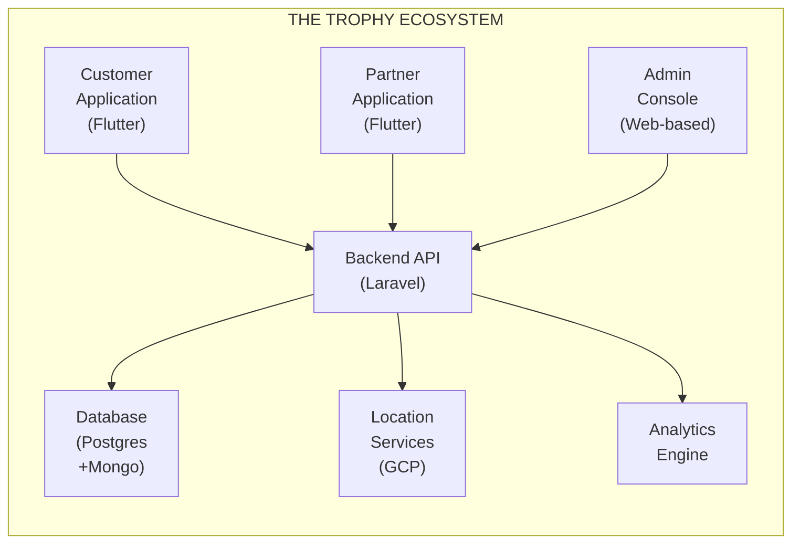

# THE TROPHY: Gamified Loyalty & Engagement Ecosystem

## Project Proposal

**Prepared for:** ________________________________________

**Prepared by:** Digitalmedia Outsource Solution Co., Ltd. (DOS)

**Date:** December 29, 2025

**Proposal Version:** 2.1

**Valid Until:** March 27, 2026

---

## Document Control

| Version | Date | Author | Changes |
| --- | --- | --- | --- |
| 1.0 | Dec 25, 2025 | DOS Team | Initial proposal |
| 1.1 | Dec 25, 2025 | Jakapong L | Review |
| 1.2 | Dec 25, 2025 | DOS Team | Update from feedback |
| 1.3 | Dec 25, 2025 | DOS Team | Simplified tiering system to 2 levels (Standard/Exclusive) |
| 2.0 | Dec 27, 2025 | DOS Team | Updated based on Meeting Note 3 - Project renamed to "The Trophy", added point transfer, wallet clarification, adjusted phases, QR recommendations |
| 2.1 | Dec 29, 2025 | Jakapong L | Final Review |

---

## Executive Summary

### The Opportunity

**The Trophy** represents a transformative approach to fan engagement and loyalty management. Rather than a simple points accumulation app, The Trophy functions as a **comprehensive Gamified Experience Platform** that creates sustainable value connections between:

- **Sports Organizations** (Football Clubs / Event Organizers)
- **Business Partners** (Retail, Service Providers, Sponsors)
- **End Users** (Fans, Members, Customers)

### Strategic Value Proposition

The platform transforms everyday fan activities into measurable business value through **mission-based engagement mechanics**, leveraging:

- **Precision Location Technology** (KML/Polygon-based geofencing)
- **Robust Fraud Prevention Systems** (Anti-gaming mechanics)
- **White-Label Architecture** (Brand-agnostic for maximum scalability)
- **Data-Driven Insights** (Real-time analytics and ROI tracking)
- **Trophy Wallet System** (Integrated point management with transfer capabilities)

### Implementation Approach

To minimize risk and maximize early value delivery, we propose a **phased implementation roadmap** that aligns with your strategic vision:

**Original Proposed Phases:**

1. MVP
2. Automation / Scaling
3. Ecosystem Expansion

**Our Recommended Approach (Mapped):**

1. **Phase 1: Proof of Concept (POC)** - THB 1,000,000
    - Added before MVP to validate core technology and reduce risk
2. **Phase 2: Minimum Viable Product (MVP)** - THB 3,000,000 - 5,000,000
    - Aligns with Original’s MVP phase
3. **Phase 3: Full-Scale Ecosystem** - THB ~10,000,000
    - Combines Original’s "Automation/Scaling" + "Ecosystem Expansion" phases

We strongly recommend including the POC phase to validate technical feasibility (especially location-based missions and Trophy Wallet integration) before full MVP investment. This minimizes risk and ensures the business model is proven with minimal cost.

---

## 1. Business Context & Strategic Rationale

### 1.1 The Problem Statement

Sports organizations and membership-based businesses face critical challenges in modern customer engagement:

**Challenge 1: Low Fan Engagement Outside Events**

- Fan interaction limited to match days or event periods
- No continuous touchpoints to maintain brand awareness
- Missed opportunities for year-round relationship building

**Challenge 2: Inefficient Partner Ecosystem Management**

- Manual processes for partner benefit distribution
- Difficulty tracking partner ROI and engagement effectiveness
- Limited data visibility into partnership performance

**Challenge 3: Benefits Distribution Complexity**

- Manual validation of VIP access, parking privileges
- High operational overhead for benefit verification
- Fraud vulnerabilities in traditional paper-based systems

**Challenge 4: Missed Revenue Opportunities**

- Underutilized club assets (training facilities, VIP areas)
- Limited monetization of fan loyalty and engagement
- Inability to create new revenue streams from existing resources

### 1.2 The Trophy Solution

The Trophy addresses these challenges through a comprehensive digital ecosystem that:

**Creates Continuous Engagement**

- Mission-based gamification keeps users engaged year-round
- Multiple touchpoint opportunities beyond event days
- Personalized experiences based on user behavior and preferences

**Enables Automated Partner Management**

- Digital validation tools for partner verification
- Real-time ROI tracking and analytics
- Automated point distribution and redemption workflows

**Streamlines Benefits Distribution**

- Digital verification replacing manual processes
- Secure QR-based validation system
- Fraud prevention through multi-layer verification

**Unlocks New Revenue Streams**

- Monetization of club assets through point redemption
- Partner acquisition revenue opportunities
- Data-driven insights for strategic decision-making

### 1.3 White-Label Strategy Rationale

**Core Principle:** The platform maintains complete brand neutrality - no club names, logos, or colors appear within the application interface.

**Strategic Benefits:**

1. **Market Expansion Flexibility:** Platform can serve multiple sports organizations or businesses simultaneously
2. **Reduced Rivalry Sensitivity:** Partners and users from competing affiliations can participate
3. **Universal Appeal:** Focus on value and benefits rather than specific brand loyalty
4. **Scalability:** Single platform can support multiple white-label deployments

**Implementation Note:** While the platform remains brand-neutral, users still gain access to exclusive club assets (training ground visits, VIP seating) through the point redemption system.

---

## 2. Solution Architecture & Technical Design

### 2.1 System Overview

The Trophy ecosystem consists of three integrated applications built on a unified backend infrastructure:

### 2.2 Customer Application (User Super App)

**Target Users:** Fans, Members, General Public

**Core Features: Trophy Wallet System**

- **Awards Points Management:** Central wallet for all earned points
- **Point Transfer (Inbound & Outbound):**
    - Transfer points to/from partner loyalty programs
    - Integration with credit card reward systems (some providers may limit to manual upload only)
    - Point exchange with external ecosystems
- **Transaction History:** Complete audit trail of all point movements
- **Balance Overview:** Real-time point balance and valuation

*Note: Point transfer feature will be designed with economic controls to prevent abuse and maintain point value stability. Transfer limits and validation rules will be configurable by admin.*

**Mission Center**

- **Location-Based Missions:** Check-in at partner locations using precision KML/Polygon geofencing (not simple radius)
- **Action-Based Missions:** Photo verification with designated staff members
- **Time-Based Missions:** Attend events, watch matches (verified through location)
- **Purchase-Based Missions:** Shopping at partner locations with receipt validation via Partner Application
- **Social Missions:** Share content, engage on social media

**Reward Redemption System**

- Browse available rewards catalog or Map view
- Filter by category: Exclusive Experiences, VIP Access, Partner Discounts, Merchandise
- Digital coupon generation with QR codes
- Redemption history and tracking
- Expiry notifications and reminders

**Tiering System**

- Standard / Exclusive membership tiers
- Tier-specific benefits and exclusive missions
- Progress tracking and tier upgrade requirements
- Special tier-only rewards and access

**User Profile & Engagement**

- Point balance and transaction history
- Mission completion statistics
- Leaderboard rankings (optional competitive element)
- Preference management and notification settings

**Authentication**

- **Mobile Number (Primary):** Phone number-based authentication
- **Change Mobile Number:** Allow users to update their registered phone number securely
- One-Time Password (OTP) verification

*Note: We recommend mobile number authentication only (not social login) for better security, data consistency, and fraud prevention. The "Change Mobile Number" feature addresses concerns about users switching phone numbers.*

**Technical Highlights:**

- Built with Flutter for native performance on iOS and Android
- Real-time data synchronization with backend
- Push notifications for new missions and rewards (via OneSignal)
- Secure authentication with social login support

### 2.3 Partner Application (Validation & Service Tool)

**Target Users:** Partner Staff, Club Staff, Event Organizers

**Core Features: QR Scanner & Validation (Hybrid Earn & Redeem)**

- **Recommended Approach:** Hybrid QR system for streamlined operations
- Single QR code for both earning points and redemption
- Partner staff can award points or redeem rewards in one scan
- Reduces friction and improves user experience
- Scan user QR codes to verify identity and eligibility
- Award points for completed missions (e.g., car wash service)
- Redeem user coupons and benefits

**Mission Verification**

- Photo mission approval interface
- Manual verification for complex missions
- Rejection with reason feedback to users
- Batch approval capabilities

*Note: We propose using partner staff for photo verification rather than pure AI-based object detection. This provides: (1) Cost savings on AI development and maintenance, (2) Better accuracy through human judgment, (3) Human touch and engagement between partner staff and end users. AI-assisted verification can be added in later phases if needed.*

**Partner Dashboard (Light)**

- Daily/weekly statistics on customer engagement
- Points awarded and redeemed
- Most popular missions and rewards
- Customer feedback and ratings

**Technical Highlights:**

- Flutter-based mobile app (iOS/Android)
- Simple, intuitive interface for non-technical staff
- Secure partner authentication

### 2.4 Admin Console (Central Command & Control)

**Target Users:** Platform Administrators, Business Managers, Data Analysts

**Core Features: Real-Time Dashboard**

- Active users and session metrics
- Points circulation (awarded vs. redeemed)
- Mission completion rates
- Partner performance overview
- Revenue and ROI tracking

**Mission Management**

- Create and configure missions (location, action, time-based)
- Set point rewards and eligibility criteria
- Define geofence polygons using KML mapping
- Schedule mission availability (start/end dates)
- Monitor mission performance and engagement

**Polygon & Geofence Manager**

- Import KML files from Google Maps
- Multi-polygon support for complex locations
- Testing tools to validate location accuracy

**Reward Catalog Management**

- Create and manage rewards
- Set point costs and availability limits
- Upload images and descriptions (bilingual Thai/English)
- Monitor redemption rates and popularity

**Partner Management**

- Onboard new partners with credentials
- Set point allocation limits per partner
- Monitor partner activity and compliance
- Generate partner performance reports

**Fraud Detection & Prevention**

- Anomaly detection alerts (unusual check-in patterns)
- Suspicious user activity monitoring
- Partner audit trails for point distribution
- Blacklist management and user suspension
- GPS spoofing detection

**User Management**

- User profiles and activity history
- Manual point adjustments (with audit trail)
- Tier management and manual upgrades (Standard/Exclusive)
- Basic customer support ticketing interface

**Trophy Wallet Admin**

- Point transfer monitoring and approval (if required)
- External ecosystem integration management
- Transfer limits and rules configuration
- Economic health monitoring (point liability, circulation)

**Analytics & Reporting**

- Custom report builder
- Export capabilities (CSV, PDF)
- Cohort analysis and user segmentation
- Partner ROI calculation tools
- Predictive analytics for point liability forecasting

**Technical Highlights:**

- Web-based responsive interface (Vue.js)
- Role-based access control (Admin, Manager, Support, Analyst)
- Advanced data visualization (charts, heatmaps)
- Integration with Google Maps API for geofencing

---

## 3. Implementation Roadmap & Phasing

### 3.1 Phase 1: Proof of Concept (POC)

**Objective:** Validate core technology feasibility and business model assumptions with minimal investment.

**Duration:** 8-10 weeks

**Budget:** THB 1,000,000

**Key Deliverables: Customer App (Basic)**

- User registration and authentication (mobile number)
- Simple location-based check-in (using basic geofencing)
- Point accumulation display
- Basic profile management
- Trophy Wallet prototype (view balance, basic transaction history)

**Partner App (Prototype)**

- QR scanner for user verification
- Manual point award interface

**Admin Console (Essential)**

- Basic dashboard with user counts and point totals
- Simple mission creation (location-based only)
- Manual user and partner management

**Backend Infrastructure**

- Basic API for user, mission, and point management
- Simple database schema
- Authentication service

**Testing & Validation**

- Limited pilot with 50-100 test users
- 3-5 partner locations for validation
- Basic fraud prevention (rate limiting)

**Success Criteria:**

- Users successfully complete location-based missions
- Points are accurately awarded and tracked
- Partner verification workflow functions correctly
- No critical security vulnerabilities identified

**Exclusions (Moved to Later Phases):**

- Advanced fraud AI
- Complex mission types (photo verification)
- Two-tier membership system
- Reward redemption
- Advanced analytics
- Point transfer functionality
- Production-grade security hardening
- Publishing to App Store / Play Store (testing via TestFlight/Internal Testing only)

### 3.2 Phase 2: Minimum Viable Product (MVP)

**Objective:** Launch production-ready system with core features for real-world user acquisition and partner onboarding.

**Duration:** 16-20 weeks

**Budget:** THB 3,000,000 - 5,000,000

**Key Deliverables: Customer App (Production)**

- Full mission types: Location, Action (photo), Time-based
- Reward redemption with QR coupon generation
- Two-tier system (Standard/Exclusive)
- Enhanced UI/UX with onboarding flow
- Push notifications for missions and rewards
- Social sharing capabilities
- **Trophy Wallet (Full):**
    - Complete point management
    - Point transfer (Inbound/Outbound) with partner ecosystems
    - Transaction history and export
    - Transfer limits and validation

**Partner App (Full)**

- QR scanning for both validation and redemption (Hybrid approach)
- Photo mission approval interface (staff verification)
- Partner dashboard with basic analytics
- Daily/weekly reports

**Admin Console (Operational)**

- Comprehensive dashboard with real-time metrics
- Advanced mission creation with all types
- KML/Polygon geofence tools
- Reward catalog management
- Partner onboarding and management
- Basic fraud detection alerts
- User support tools
- Trophy Wallet admin controls (transfer monitoring, limits)

**Backend Infrastructure (Scalable)**

- Production-grade API with authentication and authorization
- Optimized database design for scale
- Cloud deployment (GCP)
- Basic monitoring and logging
- Automated backups

**Security & Compliance**

- HTTPS encryption
- Secure token-based authentication
- PDPA compliance (Thai data protection)
- Basic anti-fraud mechanisms (GPS spoofing detection, rate limiting)
- Partner audit trails

**Testing & Launch**

- Comprehensive UAT/SIT
- Load testing for target user capacity (10,000 concurrent users)
- Security penetration testing
- Beta launch with early adopters
- Post-launch monitoring and support

**Success Criteria:**

- Support 5,000+ active users
- Onboard 20+ partner locations
- Mission completion rate > 30%
- Reward redemption rate > 15%
- No critical bugs in production
- System uptime > 99%

**Note:** Success metrics are dependent on client's budget allocation for user acquisition and marketing campaigns. DOS will design the system to support digital marketing integration, but does not provide marketing services.

**Exclusions (Moved to Phase 3):**

- Advanced AI-based fraud detection
- Complex analytics and predictive models
- Multiple white-label deployments
- Advanced personalization engine
- Third-party integrations (CRM, marketing automation)

### 3.3 Phase 3: Full-Scale Ecosystem

**Objective:** Build comprehensive platform with advanced features, scalability for multiple deployments, and sophisticated analytics.

**Original Vision Alignment:** This phase combines your "Automation / Scaling" and "Ecosystem Expansion" phases into a unified development effort.

**Duration:** 24-30 weeks

**Budget:** THB ~10,000,000

**Key Enhancements: Advanced Features**

- AI-powered fraud detection and anomaly prevention
- Personalization engine for mission recommendations
- Enhanced tiering capabilities and custom tier configurations
- Gamification enhancements (badges, achievements, streaks)
- **Pay with Points:** Real-time partner discounts and redemption system
    - Partners can offer instant discounts across all products/services
    - Real-time point redemption (not pre-set discount vouchers)
    - Dynamic pricing and point value calculations

**Platform Scalability (Automation / Scaling)**

- Multi-tenant white-label architecture
- Organization-level customization (themes, branding)
- API for third-party integrations
- Webhook support for external systems
- Multi-language support (beyond Thai/English)
- Automated partner onboarding workflows
- Auto-scaling infrastructure

**Ecosystem Expansion**

- Advanced Trophy Wallet integrations
- Credit card reward systems
- Banking loyalty programs
- Multi-brand point exchanges
- Expanded partner network tools
- API marketplace for third-party developers
- Cross-ecosystem point transfer protocols

**Analytics & Intelligence**

- Predictive analytics for point liability forecasting
- Machine learning for user segmentation
- Churn prediction and retention campaigns
- Partner ROI optimization algorithms
- Custom reporting API for enterprise clients

**Enterprise Integrations**

- CRM integration (Salesforce, HubSpot)
- Marketing automation (Email, SMS campaigns)
- Payment gateway for premium features
- Social media platform APIs
- E-commerce platform connections

**Advanced Security**

- Biometric authentication (fingerprint, face ID)
- Advanced GPS spoofing detection
- SOC 2 compliance preparation
- Enhanced audit trails and compliance reporting

**Operational Excellence**

- 24/7 monitoring and alerting
- Auto-scaling infrastructure
- Disaster recovery and business continuity
- Advanced DevOps and CI/CD pipelines
- Performance optimization for 100,000+ users

**Success Criteria:**

- Support 50,000+ concurrent active users
- 100+ partner locations across multiple organizations
- Advanced fraud detection with <1% false positive rate
- 99.9% uptime SLA
- Full self-service partner onboarding

**Note:** Success metrics are dependent on client's budget allocation for scaling operations and marketing plan execution. DOS provides the technical platform; client is responsible for marketing strategy and execution.

---

## 4. Technology Stack & Architecture

### 4.1 Mobile Applications (Customer & Partner)

- **Framework:** Flutter (Single codebase for iOS & Android)
- **Key Tech:** Provider/Riverpod (State Mgt), Google Maps, OneSignal (Noti), Pusher (Real-time), Hive/SQLite (Local DB)

### 4.2 Admin Console (Web App)

- **Framework:** React or Vue.js
- **Key Tech:** Material-UI/Ant Design, Redux/Vuex, Chart.js/D3.js (Data Viz)

### 4.3 Backend Services

- **Framework:** Laravel (PHP)
- **Key Tech:** RESTful API, JWT Auth, Laravel Queues (Background jobs), Swagger (Docs)

### 4.4 Database & Storage

- **Primary DB:** PostgreSQL (Transactions & Points)
- **Secondary DB:** MongoDB (Logs & Configs), Redis (Caching)
- **Storage:** GCP Cloud Storage (Files & Images)

### 4.5 Cloud Infrastructure

- **Platform:** Google Cloud Platform (GCP)
- **Services:** GKE/Cloud Run (Compute), Cloud SQL, Cloud Functions

### 4.6 Third-Party Services

- **Tools:** Google Maps Platform, OneSignal, Pusher, SendGrid/Twilio, Sentry (Error Tracking)

---

## 5. Risk Management & Security

### 5.1 Fraud Prevention Strategy

**Risk Category 1: User Gaming**

**Threats:**

- GPS spoofing to fake location check-ins
- Repeated check-ins for point farming
- Fake photo submissions
- Multiple accounts per user

**Mitigation Strategies:**

- **GPS Validation:** Cross-verify GPS data with cell tower triangulation and Wi-Fi location
- **Rate Limiting:** Restrict check-in frequency (e.g., max 1 check-in per location per day)
- **Device Fingerprinting:** Track unique device IDs to prevent multi-account abuse
- **Photo Verification:** Human review by partner staff or admin team
- **Behavioral Analysis:** Pattern detection to identify abnormal user activity

**Risk Category 2: Partner Fraud**

**Threats:**

- Partners awarding points without legitimate transactions
- Collusion between partners and users
- Excessive point distribution beyond limits
- Fake redemptions to deplete user balances

**Mitigation Strategies:**

- **Daily Caps:** Limit points a partner can award per day
- **Audit Trails:** Complete logging of all partner actions with timestamps
- **Anomaly Detection:** Alert when partner behavior deviates from normal patterns
- **Random Audits:** Periodic review of partner transactions
- **Reputation System:** Partner performance scoring with suspension capabilities

**Risk Category 3: System Abuse**

**Threats:**

- API abuse and automated bot attacks
- Point inflation through system exploits
- Unauthorized access to admin functions

**Mitigation Strategies:**

- **API Rate Limiting:** Throttle requests per user/IP
- **CAPTCHA:** For sensitive operations
- **Role-Based Access Control:** Strict admin permission management
- **Security Audits:** Regular penetration testing
- **Bug Bounty Program:** Incentivize responsible disclosure

### 5.2 Economic Control & Point Management

**Point Liability Management**

**Challenge:** Points represent a financial liability - the organization must be able to fulfill redemptions without excessive cost.

**Strategies:**

- **Point Expiry:** All points expire after 12 months (configurable)
- **Redemption Limits:** Cap total point redemption value per user per month
- **Reserve Ratio:** Maintain financial reserves proportional to outstanding points
- **Inflation Control:** Monitor point circulation and adjust mission rewards dynamically
- **Transfer Controls:** Point transfer limits to prevent economic abuse

*Note: Point transfer feature will include strict economic controls including: (1) Daily/monthly transfer limits per user, (2) Transfer fees to discourage abuse, (3) Admin approval for large transfers (optional), (4) Real-time monitoring of transfer patterns for fraud detection. These controls protect the point economy while enabling ecosystem integration.*

**Point Economy Balancing**

**Objective:** Ensure healthy balance between points awarded (inflow) and redeemed (outflow)

**Metrics to Monitor:**

- **Burn Rate:** Percentage of awarded points redeemed
- **Velocity:** Average time between point award and redemption
- **Inflation Rate:** Growth rate of total outstanding points
- **Redemption Ratio:** Target 60-80% of points redeemed before expiry
- **Transfer Volume:** Monitor inbound/outbound point transfers

**Tools:**

- Real-time economic dashboard
- Automated alerts for unhealthy ratios
- Dynamic reward pricing adjustments
- Predictive modeling for liability forecasting

### 5.3 Data Security & Privacy Compliance

**PDPA Compliance (Thai Personal Data Protection Act)**

**Requirements:**

- Explicit user consent for data collection
- Clear privacy policy in Thai language
- User rights: Access, correction, deletion, data portability
- Data breach notification protocols

**Implementation:**

- Consent management during registration
- Privacy policy and terms acceptance
- User data export functionality
- Secure data deletion procedures

**Security Best Practices**

- **Data Encryption:** All data encrypted at rest and in transit (TLS 1.3)
- **Access Controls:** Least-privilege principle for all system access
- **Regular Backups:** Daily automated backups with 30-day retention
- **Incident Response Plan:** Documented procedures for security incidents
- **Regular Updates:** Prompt security patching and dependency updates

### 5.4 Operational Risks & Mitigation

**Risk: System Downtime**

- **Impact:** User frustration, lost engagement opportunities, partner disruption
- **Mitigation:**
    - High availability architecture (multi-zone deployment)
    - Auto-scaling to handle traffic spikes
    - 99.9% uptime SLA target
    - Incident response runbooks

**Risk: Poor User Adoption**

- **Impact:** Low ROI, failed business case
- **Mitigation:**
    - User research and UX testing before launch
    - Phased rollout with early adopter program
    - Continuous feedback collection and iteration
    - Onboarding optimization and user education

**Risk: Partner Churn**

- **Impact:** Reduced value proposition for users
- **Mitigation:**
    - Clear ROI demonstration for partners
    - Regular partner performance reports
    - Dedicated partner success support
    - Flexible partnership models

**Risk: Scope Creep & Budget Overrun**

- **Impact:** Delayed delivery, cost overruns
- **Mitigation:**
    - Phased approach with clear deliverables
    - Change request process with impact assessment
    - Regular stakeholder alignment meetings
    - Contingency buffer in budget (10-15%)

### 5.5 Feature Concerns & Recommendations

**Send Points to Friends**

- This feature raises concerns about point economy stability. Peer-to-peer transfers can enable: (1) Point farming through multi-account abuse, (2) Uncontrolled point circulation affecting economic balance, (3) Gray market point trading. If this feature is required, we recommend implementing it in Phase 3 with strict controls: transfer limits, transaction fees, cooling periods, and fraud monitoring.

**In-App Marketplace (Buy Items for Quests)**

- We strongly advise against implementing a marketplace where users can purchase items to help complete quests. This creates a "Pay-to-Win" dynamic that: (1) Reduces campaign engagement and authenticity, (2) Undermines the mission-based gamification model, (3) Creates unfair advantage for paying users. We recommend keeping the platform skill/engagement-based rather than purchase-based.

---

## 6. Business Model & ROI Framework

### 6.1 Value Proposition by Stakeholder

**For Sports Organizations / Clubs:**

**Benefits:**

- **Increased Fan Engagement:** Year-round touchpoints beyond match days
- **Data Insights:** Understand fan behavior, preferences, and demographics
- **New Revenue Streams:** Monetize club assets (VIP access, training ground visits)
- **Partner Acquisition:** Attract sponsors and partners through engaged fan base
- **Operational Efficiency:** Digital validation replaces manual benefit distribution

**ROI Indicators:**

- Fan engagement rate (active users / total fan base)
- Average session time and mission completion rate
- Partner revenue from new acquisitions
- Cost savings from automated processes

**For Business Partners:**

**Benefits:**

- **Customer Acquisition:** Access to engaged, targeted customer base
- **Brand Exposure:** Visibility through mission placements and rewards
- **Trackable ROI:** Clear metrics on customer visits and conversions
- **Loyalty Building:** Repeat customer visits through mission engagement
- **Low Entry Cost:** Performance-based model (pay per engagement)

**ROI Calculation:**

<aside>
💡

Partner ROI = (Revenue from Trophy users - Point costs - Integration costs) / Total investment

</aside>

Example:

- Car wash partner: 100 users × THB 200 avg. spend = THB 20,000 revenue
- Point costs: 100 users × 50 points × THB 0.50/point = THB 2,500
- Monthly platform fee: THB 2,000
- Net Benefit: THB 15,500 (344% ROI)

**For End Users (Fans):**

**Benefits:**

- **Exclusive Experiences:** Access to money-can't-buy opportunities
- **Tangible Rewards:** Discounts, merchandise, VIP experiences
- **Gamified Fun:** Engaging missions and competitive elements
- **Community Connection:** Feel part of larger fan community
- **Personalized Benefits:** Tier-based rewards matching engagement level (Standard or Exclusive)
- **Trophy Wallet:** Flexible point management and ecosystem connectivity

**Value Perception:**

- 100 points = ~THB 50 value in rewards
- Exclusive access (training ground) = priceless for true fans
- VIP parking = THB 100-200 saved per match

### 6.2 Revenue Model Options

**Model 1: Platform Licensing (Recommended for White-Label)**

- **Annual License Fee:** THB 500,000 - 2,000,000 per organization (based on user scale)
- **Implementation Fee:** One-time setup charge (covered by project budget)
- **Maintenance & Support:** 20% of license fee annually

**Model 2: Transaction-Based**

- **Partner Acquisition Fee:** THB 5,000 - 20,000 per partner onboarded
- **Transaction Fee:** 5-10% of partner point costs
- **Redemption Fee:** THB 5-10 per reward redemption

**Model 3: Hybrid (Platform + Performance)**

- **Base Platform Fee:** Lower annual fee (THB 300,000)
- **Performance Tier:** Additional fees based on active users (THB 2-5 per active user/month)
- **Partner Revenue Share:** 10-15% of partner-generated revenue

**Model 4: Freemium (For Consumer-Facing Deployment)**

- **Free Tier:** Basic missions and rewards
- **Premium Subscription:** THB 99-299/month for exclusive missions and higher point multipliers
- **In-App Purchases:** Special rewards or point packs

### 6.3 Cost Structure & Investment Analysis

**Phase 1 (POC): THB 1,000,000**

| Item | Percentage | Amount (THB) | Description |
| --- | --- | --- | --- |
| Development | 60% | 600,000 | Design, implementation, and core feature development |
| Infrastructure | 15% | 150,000 | Cloud services and environments for POC |
| Testing &amp; QA | 10% | 100,000 | Functional testing, bug fixing, basic security checks |
| Project Management | 15% | 150,000 | Planning, coordination, reporting, stakeholder communication |
| **Total** | **100%** | **1,000,000** |  |

**Phase 2 (MVP): THB 3,000,000 - 5,000,000**

| Item | Percentage | Amount (THB) | Description |
| --- | --- | --- | --- |
| Development | 55% | 1,650,000 - 2,750,000 | Core feature development for mobile apps, admin console, and backend |
| Infrastructure &amp; Cloud | 15% | 450,000 - 750,000 | Cloud environments, scaling setup, monitoring, backups |
| Testing &amp; Security | 12% | 360,000 - 600,000 | UAT/SIT, load testing, penetration testing, hardening |
| Design &amp; UX | 8% | 240,000 - 400,000 | UI/UX design, journeys, design system |
| Project Management | 10% | 300,000 - 500,000 | Planning, coordination, reporting, risk management |
| **Total** | **100%** | **3,000,000 - 5,000,000** |  |

**Phase 3 (Full Scale): THB ~10,000,000**

| Item | Percentage | Amount (THB) | Description |
| --- | --- | --- | --- |
| Advanced Development | 50% | 5,000,000 | Advanced features (AI, multi-tenant, ecosystem expansion) |
| AI/ML &amp; Analytics | 15% | 1,500,000 | Predictive analytics, personalization, fraud models |
| Infrastructure &amp; Scaling | 15% | 1,500,000 | High-availability infrastructure, auto-scaling, DR/BCP |
| Security &amp; Compliance | 10% | 1,000,000 | Advanced security, audits, compliance (e.g. SOC 2 preparation) |
| Testing &amp; QA | 5% | 500,000 | Extensive testing at scale, regression, performance |
| Project Management | 5% | 500,000 | Program management, coordination across work streams |
| **Total** | **100%** | **10,000,000 (approx.)** |  |

**Ongoing Operational Costs (Annual):**

- Cloud Hosting: THB 300,000 - 600,000 (scales with users)
- Maintenance & Support: THB 600,000 - 1,200,000 (20% of development cost)
- Third-Party Services: THB 200,000 - 400,000 (maps, notifications, analytics)
- Staffing (in-house team): THB 2,400,000+ (2-3 developers + support)

**Total 3-Year Investment:**

- Development (All Phases): THB 14,000,000 - 16,000,000
- Operations (3 years): THB 10,200,000 - 18,600,000
- **Total: THB 24,200,000 - 34,600,000**

### 6.4 Return on Investment (ROI) Scenarios

**Scenario 1: Single Sports Club Deployment**

**Assumptions:**

- Club with 50,000 registered fans
- Target: 20% active users (10,000 users)
- 30 partner locations
- 3-year analysis period

**Revenue Streams:**

- Partner Acquisition: 30 × THB 10,000 = THB 300,000
- Annual Platform License: THB 1,000,000/year × 3 = THB 3,000,000
- Partner Transaction Fees: THB 500,000/year × 3 = THB 1,500,000
- **Total Revenue (3 years): THB 4,800,000**

**Costs:**

- Development: THB 14,000,000
- Operations: THB 10,200,000
- **Total Costs (3 years): THB 24,200,000**

**Net ROI:** Negative in first 3 years (typical for platform investment)

**Break-even:** Year 4-5 with recurring revenue

**Strategic Value:** Customer data, engagement insights, operational efficiency

**Scenario 2: Multi-Tenant White-Label Platform**

**Assumptions:**

- 5 organization clients by Year 2
- 10 organization clients by Year 3
- Average 5,000 active users per client
- Average 20 partners per client

**Revenue Streams:**

- License Fees (Year 1: 2 clients, Year 2: 5 clients, Year 3: 10 clients)
    - Year 1: THB 1,000,000 × 2 = THB 2,000,000
    - Year 2: THB 1,000,000 × 5 = THB 5,000,000
    - Year 3: THB 1,000,000 × 10 = THB 10,000,000
- Partner Fees: ~THB 3,000,000 (cumulative over 3 years)
- **Total Revenue (3 years): THB 20,000,000**

**Costs:**

- Development (includes multi-tenant architecture): THB 16,000,000
- Operations (scaled infrastructure): THB 18,600,000
- **Total Costs (3 years): THB 34,600,000**

**Net ROI:** Negative in first 3 years, but approaching break-even

**Break-even:** Year 3-4

**Scaling Advantage:** Marginal cost of additional clients is low (primarily support)

**Note on ROI:** These projections are illustrative. Actual ROI depends heavily on:

- Client acquisition success
- User adoption rates
- Partner ecosystem development
- Competitive landscape
- Market conditions

---

## 7. Project Delivery & Engagement Model

### 7.1 DOS Standard Working Process

The Trophy project will follow DOS's proven 8-phase methodology:

**Phase 1: NDA & Contract Signing**

- Mutual non-disclosure agreement
- Master service agreement
- Project-specific statement of work (SOW)
- Payment terms and milestones

**Phase 2: Requirements Gathering**

- Stakeholder interviews
- User research and persona development
- Business process mapping
- Functional and technical requirements documentation
- Acceptance criteria definition

**Phase 3: Kickoff**

- Project team introduction
- Communication plan establishment
- Timeline and milestone review
- Risk assessment and mitigation planning
- Tools and access provisioning

**Phase 4: Design**

- Information architecture
- Wireframing and user flows
- High-fidelity mockups (UI)
- Design system creation
- Interactive prototypes
- Client review and approval

**Phase 5: Development**

- Sprint planning (2-week sprints)
- Continuous development and testing
- Regular sprint demos
- Code reviews and quality assurance
- Integration and API development

**Phase 6: UAT/SIT**

- **User Acceptance Testing (UAT):** Client validates features against requirements
- **System Integration Testing (SIT):** Verify all components work together
- Bug tracking and resolution
- Performance testing
- Security testing
- Final client approval

**Phase 7: Go-Live**

- Production deployment
- Data migration (if applicable)
- User training and documentation
- Launch monitoring and support
- Staged rollout (if appropriate)

**Phase 8: Support & Warranty**

- 90-day warranty period (standard)
- Bug fixes and issue resolution
- Performance monitoring
- Transition to ongoing maintenance (optional)

### 7.2 Engagement Model & Pricing

**Project Type:** Agile Fixed-Price (Phased Delivery)

**Phase 1 (POC): THB 1,000,000**

- Fixed price for defined scope
- 8-10 week delivery timeline
- Team composition:
    - 1 Lead Developer (50 days × THB 13,000 = THB 650,000)
    - 1 Senior Developer (30 days × THB 11,000 = THB 330,000)
    - Project buffer: THB 20,000

**Phase 2 (MVP): THB 3,000,000 - 5,000,000**

- Fixed price for core features
- 16-20 week delivery timeline
- Team composition:
    - 1 Project Manager / Lead (120 days × THB 13,000 = THB 1,560,000)
    - 2 Senior Developers (200 days × THB 11,000 = THB 2,200,000)
    - 1 Junior Developer (100 days × THB 8,000 = THB 800,000)
    - 1 UI/UX Designer (40 days × THB 11,000 = THB 440,000)
- Total: THB 5,000,000

**Phase 3 (Full Scale): THB ~10,000,000**

- Detailed breakdown provided after Phase 2 completion
- Estimated 24-30 week delivery
- Expanded team with specialists

**Payment Terms (Standard):**

For Phase 1:

- 30% upon contract signing: THB 300,000
- 40% upon UAT approval: THB 400,000
- 30% upon go-live: THB 300,000

For Phase 2:

- 20% upon contract signing
- 30% upon design approval
- 30% upon UAT approval
- 20% upon go-live

**Alternative: Monthly Retainer Model**

- Available for ongoing development after initial launch
- Senior Developer: THB 180,000/month
- Junior Developer: THB 150,000/month
- Minimum 6-month commitment
- Suitable for continuous feature development and support

### 7.3 Timeline & Milestones

**Phase 1: Proof of Concept**

| Week | Milestone | Deliverable |
| --- | --- | --- |
| 1-2 | Requirements & Design | Wireframes, technical architecture |
| 3-5 | Core Development | Basic customer app, partner app, admin console |
| 6-7 | Integration & Testing | API integration, basic geofencing |
| 8 | UAT | Client testing and feedback |
| 9-10 | Refinement & Launch | Bug fixes, pilot deployment |

**Phase 2: MVP**

| Week | Milestone | Deliverable |
| --- | --- | --- |
| 1-3 | Design & Architecture | Full UI/UX design, database design, API specs |
| 4-8 | Customer App Development | All mission types, rewards, tiering, Trophy Wallet |
| 9-12 | Partner App & Admin Console | Full partner tools, comprehensive admin features |
| 13-15 | Integration & Security | Point transfer integration, fraud prevention, security hardening |
| 16-17 | Testing | UAT, SIT, load testing, security testing |
| 18-20 | Beta Launch & Refinement | Beta user onboarding, monitoring, optimization |

**Phase 3: Full Scale**

- Detailed timeline provided after Phase 2 review
- Approximately 24-30 weeks
- Modular approach allowing parallel development streams

### 7.4 Team Composition & Roles

**DOS Core Team:**

**Project Leadership:**

- **Jakapong (TLE)** - Chief Operating Officer / Executive Sponsor
- **Project Manager** - Day-to-day project coordination, stakeholder communication

**Development Team:**

- **Lead Developer (Mobile)** - Flutter architecture, iOS/Android deployment
- **Senior Backend Developer** - API design, database architecture
- **Senior Frontend Developer** - Admin console (React/Vue.js)
- **Junior Developer** - Support development, testing, documentation

**Design & UX:**

- **Nitipong (OHM)** - Head of Design / UX Strategy
- **UI/UX Designer** - Interface design, user flows, design system

**Infrastructure & DevOps:**

- **Surasee (PECK)** - Head of Infrastructure / Cloud Architecture
- **DevOps Engineer** - CI/CD, deployment, monitoring

**Quality Assurance:**

- **QA Engineer** - Test planning, manual and automated testing
- **Security Specialist** - Security audits, penetration testing (external consultant if needed)

**Client Responsibilities:**

**Product Owner:**

- Define business requirements and priorities
- Provide timely feedback on designs and features
- Approve deliverables and accept completed work
- Participate in sprint reviews and key decision meetings

**Subject Matter Experts:**

- Provide domain knowledge (sports operations, partner relationships)
- Validate business logic and workflows
- Support user testing and training

**Stakeholders:**

- Executive sponsor for strategic alignment
- Marketing team for user acquisition strategy
- Partner managers for partner onboarding

### 7.5 Communication & Collaboration

**Regular Meetings:**

- **Daily Standups:** DOS team internal (15 minutes)
- **Weekly Sprint Reviews:** Client + DOS team (1 hour)
    - Demo of completed features
    - Feedback collection
    - Next sprint planning
- **Bi-weekly Steering Committee:** Executive stakeholders + DOS leadership (30-60 minutes)
    - Progress review
    - Risk and issue management
    - Strategic alignment

**Communication Channels:**

- **Primary:** Email for formal communications
- **Real-time:** LINE, Slack, or Microsoft Teams for quick questions
- **Project Management:** Jira, Asana, or Trello for task tracking
- **Documentation:** Google Drive or Confluence for shared documents

**Reporting:**

- **Weekly Status Report:** Progress, risks, issues, upcoming milestones
- **Monthly Executive Summary:** High-level progress for stakeholders
- **Sprint Reports:** Detailed feature completion and burndown charts

---

## 8. Warranty, Support & Maintenance

### 8.1 Standard Warranty (Included)

**Duration:** 90 days after Go-Live delivery

**Coverage:**

- Software defects and bugs that deviate from agreed specifications
- Server configuration issues caused by DOS
- Critical security vulnerabilities discovered
- Performance issues not meeting agreed SLAs

**Conditions for Free Corrections:**

- Issue clearly deviates from signed-off specifications
- Issue caused by DOS development or configuration
- Issue reported within 90-day warranty period
- Issue reproducible in production environment

**Exclusions (Not Covered Under Warranty):**

- Feature enhancements or scope additions
- Issues caused by client modifications or third-party integrations
- Infrastructure changes requested by client
- User training or documentation updates
- Issues caused by force majeure (natural disasters, etc.)

### 8.2 Post-Warranty Support Options

**Option 1: Time & Materials (Ad-Hoc)**

- No monthly commitment
- Pay only for work performed
- Rates: Junior THB 8,000/day, Senior THB 11,000/day
- Suitable for: Occasional bug fixes or minor updates
- Response time: Best effort (typically 3-5 business days)

**Option 2: Monthly Retainer (Recommended)**

**Basic Plan: THB 50,000/month**

- 5 hours/month support allocation (unused hours don't roll over)
- Email support (response within 24 hours)
- Non-critical bug fixes
- Minor content updates
- Suitable for: Stable production with occasional needs

**Professional Plan: THB 150,000/month**

- 15 hours/month support allocation
- Email and phone support (response within 4 hours)
- Critical bug fixes within 24 hours
- Monthly health check and performance reports
- Security updates and patches
- Suitable for: Active production with regular updates

**Enterprise Plan: THB 300,000/month**

- 30 hours/month support allocation
- Priority support (response within 2 hours)
- Critical bug fixes within 4 hours
- Dedicated account manager
- Quarterly feature enhancements
- Proactive monitoring and optimization
- Suitable for: Mission-critical systems with high user activity

**Option 3: Extended Development Team**

- Full-time or part-time dedicated developers
- Senior Developer: THB 180,000/month
- Junior Developer: THB 150,000/month
- Minimum 6-month commitment
- Suitable for: Continuous feature development and major enhancements

### 8.3 Service Level Agreements (SLAs)

**System Availability:**

- **MVP (Phase 2):** 99% uptime (max 7.2 hours downtime/month)
- **Full Scale (Phase 3):** 99.9% uptime (max 43 minutes downtime/month)
- Measured monthly, excludes scheduled maintenance windows

**Support Response Times:**

| Severity | Description | Professional Plan | Enterprise Plan |
| --- | --- | --- | --- |
| Critical | System down, major functionality broken | 4 hours | 2 hours |
| High | Significant feature impaired, workaround available | 8 hours | 4 hours |
| Medium | Minor feature issue, limited user impact | 24 hours | 12 hours |
| Low | Cosmetic issue, feature request | 72 hours | 24 hours |

**Scheduled Maintenance:**

- Announced 7 days in advance
- Performed during low-traffic windows (e.g., 1-4 AM Thailand time)
- Maximum 4 hours duration
- Maximum 1 scheduled maintenance per month

### 8.4 Monitoring & Proactive Management

**Included in Professional and Enterprise Plans:**

- 24/7 automated monitoring for:
    - System availability and uptime
    - API response times
    - Database performance
    - Error rates and exceptions
    - Infrastructure health (CPU, memory, disk)
- Automated alerts for threshold breaches
- Monthly performance and health reports
- Proactive recommendations for optimization

**Security Management:**

- Regular security updates for dependencies
- Quarterly security audits (Enterprise plan)
- PDPA compliance monitoring
- Incident response support

---

## 9. Future Enhancements & Roadmap

The phased approach allows for controlled expansion. Below are potential enhancements beyond Phase 3:

### 9.1 Advanced Personalization & AI

**Personalized Mission Recommendations**

- Machine learning algorithms suggest missions based on user behavior, location patterns, and preferences
- Increases engagement by showing relevant opportunities

**Predictive Analytics**

- Forecast user churn and trigger retention campaigns
- Predict point redemption patterns for better inventory planning
- Partner performance forecasting

**Chatbot Assistant**

- AI-powered chatbot for user support
- Answer FAQs, help with mission completion, suggest rewards
- Reduce support overhead

### 9.2 Social & Community Features

**User-Generated Content**

- Allow users to share mission completion photos and stories
- Community feed for fan interaction
- Moderation tools for admin

**Teams & Challenges**

- Group missions where users collaborate
- Leaderboards for teams or fan clubs
- Competitive challenges with prizes

**Referral Program**

- Reward users for inviting friends
- Tiered bonuses for successful referrals
- Viral growth mechanism

### 9.3 Expanded Partner Ecosystem

**E-Commerce Integration**

- Allow users to redeem points for products from partner online stores
- Track online purchases for point awards
- Affiliate revenue model

**API Marketplace**

- Open API for third-party developers
- Partner apps can integrate The Trophy loyalty
- Ecosystem expansion without direct development

**Corporate Partnerships**

- Large brands (telecom, banking) integrate loyalty programs
- Cross-brand point exchanges
- Enterprise sales channel

### 9.4 Blockchain & Web3 Integration

**Blockchain-Based Points**

- Points as cryptocurrency tokens
- Transparent, immutable ledger
- Potential for point trading or exchange

**NFT Rewards**

- Unique digital collectibles as exclusive rewards
- Limited edition memorabilia for top-tier fans
- Additional revenue stream through NFT sales

**Note:** These are experimental and depend on market readiness and regulatory clarity in Thailand.

### 9.5 Augmented Reality (AR) Missions

**AR Treasure Hunts**

- Users find virtual objects in physical locations
- Stadium-based AR experiences during match days
- Gamified engagement with cutting-edge technology

**Virtual Try-Ons**

- AR preview of merchandise rewards
- Enhanced shopping experience

### 9.6 International Expansion

**Multi-Language Support**

- Beyond Thai/English: Chinese, Japanese, Indonesian, etc.
- Localized content and rewards

**Multi-Currency & Regional Adaptations**

- Support for different currencies and payment methods
- Compliance with regional data protection laws (GDPR, etc.)

**White-Label Replication**

- Deploy platform for international sports clubs or brands
- Centralized platform management with localized instances

---

## 10. Client Investment & Next Steps

### 10.1 Recommended Investment Path

**Immediate Action: Phase 1 (POC)**

- **Investment:** THB 1,000,000
- **Duration:** 8-10 weeks
- **Objective:** Validate technology and business model with minimal risk
- **Outcome:** Working prototype with core location-based missions

**Upon POC Success: Phase 2 (MVP)**

- **Investment:** THB 3,000,000 - 5,000,000
- **Duration:** 16-20 weeks
- **Objective:** Launch production-ready platform for real users and partners
- **Outcome:** Fully functional ecosystem supporting thousands of users

**After Market Validation: Phase 3 (Full Scale)**

- **Investment:** THB ~10,000,000
- **Duration:** 24-30 weeks
- **Objective:** Scale to enterprise-grade with advanced features
- **Outcome:** Multi-tenant platform capable of serving multiple organizations

### 10.2 Decision Criteria for Phase Progression

**Proceed to Phase 2 if:**

- POC successfully demonstrates location-based check-ins with acceptable accuracy
- User testing shows positive engagement and usability
- No critical technical blockers identified
- Client business case validated (partner interest confirmed)
- Budget approved for full development

**Proceed to Phase 3 if:**

- MVP achieves target user adoption (>20% of registered base)
- Partner ecosystem develops (>20 active partners)
- System stability proven (>99% uptime for 3 months)
- ROI trajectory positive or within expectations
- Strategic need for advanced features (multi-tenant, AI, etc.)

### 10.3 Immediate Next Steps

**Step 1: Proposal Review & Clarifications (Week 1)**

- Client stakeholders review this proposal
- Identify questions, concerns, or required modifications
- DOS team provides clarifications and adjustments

**Step 2: Alignment Workshop (Week 2)**

- 1-day workshop with key stakeholders
- Refine business requirements and priorities
- Align on Phase 1 (POC) scope and success criteria
- Review and adjust timeline

**Step 3: Contract Negotiation & Signing (Week 3-4)**

- Finalize statement of work (SOW) for Phase 1
- Sign NDA and Master Service Agreement
- Define payment terms and milestones
- Establish communication protocols

**Step 4: Project Kickoff (Week 5)**

- Formal project kickoff meeting
- Team introductions and role assignments
- Tools and access provisioning
- Requirements gathering begins

**Step 5: Design & Development (Week 6-14)**

- Iterative design and development sprints
- Weekly progress reviews
- Continuous client feedback

**Step 6: UAT & Pilot Launch (Week 15-18)**

- User acceptance testing
- Pilot with limited users
- Refinement based on feedback

---

## 11. Why Choose DOS for The Trophy?

### 11.1 Proven Expertise in Loyalty Systems

**Relevant Experience:**

- **Ally Sky Rewards** - Multi-partner privilege ecosystem for CDC network
- **Big C Loyalty App** - E-commerce and loyalty for major retail chain
- **SCG Debenture Club** - Exclusive communication and privilege platform for bondholders

DOS has successfully delivered multiple loyalty and rewards platforms for major Thai corporations, demonstrating deep understanding of:

- Points management and economic balancing
- Partner ecosystem development
- Fraud prevention in loyalty programs
- Scalable architecture for high-transaction systems

### 11.2 Technical Excellence & Innovation

**Technology Leadership:**

- 10+ years software development experience
- 100+ successfully delivered projects
- 20+ technology stacks mastered
- Strong cloud infrastructure expertise (GCP)

**Innovation Track Record:**

- Early adopter of Flutter for cross-platform mobile development
- Expertise in location-based services and geofencing
- AI/ML integration for personalization and fraud detection
- Modern DevOps practices for rapid, reliable deployment

### 11.3 Enterprise-Grade Quality

**Rigorous Development Process:**

- Comprehensive UAT/SIT before every launch
- Code review and quality assurance standards
- Security-first approach with regular audits
- Performance testing and optimization

**Proven Client Satisfaction:**

- Major clients: SCG Group, CP ALL, Central Group
- Long-term relationships and repeat engagements
- 90-day warranty and reliable post-launch support

### 11.4 Local Market Understanding

**Thai Business Context:**

- Bilingual team (Thai/English)
- Understanding of Thai consumer behavior and preferences
- PDPA compliance expertise
- Familiarity with Thai payment systems and integrations

**Cultural Alignment:**

- Consultative, partnership-based approach
- Transparent communication and realistic scoping
- Flexible engagement models suited to Thai business practices

### 11.5 Phased, Risk-Mitigated Approach

**Conservative, Client-Centric Philosophy:**

- Start small, validate, then scale
- No over-commitment or unrealistic promises
- Clear scope boundaries and deliverables
- Budget-conscious development aligned with ROI expectations

**Flexibility:**

- Adapt to client feedback and changing requirements
- Multiple engagement models (fixed price, retainer, T&M)
- Scalable team augmentation

---

## 12. Frequently Asked Questions (FAQ)

### Q1: What makes The Trophy different from existing loyalty apps?

**A:** The Trophy combines four unique elements:

1. **Gamified Mission System:** Beyond simple purchases, users earn points through location-based check-ins, photo missions, and event participation
2. **White-Label Flexibility:** Platform remains brand-neutral, allowing diverse partners and users without rivalry conflicts
3. **Precision Location Technology:** Uses KML/Polygon geofencing, not simple radius, for accurate and fraud-resistant check-ins
4. **Trophy Wallet:** Integrated point transfer system connecting multiple loyalty ecosystems

### Q2: How do you prevent users from faking their location?

**A:** Multi-layered fraud prevention:

- GPS validation cross-referenced with cell tower triangulation and Wi-Fi location
- Device fingerprinting to track unique devices
- Rate limiting (e.g., max 1 check-in per location per day)
- Behavioral analysis using machine learning to detect anomalies
- Human verification for high-value missions (partner staff approval)

### Q3: What if we only have a small budget - can we start with less than Phase 1?

**A:** Phase 1 (POC) at THB 1,000,000 is already the minimum viable scope to validate the core technology. Below this budget, we cannot deliver a functional prototype that demonstrates the key value propositions. We recommend:

- Securing full Phase 1 budget to properly validate the concept
- Alternatively, consider starting with a detailed feasibility study (THB 200,000-300,000) before committing to development

### Q4: How long does it take to onboard a new partner?

**A:**

- **Phase 2 (MVP):** Manual onboarding process - approximately 1-2 weeks per partner (account creation, training, location setup)
- **Phase 3 (Full Scale):** Self-service partner portal - partners can onboard in 1-3 days with minimal DOS support

### Q5: Can users exchange points for cash?

**A:** Not in the standard implementation. Points are designed as a closed-loop system to:

- Maintain economic control and prevent inflation
- Comply with financial regulations (cash redemption may trigger licensing requirements)
- Ensure points drive desired behaviors (partner visits, reward redemptions)

However, rewards can include gift cards or vouchers that are cash-equivalent.

### Q6: What happens if a partner goes out of business?

**A:**

- Admin can deactivate partner missions immediately
- Existing user points remain valid for redemption with other partners
- System design prevents over-reliance on single partner
- Partner diversity is key to ecosystem resilience

### Q7: How do you handle PDPA compliance?

**A:**

- Explicit user consent during registration
- Clear privacy policy in Thai language
- User rights functionality: data export, correction, deletion
- Data encryption at rest and in transit
- Regular compliance audits
- Incident response procedures documented

### Q8: Can we customize the app for our specific brand after launch?

**A:** Yes, within the white-label framework:

- **Phase 2 (MVP):** Limited customization (color themes, basic branding in rewards/missions, tier naming)
- **Phase 3 (Full Scale):** Full white-label customization with organization-specific themes, branding in content (not core app UI)
- Complete brand customization would require additional development (quoted separately)

### Q9: What if we want to add a feature not in the proposal?

**A:** Change request process:

1. Submit feature request with business justification
2. DOS evaluates effort and impact on timeline/budget
3. Provide estimate (fixed price or T&M)
4. If approved, adjust scope and contract
5. Implement in next available sprint or future phase

### Q10: Do you provide user training and documentation?

**A:** Yes:

- **User-Facing:** In-app onboarding flows, help sections, FAQs
- **Partner Training:** Video tutorials and PDF guides for partner app usage
- **Admin Training:** Live training sessions (2-4 hours) for admin staff, plus comprehensive admin manual
- **Ongoing Support:** Available through support plans post-warranty

### Q11: Can we host the system on our own servers instead of cloud?

**A:** Technically possible but not recommended:

- Requires significant infrastructure investment and expertise
- Loses benefits of cloud auto-scaling and managed services
- Increases operational risk and maintenance overhead
- DOS warranty and SLAs may not apply to on-premise deployments

We strongly recommend cloud hosting (GCP) for optimal performance, reliability, and cost-effectiveness. If required, we can provide a hybrid model or assess on-premise feasibility separately.

### Q12: What if we're not satisfied with Phase 1 (POC)?

**A:** Phase 1 is designed as a low-risk validation:

- Clear success criteria defined upfront
- If POC fails to meet agreed criteria, we work with you to either:
    - Refine and iterate at no additional cost (within reason)
    - Mutually agree to pause and reassess
- Payment is milestone-based, so you only pay in full upon successful UAT acceptance

We're committed to transparent communication and will flag any risks early to avoid surprises.

### Q13: How does point transfer work in the Trophy Wallet?

**A:** Point transfer enables ecosystem connectivity:

- **Inbound:** Receive points from partner loyalty programs, credit card rewards, etc.
- **Outbound:** Transfer your Trophy points to external systems
- **Controls:** Daily/monthly limits, transfer fees, admin monitoring
- **Security:** Multi-factor verification for large transfers
- **Integration:** API-based connections with partner systems

*Note: Point transfer will be implemented with strict economic controls to maintain point value stability and prevent abuse.*

### Q14: Why do you recommend mobile number authentication over social login?

**A:** Mobile number authentication provides:

- **Better Security:** Harder to create fake accounts, easier to verify real users
- **Data Consistency:** More reliable contact information for notifications and support
- **Fraud Prevention:** One phone number = one account (with change number feature for legitimate needs)
- **PDPA Compliance:** Simpler data privacy management
- **Local Context:** Mobile numbers are universal in Thailand, social media accounts vary

We include "Change Mobile Number" functionality to address concerns about users switching phone numbers.

---

## 13. Conclusion & Call to Action

### 13.1 Summary

The **Trophy Gamified Loyalty & Engagement Ecosystem** represents a strategic opportunity to:

- Transform fan engagement from passive to active, year-round participation
- Create measurable value for business partners through targeted customer acquisition
- Unlock new revenue streams from existing organizational assets
- Build a scalable, white-label platform with multi-tenant potential
- Enable ecosystem connectivity through the Trophy Wallet

Through a **phased, risk-mitigated approach**, DOS proposes starting with a **THB 1,000,000 Proof of Concept** to validate core technology and business assumptions before committing to full-scale development.

With **10+ years of proven experience**, expertise in **loyalty systems**, and a **conservative, client-centric philosophy**, DOS is uniquely positioned to deliver a successful Trophy platform that meets business objectives within budget and timeline constraints.

### 13.2 Investment Summary

| Phase | Investment (THB) | Duration | Key Outcomes |
| --- | --- | --- | --- |
| **1: POC** | 1,000,000 | 8-10 weeks | Validated prototype, business model proof |
| **2: MVP** | 3,000,000 - 5,000,000 | 16-20 weeks | Production launch, 5,000+ users, 20+ partners, Trophy Wallet |
| **3: Full Scale** | ~10,000,000 | 24-30 weeks | Enterprise platform, AI features, multi-tenant, ecosystem expansion |
| **Total (All Phases)** | **14,000,000 - 16,000,000** | **48-60 weeks** | **Complete ecosystem at scale** |

### 13.3 Next Steps - Let's Begin

We invite you to take the first step in bringing The Trophy to life:

**Immediate Actions:**

1. **Review this proposal** with your stakeholders and compile questions
2. **Schedule an alignment workshop** with DOS team to refine requirements
3. **Approve Phase 1 (POC) budget** to begin validation
4. **Sign engagement contract** and kickoff within 4 weeks

**Contact DOS:**

**Jakapong Lomvong (TLE)**

Chief Operating Officer

Digitalmedia Outsource Solution Co., Ltd.

- **Email:** [jakapong@digitalmedia.co.th](mailto:jakapong@digitalmedia.co.th)
- **Phone:** (+66) 88-622-2488
- **Website:** [digitalmedia.co.th](http://digitalmedia.co.th) | [application.in.th](http://application.in.th)

**Office Address:**

91/11 Moo 2, Banmai, Pak Kret, Nonthaburi, TH 11120

---

## Appendices

### Appendix A: Team Credentials

**Digitalmedia Outsource Solution Co., Ltd. (DOS)**

- **Founded:** 2014 (10+ years)
- **Team Size:** 30+ professionals
- **Projects Delivered:** 100+
- **Technology Stacks:** 20+
- **Tax ID:** 0105555063821

**Key Personnel:**

| Name | Role | Experience |
| --- | --- | --- |
| Jakapong Lomvong (Tle) | Chief Operating Officer | 10+ years, Project Leadership |
| Nitipong (Ohm) | Head of Design | 8+ years, UX/UI Strategy |
| Surasee (Peck) | Head of Infrastructure | 10+ years, Cloud Architecture |
| Wasin (Gift) | Head of Developer | 9+ years, Full-Stack Development |

**Major Clients:**

- SCG Group
- CP ALL (7-Eleven Thailand)
- Central Group
- COM7
- Big C

### Appendix B: Technology Stack Details

**Mobile Applications:**

- Flutter SDK 3.x
- Dart language
- Provider/Riverpod for state management
- Google Maps Flutter Plugin
- OneSignal (Push Notifications)
- Pusher (Real-time updates)
- Hive/SQLite for local storage

**Backend:**

- Laravel (PHP 8.2+)
- PostgreSQL 14+ for relational data
- MongoDB for flexible schema data
- Redis for caching and sessions
- Pusher for real-time features
- RESTful API design

**Cloud Infrastructure:**

- Google Cloud Platform (GCP)
- Google Kubernetes Engine (GKE) for containerization
- Cloud SQL for managed PostgreSQL
- MongoDB Atlas for managed MongoDB
- Cloud Storage for media files
- Cloud Functions for serverless tasks

**Third-Party Services:**

- Google Maps Platform API
- OneSignal (Push Notifications)
- Pusher (Real-time database)
- SendGrid (Email)
- Sentry (Error tracking)

### Appendix C: Case Study - Ally Sky Rewards

**Client:** CDC Network (Property Developer)

**Challenge:** Create loyalty program for property owners across multiple developments

**Solution:** Mobile app with mission-based point system and partner rewards

**Results:**

- 5,000+ active users within 6 months
- 30+ partner locations onboarded
- 40% monthly active user rate
- Client satisfaction: Successful long-term engagement

**Relevance to The Trophy:** Demonstrated DOS expertise in:

- Multi-partner ecosystem management
- Point economy balancing
- User engagement strategies
- Scalable loyalty platform architecture

### Appendix D: Glossary of Terms

**API:** Application Programming Interface - allows different software systems to communicate

**Geofencing:** Virtual geographic boundary that triggers actions when a device enters/exits

**KML (Keyhole Markup Language):** File format for geographic data, used for precise location definitions

**MVP (Minimum Viable Product):** Simplest version of a product with core features

**POC (Proof of Concept):** Prototype to demonstrate feasibility

**PDPA:** Personal Data Protection Act (Thailand's data privacy law)

**QR Code:** Quick Response code - 2D barcode for digital information scanning

**ROI:** Return on Investment - financial benefit relative to cost

**SLA:** Service Level Agreement - commitment to service quality standards

**Trophy Wallet:** Integrated point management system with transfer capabilities

**UAT/SIT:** User Acceptance Testing / System Integration Testing - validation before launch

**White-Label:** Product/platform that can be rebranded by different organizations

---

**Proposal Prepared By:**

Digitalmedia Outsource Solution Co., Ltd. (DOS)

**Date:** December 29, 2025

**Version:** 2.1

**Validity:** 90 days from proposal date

**Confidentiality Notice:**

This proposal and all associated materials are confidential and proprietary to DOS. They may not be disclosed to third parties without written consent.

---

**Thank you for considering DOS as your technology partner for The Trophy ecosystem. We look forward to collaborating with you to create an innovative, impactful loyalty platform that drives measurable business value.**