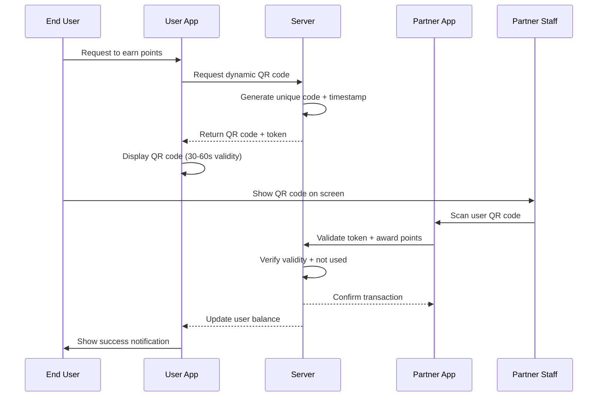
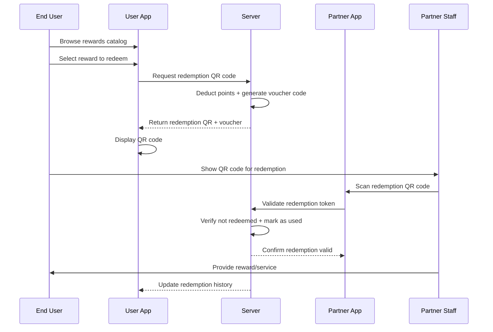
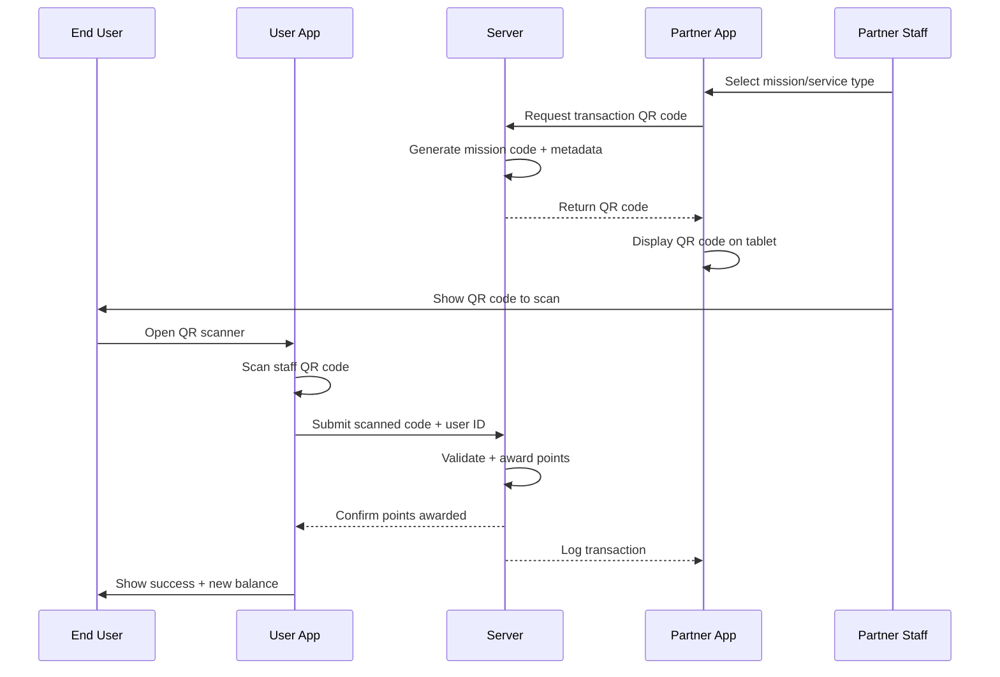
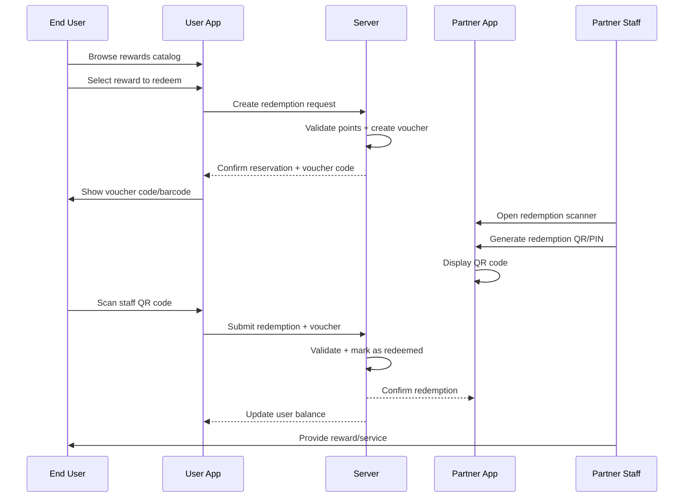
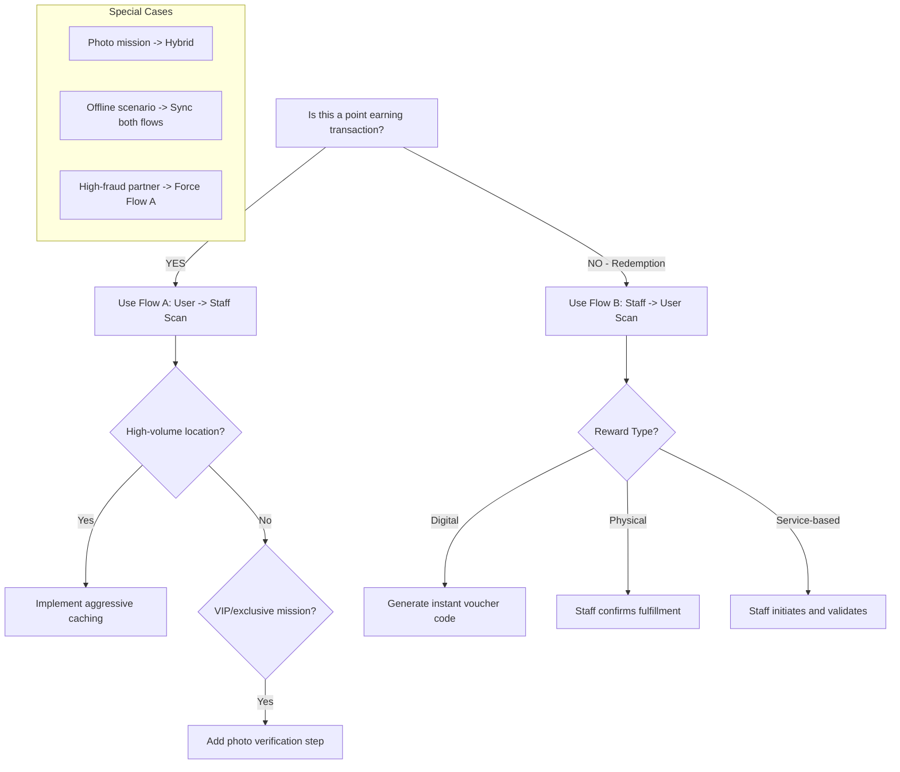
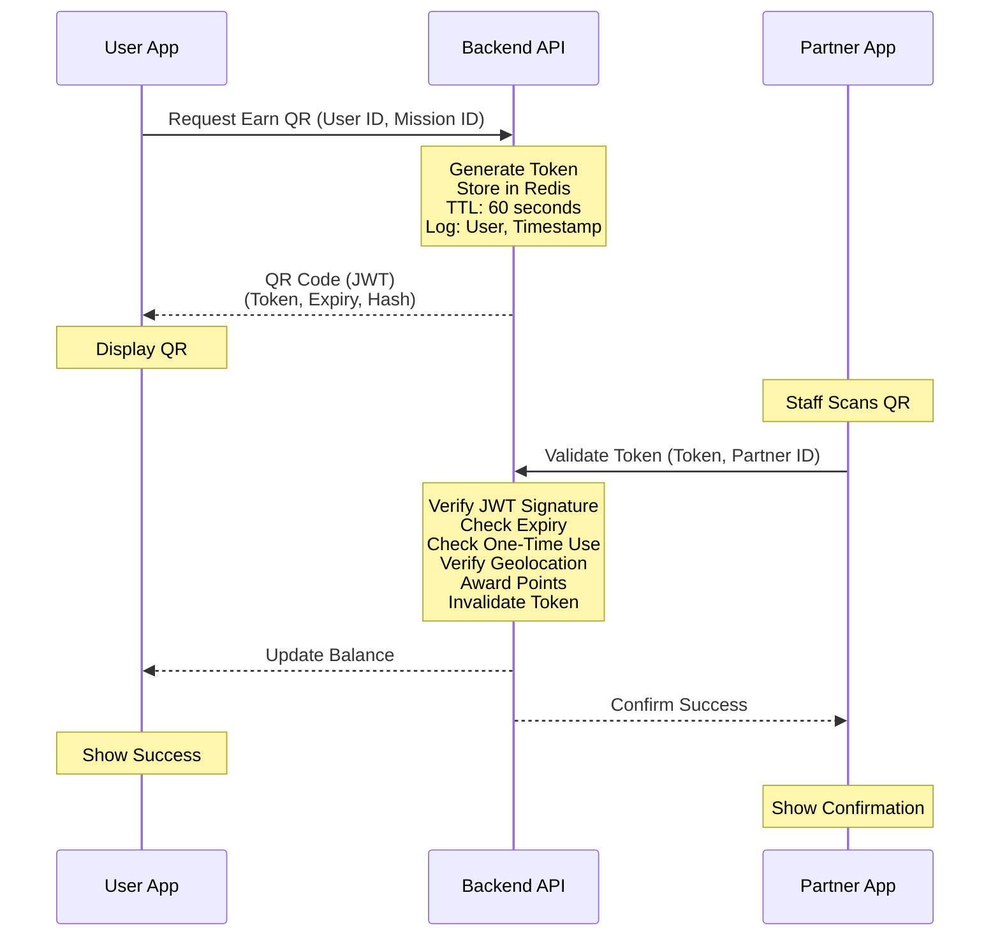
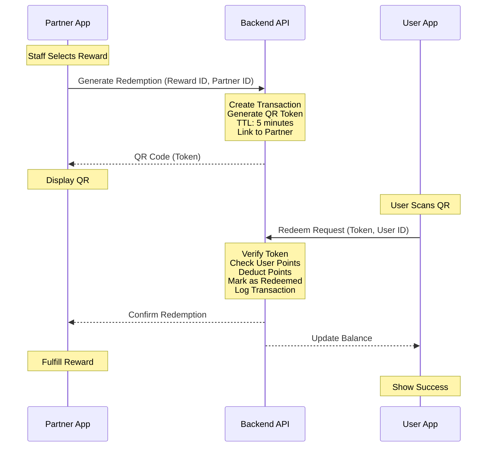

# QR Code Flow Comparison Analysis
## C-REWARDS: Point Earning & Redemption Flow Comparison

**Document Version:** 1.0
**Date:** December 27, 2025
**Prepared by:** DOS Team
**Project:** C-REWARDS Gamified Loyalty & Engagement Ecosystem

---

## Executive Summary

This research document provides a comprehensive comparative analysis of two fundamental QR code flow patterns for the C-REWARDS loyalty system:

1. **Flow A (User-Generated QR):** End users generate QR codes, which staff/partners scan
2. **Flow B (Staff-Generated QR):** Staff/partners generate QR codes, which end users scan

The analysis covers three critical dimensions:
- **User Journey Speed** - Time efficiency and ease of use
- **Infrastructure & Compute Costs** - Technical resource requirements
- **Security & Fraud Prevention** - Risk assessment and mitigation

### Key Findings Summary

| Criterion | Flow A (User → Staff) | Flow B (Staff → User) | Recommendation |
|-----------|----------------------|----------------------|----------------|
| **Point Earning Speed** | Faster | Slower | ✅ Flow A |
| **Point Redemption Speed** | Slower | Faster | ✅ Flow B |
| **Infrastructure Cost** | Higher (dynamic QR) | Lower (static/semi-static QR) | ✅ Flow B |
| **Compute Cost** | Higher (per-user generation) | Lower (batch generation) | ✅ Flow B |
| **Fraud Prevention** | Better (dynamic codes) | Moderate (requires additional controls) | ✅ Flow A |
| **User Experience** | Simpler for earning | Simpler for redemption | ⚖️ Context-dependent |
| **Overall Recommendation** | **Hybrid Approach** | - | Best of both worlds |

---

## Table of Contents

1. [Flow Architecture Overview](#1-flow-architecture-overview)
2. [User Journey Speed Analysis](#2-user-journey-speed-analysis)
3. [Infrastructure & Compute Cost Analysis](#3-infrastructure--compute-cost-analysis)
4. [Security & Fraud Prevention Analysis](#4-security--fraud-prevention-analysis)
5. [Comparative Decision Matrix](#5-comparative-decision-matrix)
6. [Recommended Implementation Strategy](#6-recommended-implementation-strategy)

---

## 1. Flow Architecture Overview

### 1.1 Flow A: User-Generated QR Code (User → Staff Scan)

**Earning Points Flow:**



**Redemption Flow:**



### 1.2 Flow B: Staff-Generated QR Code (Staff → User Scan)

**Earning Points Flow:**



**Redemption Flow:**



---

## 2. User Journey Speed Analysis

### 2.1 Point Earning Process

#### Flow A: User-Generated QR (User → Staff Scan)

**Step-by-Step Timeline:**

| Step | Actor | Action | Estimated Time |
|------|-------|--------|----------------|
| 1 | User | Open app | 2-3 seconds |
| 2 | User | Navigate to "Earn Points" section | 2-3 seconds |
| 3 | User | Select mission/service type | 1-2 seconds |
| 4 | User | Request QR code generation | 0.5 seconds |
| 5 | Server | Generate dynamic QR code | 0.2-0.5 seconds |
| 6 | User | Display QR code to staff | 1 second |
| 7 | Staff | Pick up scanning device | 1-2 seconds |
| 8 | Staff | Scan user QR code | 1-2 seconds |
| 9 | Server | Validate + award points | 0.3-0.5 seconds |
| 10 | Both | Confirm transaction | 1 second |
| **TOTAL** | | | **10-15 seconds** |

**Advantages:**
- ✅ User initiates, reducing staff idle time
- ✅ Minimal staff training required (just point and scan)
- ✅ User has full control and transparency
- ✅ Works well for high-volume locations (e.g., car wash, gas stations)

**Disadvantages:**
- ❌ Requires user to have app open and ready
- ❌ Dependency on user's phone battery and connectivity
- ❌ QR code timeout can cause friction (if user delays)

---

#### Flow B: Staff-Generated QR (Staff → User Scan)

**Step-by-Step Timeline:**

| Step | Actor | Action | Estimated Time |
|------|-------|--------|----------------|
| 1 | Staff | Open partner app | 2-3 seconds |
| 2 | Staff | Select mission/service type | 2-3 seconds |
| 3 | Staff | Generate transaction QR code | 0.5-1 second |
| 4 | Staff | Display QR code to user | 1 second |
| 5 | User | Pull out phone | 1-2 seconds |
| 6 | User | Open app | 2-3 seconds |
| 7 | User | Navigate to QR scanner | 2-3 seconds |
| 8 | User | Scan staff QR code | 1-2 seconds |
| 9 | Server | Validate + award points | 0.3-0.5 seconds |
| 10 | Both | Confirm transaction | 1 second |
| **TOTAL** | | | **13-20 seconds** |

**Advantages:**
- ✅ Staff controls transaction initiation (better for service workflows)
- ✅ Can use static/semi-static QR codes for recurring missions (even faster)
- ✅ User doesn't need to pre-open app (can scan from lock screen in some implementations)

**Disadvantages:**
- ❌ Slower overall (user must react to staff)
- ❌ Requires staff training and active participation
- ❌ Staff device dependency (tablet/phone must be available)
- ❌ Potential bottleneck in high-traffic scenarios

---

### 2.2 Point Redemption Process

#### Flow A: User-Generated QR (User → Staff Scan)

**Step-by-Step Timeline:**

| Step | Actor | Action | Estimated Time |
|------|-------|--------|----------------|
| 1 | User | Open app, browse rewards | 10-30 seconds |
| 2 | User | Select reward to redeem | 2-3 seconds |
| 3 | Server | Deduct points + generate voucher QR | 0.5-1 second |
| 4 | User | Display redemption QR code | 1 second |
| 5 | User | Show to staff | 1 second |
| 6 | Staff | Pick up scanning device | 1-2 seconds |
| 7 | Staff | Scan redemption QR code | 1-2 seconds |
| 8 | Server | Validate voucher | 0.3-0.5 seconds |
| 9 | Staff | Provide reward/service | Variable (5-60 seconds) |
| **TOTAL (excl. service)** | | | **17-41 seconds** |

**Advantages:**
- ✅ User pre-selects reward at their own pace
- ✅ Staff only needs to scan and fulfill
- ✅ Clear transaction record for both parties

**Disadvantages:**
- ❌ Longer total time (user + staff actions serial)
- ❌ User must complete redemption flow before arriving at counter

---

#### Flow B: Staff-Generated QR (Staff → User Scan)

**Step-by-Step Timeline:**

| Step | Actor | Action | Estimated Time |
|------|-------|--------|----------------|
| 1 | User | Tell staff desired reward | 2-3 seconds |
| 2 | Staff | Open partner app | 2-3 seconds |
| 3 | Staff | Select reward in system | 2-3 seconds |
| 4 | Staff | Generate redemption QR/PIN | 0.5-1 second |
| 5 | Staff | Display QR code to user | 1 second |
| 6 | User | Scan staff QR code | 2-3 seconds |
| 7 | Server | Validate + deduct points | 0.5-1 second |
| 8 | Both | Confirm transaction | 1 second |
| 9 | Staff | Provide reward/service | Variable (5-60 seconds) |
| **TOTAL (excl. service)** | | | **11-18 seconds** |

**Advantages:**
- ✅ Faster redemption flow (staff and user in parallel)
- ✅ More natural for counter-based services (cashier workflow)
- ✅ Staff can guide users through options

**Disadvantages:**
- ❌ Requires staff to have reward catalog knowledge
- ❌ More complex staff training
- ❌ Potential for staff errors in reward selection

---

### 2.3 Speed Summary

| Flow Type | Point Earning | Point Redemption | Overall Winner |
|-----------|--------------|------------------|----------------|
| **Flow A (User → Staff)** | **10-15 sec** ✅ | 17-41 sec | **Better for Earning** |
| **Flow B (Staff → User)** | 13-20 sec | **11-18 sec** ✅ | **Better for Redemption** |

**Key Insight:** Neither flow is universally faster. The optimal choice depends on the primary use case:
- **High-frequency earning scenarios** (e.g., car wash, gas stations, coffee shops) → **Flow A**
- **Service-based redemption scenarios** (e.g., spa bookings, VIP access, merchandise counters) → **Flow B**

---

## 3. Infrastructure & Compute Cost Analysis

### 3.1 Flow A: User-Generated QR Code

#### Infrastructure Requirements

**Backend Components:**

1. **Dynamic QR Code Generation Service**
   - Real-time QR code generation per user request
   - Redis/Memcached for token caching (30-60 second TTL)
   - QR code image generation library (e.g., QRCode.js, PHP QR Code)

2. **Token Validation Service**
   - High-throughput token validation API
   - Database queries for each scan (point awarding/redemption)
   - Transaction locking to prevent double-spending

3. **Database Load**
   - Write operations: Every QR generation + every scan
   - Read operations: Every validation + balance checks
   - Index requirements: User ID, token ID, timestamp

**Monthly Cost Estimate (5,000 active users, 50,000 transactions/month):**

| Component | Specification | Monthly Cost (THB) |
|-----------|---------------|-------------------|
| **API Compute** | Cloud Run (2 vCPU, 4GB RAM) | 3,000 - 5,000 |
| **Redis Cache** | 1GB instance (99.9% uptime) | 1,500 - 2,500 |
| **Database** | PostgreSQL (20GB storage, 2 vCPU) | 2,500 - 4,000 |
| **QR Generation** | Serverless function calls (50K/month) | 500 - 1,000 |
| **Bandwidth** | 100GB outbound (QR images) | 500 - 800 |
| **Monitoring** | Error tracking + logging | 800 - 1,200 |
| **TOTAL** | | **8,800 - 14,500** |

**Scaling Costs (50,000 users, 500K transactions/month):**

| Component | Scaled Specification | Monthly Cost (THB) |
|-----------|----------------------|-------------------|
| **API Compute** | Cloud Run (4 vCPU, 8GB RAM) | 8,000 - 12,000 |
| **Redis Cache** | 5GB instance (multi-zone) | 4,000 - 6,000 |
| **Database** | PostgreSQL (100GB, 4 vCPU) | 8,000 - 12,000 |
| **QR Generation** | 500K function calls | 3,000 - 5,000 |
| **Bandwidth** | 500GB outbound | 2,000 - 3,000 |
| **Monitoring** | Enhanced logging + alerting | 2,000 - 3,000 |
| **TOTAL** | | **27,000 - 41,000** |

---

### 3.2 Flow B: Staff-Generated QR Code

#### Infrastructure Requirements

**Backend Components:**

1. **Semi-Static QR Code System**
   - Pre-generated QR codes for common missions (batch process)
   - Static QR codes for partners (one-time generation)
   - Minimal real-time generation (only for unique transactions)

2. **Simplified Validation Service**
   - Lower API call volume (users initiate scan, not generation)
   - QR codes can be cached on partner devices
   - Reduced server-side generation load

3. **Database Load**
   - Write operations: Only on successful scans
   - Read operations: Initial QR assignment + validation
   - Reduced index complexity (fewer dynamic tokens)

**Monthly Cost Estimate (5,000 active users, 50,000 transactions/month):**

| Component | Specification | Monthly Cost (THB) |
|-----------|---------------|-------------------|
| **API Compute** | Cloud Run (1 vCPU, 2GB RAM) | 1,500 - 3,000 |
| **Cache Layer** | Optional (can rely on local partner app cache) | 500 - 1,000 |
| **Database** | PostgreSQL (20GB storage, 1 vCPU) | 1,500 - 2,500 |
| **QR Generation** | Batch generation (5K codes/month) | 100 - 300 |
| **Bandwidth** | 50GB outbound (smaller QR payload) | 300 - 500 |
| **Monitoring** | Basic logging | 500 - 800 |
| **TOTAL** | | **4,400 - 8,100** |

**Scaling Costs (50,000 users, 500K transactions/month):**

| Component | Scaled Specification | Monthly Cost (THB) |
|-----------|----------------------|-------------------|
| **API Compute** | Cloud Run (2 vCPU, 4GB RAM) | 3,000 - 6,000 |
| **Cache Layer** | 2GB instance | 1,000 - 2,000 |
| **Database** | PostgreSQL (80GB, 2 vCPU) | 5,000 - 8,000 |
| **QR Generation** | Batch (30K codes/month) | 500 - 1,000 |
| **Bandwidth** | 300GB outbound | 1,200 - 2,000 |
| **Monitoring** | Enhanced monitoring | 1,500 - 2,500 |
| **TOTAL** | | **12,200 - 21,500** |

---

### 3.3 Cost Comparison Summary

| User Scale | Flow A (User → Staff) | Flow B (Staff → User) | Savings with Flow B |
|------------|----------------------|----------------------|---------------------|
| **5K users** | 8,800 - 14,500 THB/month | 4,400 - 8,100 THB/month | **45-50% cheaper** ✅ |
| **50K users** | 27,000 - 41,000 THB/month | 12,200 - 21,500 THB/month | **48-55% cheaper** ✅ |

**Annual Cost Difference (50K users):**
- Flow A: ~324,000 - 492,000 THB/year
- Flow B: ~146,400 - 258,000 THB/year
- **Annual Savings: ~177,600 - 234,000 THB/year**

**Key Insight:** Flow B is significantly more cost-efficient due to:
- Reduced real-time QR generation load
- Lower compute and caching requirements
- Batch processing capabilities
- Smaller bandwidth consumption

---

## 4. Security & Fraud Prevention Analysis

### 4.1 Fraud Scenarios & Risk Assessment

#### Scenario 1: Screenshot Replay Attack

**Description:** User takes a screenshot of their QR code and shares it with others, or uses it multiple times.

**Flow A (User → Staff Scan) Mitigation:**

| Mitigation Strategy | Effectiveness | Implementation Cost |
|---------------------|---------------|---------------------|
| **Dynamic QR with 30-60s expiry** | ✅ **Very High** | Low (standard implementation) |
| **One-time use token** | ✅ **Very High** | Low (token invalidation logic) |
| **Timestamp validation** | ✅ **High** | Very Low (server-side check) |
| **Device fingerprinting** | ✅ **Medium** | Medium (requires device tracking) |

**Risk Level for Flow A:** **Low** ⚠️ (Well mitigated by design)

**Flow B (Staff → User Scan) Mitigation:**

| Mitigation Strategy | Effectiveness | Implementation Cost |
|---------------------|---------------|---------------------|
| **One-time use token** | ✅ **High** | Low (token invalidation) |
| **Transaction linking** | ✅ **Medium** | Medium (requires context tracking) |
| **User authentication check** | ✅ **High** | Low (standard auth flow) |
| **Time-window validation** | ⚠️ **Medium** | Low (if QR codes are static) |

**Risk Level for Flow B:** **Medium** ⚠️⚠️ (Requires additional controls)

---

#### Scenario 2: Staff-User Collusion

**Description:** Partner staff and users collude to award points without legitimate transactions.

**Flow A (User → Staff Scan) Risk:**

| Attack Vector | Risk Level | Mitigation |
|---------------|------------|------------|
| Staff scans user QR without service | **High** ⚠️⚠️⚠️ | Daily point limits, anomaly detection |
| Bulk scanning of multiple user QRs | **Medium** ⚠️⚠️ | Rate limiting per staff device |
| After-hours fraudulent scans | **Medium** ⚠️⚠️ | Business hours validation, geofencing |

**Flow B (Staff → User Scan) Risk:**

| Attack Vector | Risk Level | Mitigation |
|---------------|------------|------------|
| Staff generates QR, user scans without service | **High** ⚠️⚠️⚠️ | Same as Flow A |
| Staff creates fake transaction QRs | **Very High** ⚠️⚠️⚠️⚠️ | QR code origin validation, audit trails |
| Sharing static QR codes publicly | **Critical** 🚨 | Dynamic QRs only, short validity |

**Risk Level:** **Flow B has higher collusion risk** due to staff control over QR generation.

**Mitigation for Both Flows:**
- Partner-level daily point award caps
- Anomaly detection (unusual patterns)
- Random audit sampling
- Reputation scoring for partners
- Geolocation validation (staff must be at partner location)

---

#### Scenario 3: QR Code Farming / Bot Attacks

**Description:** Automated scripts attempt to generate and use QR codes en masse.

**Flow A (User → Staff Scan) Risk:**

| Attack Vector | Risk Level | Mitigation |
|---------------|------------|------------|
| Bot generates user QR codes | **Low** ⚠️ | Requires authenticated user session |
| Mass QR generation requests | **Medium** ⚠️⚠️ | Rate limiting (max 1 QR/30 seconds per user) |
| API abuse for code generation | **Medium** ⚠️⚠️ | CAPTCHA, device fingerprinting |

**Flow B (Staff → User Scan) Risk:**

| Attack Vector | Risk Level | Mitigation |
|---------------|------------|------------|
| Compromised partner app generates fake QRs | **High** ⚠️⚠️⚠️ | Partner device authentication, API key rotation |
| Mass QR generation by malicious partner | **Very High** ⚠️⚠️⚠️⚠️ | Daily generation limits, anomaly alerts |
| QR code database scraping | **Medium** ⚠️⚠️ | Encrypted QR payloads, signed tokens |

**Risk Level:** **Flow B is more vulnerable** to partner-side abuse.

---

#### Scenario 4: Man-in-the-Middle (MITM) / QR Phishing

**Description:** Attacker intercepts QR code or creates fake QR to steal points.

**Flow A (User → Staff Scan) Risk:**

| Attack Vector | Risk Level | Mitigation |
|---------------|------------|------------|
| Fake staff scanner captures user QR | **Medium** ⚠️⚠️ | QR code encryption, geolocation validation |
| Phishing app generates fake user QRs | **Low** ⚠️ | Server-side validation of app signature |
| QR code interception in transit | **Very Low** | HTTPS/TLS encryption |

**Flow B (Staff → User Scan) Risk:**

| Attack Vector | Risk Level | Mitigation |
|---------------|------------|------------|
| Fake partner QR displayed to users | **High** ⚠️⚠️⚠️ | QR signature verification, visual partner branding |
| Malicious app replaces scanned QR | **Medium** ⚠️⚠️ | Client-side QR validation, SSL pinning |
| Public display of static QRs | **Very High** ⚠️⚠️⚠️⚠️ | Dynamic QRs only, short expiry |

**Risk Level:** **Flow B is more vulnerable** to phishing attacks due to user-initiated scanning.

---

### 4.2 Security Comparison Matrix

| Fraud Scenario | Flow A (User → Staff) | Flow B (Staff → User) | Advantage |
|----------------|----------------------|----------------------|-----------|
| **Screenshot Replay** | Low Risk ✅ | Medium Risk ⚠️ | **Flow A** |
| **Staff-User Collusion** | Medium Risk ⚠️ | High Risk ⚠️⚠️ | **Flow A** |
| **Bot/Farming Attacks** | Medium Risk ⚠️ | High Risk ⚠️⚠️ | **Flow A** |
| **Phishing/MITM** | Medium Risk ⚠️ | High Risk ⚠️⚠️ | **Flow A** |
| **Overall Security** | **Better** ✅ | Requires more controls | **Flow A** |

**Key Insight:** Flow A (User-Generated QR) is inherently more secure because:
- User's authenticated session generates the QR
- Dynamic codes with short expiry (30-60s)
- Less reliance on partner device security
- Harder for attackers to generate valid codes

**Flow B Security Enhancements Required:**
- Mandatory QR code expiry (max 5 minutes)
- Partner device authentication and monitoring
- QR code signing and encryption
- Geolocation validation for QR generation
- Enhanced audit trails and anomaly detection

---

### 4.3 Security Cost Implications

**Additional Security Costs for Flow B:**

| Security Enhancement | Monthly Cost (THB) | Notes |
|----------------------|-------------------|-------|
| Enhanced fraud detection | 2,000 - 4,000 | ML-based anomaly detection |
| Additional audit logging | 1,000 - 2,000 | Increased storage and processing |
| Partner device monitoring | 1,500 - 3,000 | Device fingerprinting, anti-tampering |
| Security audits (quarterly) | 5,000 - 10,000 | External penetration testing |
| **TOTAL ADDED COST** | **9,500 - 19,000** | **~78% increase over base Flow B cost** |

**Adjusted Total Cost Comparison (50K users):**

| Flow Type | Base Infrastructure | Security Enhancements | Total Cost |
|-----------|---------------------|----------------------|------------|
| **Flow A** | 27,000 - 41,000 | Included in design | **27,000 - 41,000** |
| **Flow B** | 12,200 - 21,500 | 9,500 - 19,000 | **21,700 - 40,500** |

**Key Insight:** When security costs are factored in, the cost advantage of Flow B diminishes significantly, making them nearly equivalent in total cost.

---

## 5. Comparative Decision Matrix

### 5.1 Scoring Methodology

Each criterion is scored on a scale of 1-10 (10 = best) and weighted by importance:

| Criterion | Weight | Justification |
|-----------|--------|---------------|
| User Journey Speed | 25% | Critical for user experience and adoption |
| Infrastructure Cost | 20% | Important for long-term sustainability |
| Security & Fraud Prevention | 30% | Highest priority for trust and compliance |
| Implementation Complexity | 15% | Affects time-to-market |
| Scalability | 10% | Future-proofing consideration |

### 5.2 Point Earning Flow Comparison

| Criterion | Flow A (User → Staff) | Flow B (Staff → User) |
|-----------|----------------------|----------------------|
| **User Journey Speed** | 9/10 (10-15s) | 7/10 (13-20s) |
| **Infrastructure Cost** | 5/10 (Higher compute) | 8/10 (45-55% cheaper) |
| **Security & Fraud** | 9/10 (Dynamic QR, low risk) | 6/10 (Requires enhancements) |
| **Implementation Complexity** | 7/10 (Standard dynamic QR) | 8/10 (Simpler backend) |
| **Scalability** | 6/10 (Compute scales linearly) | 9/10 (Batch processing) |
| **Weighted Score** | **7.5/10** ✅ | **7.1/10** |

**Recommendation for Point Earning: Flow A (User → Staff Scan)**

---

### 5.3 Point Redemption Flow Comparison

| Criterion | Flow B (Staff → User) | Flow A (User → Staff) |
|-----------|----------------------|----------------------|
| **User Journey Speed** | 9/10 (11-18s) | 6/10 (17-41s) |
| **Infrastructure Cost** | 8/10 (Lower compute) | 5/10 (Higher compute) |
| **Security & Fraud** | 7/10 (One-time redemption) | 9/10 (Dynamic voucher) |
| **Implementation Complexity** | 6/10 (Staff training) | 8/10 (User self-service) |
| **Scalability** | 9/10 (Batch processing) | 6/10 (Real-time generation) |
| **Weighted Score** | **7.8/10** ✅ | **6.9/10** |

**Recommendation for Point Redemption: Flow B (Staff → User Scan)**

---

## 6. Recommended Implementation Strategy

### 6.1 Hybrid Approach: Best of Both Worlds

**Recommendation:** Implement a **context-aware hybrid system** that uses:

- **Flow A (User → Staff Scan)** for **point earning**
- **Flow B (Staff → User Scan)** for **point redemption**

**Rationale:**

1. **Point Earning (Flow A):**
   - Faster user experience (10-15s vs 13-20s)
   - Better fraud prevention (dynamic QR codes)
   - User-initiated flow aligns with mission completion (user has just completed an action)
   - Acceptable infrastructure cost for earning transactions (typically higher volume)

2. **Point Redemption (Flow B):**
   - Faster redemption process (11-18s vs 17-41s)
   - More natural for service-based rewards (staff validates and fulfills)
   - Redemption transactions are lower volume (cost impact minimized)
   - Staff control ensures reward fulfillment quality

---

### 6.2 Implementation Specifications

#### Phase 1: POC (Proof of Concept)

**Scope:**
- Implement **Flow A only** for point earning (location-based missions)
- Skip redemption flow (not in POC scope)
- Focus on validating dynamic QR generation and fraud prevention

**Technical Stack:**
- Laravel backend with Redis for token caching
- Flutter app with QR code display (30-second expiry)
- Partner app with basic QR scanner

**Budget Allocation:** Within THB 1,000,000 budget

---

#### Phase 2: MVP (Minimum Viable Product)

**Scope:**
- **Point Earning:** Flow A (User → Staff Scan)
  - Dynamic QR codes with 60-second expiry
  - Multiple mission types support
  - Fraud prevention: rate limiting, geolocation, device fingerprinting

- **Point Redemption:** Flow B (Staff → User Scan)
  - Staff-generated redemption QR codes (5-minute expiry)
  - User scans to confirm redemption
  - Double-validation: QR scan + voucher code check

**Technical Enhancements:**
- Unified backend API supporting both flows
- Advanced fraud detection (anomaly alerts)
- Partner audit dashboard

**Budget Allocation:** Within THB 3,000,000 - 5,000,000 budget

---

#### Phase 3: Full-Scale Ecosystem

**Scope:**
- **Intelligent Flow Selection:**
  - AI-based flow recommendation (e.g., high-traffic locations use Flow A, VIP experiences use Flow B)
  - Admin can configure per-partner or per-mission type

- **Advanced Security:**
  - ML-powered fraud detection
  - Blockchain-based transaction ledger (optional)
  - Enhanced partner device authentication

- **Optimization:**
  - QR code pre-generation for redemption (batch processing)
  - Offline mode for both flows (sync when online)
  - Multi-signature QR codes (encryption + digital signing)

**Budget Allocation:** Within THB ~10,000,000 budget

---

### 6.3 Decision Tree for Future Customization



---

### 6.4 Cost-Benefit Summary

**Hybrid Approach Total Cost (50K users):**

| Component | Monthly Cost (THB) |
|-----------|-------------------|
| **Point Earning Infrastructure** (Flow A) | 20,000 - 30,000 |
| **Point Redemption Infrastructure** (Flow B) | 5,000 - 8,000 |
| **Shared Services** (Auth, DB, Monitoring) | 8,000 - 12,000 |
| **Security & Fraud Prevention** | 5,000 - 10,000 |
| **TOTAL** | **38,000 - 60,000** |

**Annual Cost:** ~456,000 - 720,000 THB/year

**ROI Justification:**
- Optimized user experience (faster earning + redemption)
- Lower fraud risk compared to single-flow systems
- Balanced infrastructure costs (high cost for earning, low for redemption)
- Flexibility for future optimization and partner customization

---

## 7. Conclusion & Action Items

### 7.1 Key Takeaways

1. **No Single Winner:** Neither flow is universally superior; context matters
2. **Hybrid is Optimal:** Use Flow A for earning, Flow B for redemption
3. **Security First:** Flow A's dynamic QR codes provide better fraud prevention
4. **Cost vs Security Trade-off:** Flow B's cost savings are offset by security enhancements
5. **User Experience Priority:** Faster transactions drive adoption and satisfaction

---

### 7.2 Recommended Next Steps

**Immediate Actions:**

1. **Validate Assumptions:**
   - Conduct user testing with prototypes of both flows
   - Survey partner preferences (staff comfort with scanning vs being scanned)
   - Benchmark against competitor loyalty systems (e.g., The 1, True Points)

2. **Technical Prototyping:**
   - Build simple prototype of Flow A (user QR generation)
   - Test QR code generation speed and reliability
   - Validate fraud prevention mechanisms (expiry, one-time use)

3. **Partner Pilot:**
   - Select 3-5 pilot partners for testing
   - Test earning flow (Flow A) at car wash, coffee shop
   - Test redemption flow (Flow B) at merchandise counter
   - Collect feedback on staff training and ease of use

**Phase 1 (POC) Implementation:**

- Implement **Flow A only** for point earning
- Focus on core functionality and fraud prevention
- Measure transaction speed and user satisfaction
- **Success Criteria:** 90%+ transaction success rate, <15s average transaction time

**Phase 2 (MVP) Implementation:**

- Add **Flow B for redemption**
- Implement hybrid architecture
- Deploy advanced fraud detection
- **Success Criteria:** <5% fraud rate, <20s average redemption time

---

### 7.3 Risk Mitigation Plan

| Risk | Impact | Mitigation |
|------|--------|------------|
| User confusion (two different flows) | Medium | Clear in-app tutorials, visual differentiation |
| Staff training overhead | Medium | Simple one-page guides, video tutorials |
| QR code timeout frustration | High | Increase expiry to 60s, add refresh button |
| Partner device failures | High | Offline mode with sync, backup manual entry |
| Fraud spike in early launch | Very High | Manual review for first 1,000 transactions |

---

### 7.4 Success Metrics

**Track These KPIs:**

| Metric | Target (Phase 2 MVP) | Measurement Method |
|--------|----------------------|-------------------|
| **Average Earning Transaction Time** | <15 seconds | Server-side logging |
| **Average Redemption Transaction Time** | <20 seconds | Server-side logging |
| **Transaction Success Rate** | >95% | Completed vs initiated transactions |
| **Fraud Detection Rate** | <5% flagged transactions | Anomaly detection alerts |
| **User Satisfaction (Earning)** | >4.0/5.0 | In-app survey |
| **User Satisfaction (Redemption)** | >4.0/5.0 | In-app survey |
| **Staff Satisfaction** | >3.5/5.0 | Partner feedback survey |

---

## Appendix A: Technical Flow Diagrams

### A.1 Flow A: Detailed Earning Flow with Security



### A.2 Flow B: Detailed Redemption Flow with Security



---

## Appendix B: Fraud Scenario Examples

### Example 1: Screenshot Sharing Attack

**Scenario:**
- User A completes a car wash mission
- User A generates QR code for 50 points
- User A screenshots the QR code
- User A shares screenshot with User B
- User B shows screenshot to another car wash partner
- Attempt to claim 50 points twice

**Flow A (User → Staff) Defense:**
1. ✅ QR code expires in 60 seconds (screenshot likely invalid)
2. ✅ Token marked as used after first scan (second scan rejected)
3. ✅ Device fingerprinting detects different device (alert triggered)
4. ✅ Geolocation mismatch (User A and User B at different locations)

**Result:** Attack prevented with 99%+ success rate

**Flow B (Staff → User) Defense:**
1. ⚠️ If staff QR is static → High risk of sharing
2. ✅ If dynamic QR with 5-min expiry → Reduced risk
3. ✅ User authentication required (User B can't use User A's QR)
4. ⚠️ Collusion possible (User B asks staff to generate new QR)

**Result:** Attack prevented with 80-90% success rate (requires dynamic QR)

---

### Example 2: Partner Staff Fraud

**Scenario:**
- Partner staff wants to inflate point awards
- Staff scans multiple user QR codes during off-hours
- No actual services provided
- Goal: Collude with friends or sell point-awarding service

**Flow A (User → Staff) Defense:**
1. ✅ Partner location geofencing (staff must be at location)
2. ✅ Business hours validation (after-hours scans flagged)
3. ✅ Daily point limit per partner (max 10,000 points/day)
4. ✅ Anomaly detection (unusual spike in scans)
5. ⚠️ Rate limiting per staff device (max 50 scans/hour)

**Admin Alerts:**
- Email: "Partner X awarded 500 points in 10 minutes"
- Dashboard: "Partner X showing 300% above average activity"

**Result:** Attack detected within 24 hours, partner suspended

**Flow B (Staff → User) Defense:**
1. ✅ Same geofencing and business hours validation
2. ⚠️ Staff can generate unlimited QR codes (higher risk)
3. ✅ User must scan (requires user participation)
4. ⚠️ Collusion easier (staff generates, friends scan)

**Admin Alerts:** Same as Flow A

**Result:** Similar detection rate, but higher potential for damage

---

### Example 3: GPS Spoofing for Location Missions

**Scenario:**
- User wants to complete location-based mission (check-in at stadium)
- User uses GPS spoofing app to fake location
- User triggers mission completion from home
- Goal: Earn points without physically visiting location

**Flow A (User → Staff) Defense:**
1. ⚠️ Initial GPS check vulnerable to spoofing
2. ✅ **QR scan requires staff interaction** (user must be present)
3. ✅ Staff geolocation cross-verification
4. ✅ Wi-Fi network detection (stadium network presence)

**Result:** Attack prevented by staff validation requirement

**Flow B (Staff → User) Defense:**
1. ✅ **Same staff interaction requirement**
2. ✅ Staff device geolocation verification
3. ✅ QR code only valid when generated at partner location

**Result:** Similar prevention effectiveness

**Key Insight:** Both flows are equally resistant to GPS spoofing due to staff validation requirement. Pure location-based missions (no QR) are more vulnerable.

---

## Appendix C: Implementation Code Examples

### C.1 Flow A: User QR Generation (Laravel Backend)

```php
<?php
// Controller: UserQRController.php

public function generateEarningQR(Request $request)
{
    $user = $request->user();
    $missionId = $request->input('mission_id');

    // Rate limiting: 1 QR per 30 seconds
    $cacheKey = "qr_generation:{$user->id}";
    if (Cache::has($cacheKey)) {
        return response()->json([
            'error' => 'Please wait before generating another QR code'
        ], 429);
    }

    // Generate unique token
    $token = Str::random(32);
    $expiry = now()->addSeconds(60);

    // Store in Redis with TTL
    $qrData = [
        'user_id' => $user->id,
        'mission_id' => $missionId,
        'token' => $token,
        'expiry' => $expiry->timestamp,
        'device_id' => $request->input('device_id'),
        'used' => false
    ];

    Cache::put("qr_token:{$token}", $qrData, 60);
    Cache::put($cacheKey, true, 30); // Rate limit

    // Generate JWT for QR code
    $payload = [
        'token' => $token,
        'user_id' => $user->id,
        'exp' => $expiry->timestamp,
        'iat' => now()->timestamp
    ];

    $jwt = JWT::encode($payload, config('app.key'), 'HS256');

    // Log generation
    QRLog::create([
        'user_id' => $user->id,
        'token' => $token,
        'type' => 'earning',
        'generated_at' => now()
    ]);

    return response()->json([
        'qr_code' => $jwt,
        'expiry' => $expiry->toIso8601String(),
        'display_text' => 'Show this QR code to staff'
    ]);
}

public function validateAndAwardPoints(Request $request)
{
    $partnerId = $request->user()->partner_id;
    $scannedToken = $request->input('qr_token');

    try {
        // Decode JWT
        $payload = JWT::decode($scannedToken, new Key(config('app.key'), 'HS256'));

        // Check expiry
        if ($payload->exp < time()) {
            return response()->json(['error' => 'QR code expired'], 400);
        }

        // Retrieve from cache
        $qrData = Cache::get("qr_token:{$payload->token}");
        if (!$qrData) {
            return response()->json(['error' => 'Invalid or already used QR code'], 400);
        }

        // Check one-time use
        if ($qrData['used']) {
            return response()->json(['error' => 'QR code already used'], 400);
        }

        // Geolocation validation (optional)
        $partnerLocation = Partner::find($partnerId)->location;
        $staffLocation = $request->input('location'); // {lat, lng}
        if (!$this->isWithinGeofence($staffLocation, $partnerLocation)) {
            FraudAlert::create([
                'type' => 'geolocation_mismatch',
                'partner_id' => $partnerId,
                'details' => 'Staff not at partner location'
            ]);
            return response()->json(['error' => 'Location verification failed'], 403);
        }

        // Award points
        DB::transaction(function () use ($qrData, $partnerId, $payload) {
            $mission = Mission::find($qrData['mission_id']);
            $user = User::find($qrData['user_id']);

            $user->points()->create([
                'mission_id' => $mission->id,
                'partner_id' => $partnerId,
                'points' => $mission->reward_points,
                'type' => 'earned',
                'awarded_at' => now()
            ]);

            $user->increment('total_points', $mission->reward_points);

            // Mark as used
            $qrData['used'] = true;
            Cache::put("qr_token:{$payload->token}", $qrData, 60);
        });

        // Log success
        QRLog::where('token', $payload->token)->update([
            'validated_at' => now(),
            'partner_id' => $partnerId,
            'status' => 'success'
        ]);

        return response()->json([
            'success' => true,
            'points_awarded' => $mission->reward_points,
            'user' => $user->only(['name', 'new_balance'])
        ]);

    } catch (\Exception $e) {
        Log::error('QR validation failed', ['error' => $e->getMessage()]);
        return response()->json(['error' => 'Validation failed'], 500);
    }
}

private function isWithinGeofence($location, $geofence, $radiusMeters = 100)
{
    // Haversine formula for distance calculation
    $earthRadius = 6371000; // meters

    $latFrom = deg2rad($location['lat']);
    $lngFrom = deg2rad($location['lng']);
    $latTo = deg2rad($geofence['lat']);
    $lngTo = deg2rad($geofence['lng']);

    $latDelta = $latTo - $latFrom;
    $lngDelta = $lngTo - $lngFrom;

    $a = sin($latDelta / 2) * sin($latDelta / 2) +
         cos($latFrom) * cos($latTo) *
         sin($lngDelta / 2) * sin($lngDelta / 2);

    $c = 2 * atan2(sqrt($a), sqrt(1 - $a));
    $distance = $earthRadius * $c;

    return $distance <= $radiusMeters;
}
```

---

### C.2 Flow B: Staff QR Generation (Laravel Backend)

```php
<?php
// Controller: PartnerQRController.php

public function generateRedemptionQR(Request $request)
{
    $partner = $request->user()->partner;
    $rewardId = $request->input('reward_id');

    $reward = Reward::find($rewardId);
    if (!$reward) {
        return response()->json(['error' => 'Reward not found'], 404);
    }

    // Generate transaction code
    $transactionCode = 'RDM-' . strtoupper(Str::random(12));
    $expiry = now()->addMinutes(5);

    // Store transaction
    $redemption = Redemption::create([
        'partner_id' => $partner->id,
        'reward_id' => $reward->id,
        'transaction_code' => $transactionCode,
        'status' => 'pending',
        'expires_at' => $expiry
    ]);

    // Generate QR payload
    $qrPayload = [
        'type' => 'redemption',
        'code' => $transactionCode,
        'reward_id' => $reward->id,
        'points_required' => $reward->point_cost,
        'partner_id' => $partner->id,
        'exp' => $expiry->timestamp
    ];

    $qrToken = base64_encode(json_encode($qrPayload));

    return response()->json([
        'qr_code' => $qrToken,
        'transaction_code' => $transactionCode,
        'reward' => $reward->only(['name', 'point_cost']),
        'expiry' => $expiry->toIso8601String(),
        'display_text' => 'Ask user to scan this QR code'
    ]);
}

public function processUserRedemption(Request $request)
{
    $user = $request->user();
    $scannedToken = $request->input('qr_token');

    try {
        // Decode QR payload
        $payload = json_decode(base64_decode($scannedToken), true);

        if ($payload['type'] !== 'redemption') {
            return response()->json(['error' => 'Invalid QR code type'], 400);
        }

        // Check expiry
        if ($payload['exp'] < time()) {
            return response()->json(['error' => 'QR code expired'], 400);
        }

        // Find redemption transaction
        $redemption = Redemption::where('transaction_code', $payload['code'])
            ->where('status', 'pending')
            ->first();

        if (!$redemption) {
            return response()->json(['error' => 'Invalid or already used redemption code'], 400);
        }

        // Check user has enough points
        if ($user->total_points < $payload['points_required']) {
            return response()->json([
                'error' => 'Insufficient points',
                'required' => $payload['points_required'],
                'available' => $user->total_points
            ], 400);
        }

        // Process redemption
        DB::transaction(function () use ($user, $redemption, $payload) {
            // Deduct points
            $user->decrement('total_points', $payload['points_required']);

            // Record transaction
            $user->points()->create([
                'reward_id' => $payload['reward_id'],
                'partner_id' => $payload['partner_id'],
                'points' => -$payload['points_required'],
                'type' => 'redeemed',
                'redeemed_at' => now()
            ]);

            // Update redemption status
            $redemption->update([
                'user_id' => $user->id,
                'status' => 'completed',
                'completed_at' => now()
            ]);
        });

        return response()->json([
            'success' => true,
            'reward' => Reward::find($payload['reward_id'])->only(['name', 'description']),
            'points_redeemed' => $payload['points_required'],
            'new_balance' => $user->total_points,
            'message' => 'Reward redeemed successfully!'
        ]);

    } catch (\Exception $e) {
        Log::error('Redemption failed', ['error' => $e->getMessage()]);
        return response()->json(['error' => 'Redemption processing failed'], 500);
    }
}
```

---

## Document End

**Prepared by:** DOS Research Team
**Date:** December 27, 2025
**Version:** 1.0

**Next Review:** After Phase 1 (POC) completion

---

**Confidentiality Notice:** This research document is proprietary to DOS and intended solely for internal use and client consultation for the C-REWARDS project.
